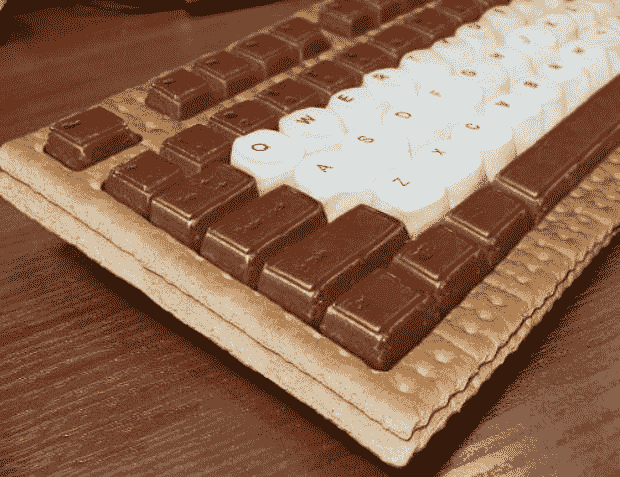

# 更多的键盘加入了我想吃的东西的长长清单

> 原文：<https://web.archive.org/web/https://techcrunch.com/2009/06/26/smore-keyboard-joins-long-list-of-things-id-like-to-eat/>

# 更多的键盘加入了我想吃的东西的长长的清单

我都不记得上次这么想吃外设是什么时候了。请观察由全麦饼干、巧克力和棉花糖制成的键盘。这是 S'more 键盘。

当然，[汉堡床](https://web.archive.org/web/20230322155125/http://www.crunchgear.com/2009/01/14/damn-this-bed-is-making-me-hungry/)看起来很好吃。过了一会儿，就连棉花糖汉堡也开始变得诱人起来。但是吃看起来像汉堡的东西不是一个好的长期策略。你真的需要专注于主要由糖果制成的看起来美味的电脑设备。

这个键盘显然不能用来打字，但是说实话，这有什么意义呢？我每天早上第一件事就是发一个帖子，然后你会开始注意到每一个后续的帖子使用的字母越来越少，直到最后每一个帖子都只是我在键盘上从左到右输入的随机数字。

[via [愚蠢的小玩意](https://web.archive.org/web/20230322155125/http://foolishgadgets.com/200906/the-smore-keyboard/)