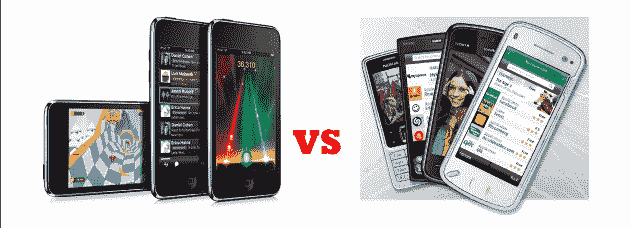

# 苹果 App Store 与诺基亚 Ovi Store——快速而肮脏的比较 TechCrunch

> 原文：<https://web.archive.org/web/http://techcrunch.com/2009/06/27/a-quick-and-dirty-comparison-apple-app-store-vs-nokia-ovi-store/>

# 苹果应用商店和诺基亚 Ovi 商店——一个快速和肮脏的比较

当[诺基亚](https://web.archive.org/web/20230203003118/http://nokia.com/)一个月前为移动应用[推出](https://web.archive.org/web/20230203003118/http://techcrunch.com/2009/05/26/nokias-ovi-store-opens-for-business-10-must-downloads-to-kick-off/) [Ovi 商店](https://web.archive.org/web/20230203003118/https://store.ovi.com/)时，很明显——尽管推出[不及](https://web.archive.org/web/20230203003118/http://techcrunch.com/2009/05/26/nokia-ovi-store-launch-is-a-complete-disaster/)出色——简单地认为芬兰移动巨头的努力毫无意义是错误的。该公司可能正在努力在软件和服务方面保持相关性，但鉴于诺基亚在手机分销层面的影响力，我认为不言而喻，许多人都在密切关注诺基亚在该领域的举措。

在发布日，有人批评 Ovi 商店缺乏内容，特别是因为缺乏许多大牌，但我认为我应该至少给它一个月的时间，看看是否会有多少开发者涌向这个平台。现在，我认为是时候看看一个月后他们的情况了，我想我应该从比较苹果应用商店的内容开始，苹果应用商店是 iPhone 和 iPod Touch 设备的核心应用市场。

这显然不是一个公平的比较，因为苹果的应用商店已经存在了将近一年，而诺基亚才刚刚起步。然而，值得注意的是，互联网上的许多知名企业——无论是社交网络、搜索公司还是游戏开发商——仍然没有出现在 Ovi 商店中。

快速粗略的比较(注意，根据您所在的位置，我的 App Store 列表可能与您的不同，我的是比利时、欧洲):

**社交网络**

App Store 中的十款热门应用(免费和付费混合在一起):

–脸书
–Skype
–TweetDeck
–Nimbuzz
–fring
–LinkedIn
–Truphone
–AIM
–tweet ie
–BeejiveIM

Ovi 商店中的十个热门应用程序(免费和付费混合在一起):

–Gravity(一个 Twitter 客户端)
–Insy
–Friendster
–thumb dive
–Hi5
–GyPSii
–Skype 的 IM+
–See-Fi
–Twittix(另一个 Twitter 客户端)
–诺基亚的脸书

**新闻和信息**

App Store 中的十款热门应用(免费和付费混合在一起):

–BBC 世界新闻直播
–纽约时报
–美联社移动版
–法国 24 台
–汤森路透新闻专业版
–CNN
–华尔街日报
–洛杉矶时报
–每日电讯报
–今日美国

Ovi 商店中的十个热门应用程序(免费和付费混合在一起):

–每日星报
–每日快报英国
–法国 24
–美联社新闻
–路透社
–海峡时报(新加坡流行的日报)
–星报(马来西亚报纸)
–卫报
–美国消费者新闻与商业频道
–突发新闻

**音乐**

App Store 中的十款热门应用(免费和付费混合在一起):

–天狼星 XM
–潘多拉电台
–沙扎姆
–Y！音乐
–imeem 手机
–袖珍吉他
–AOL 电台
–last . FM
–KCRW 电台
–陶笛

Ovi 商店中的十个热门应用程序(免费和付费混合在一起):

–蒙杜电台
–NME
–穆赛克
–米度米
–诺基亚网络电台
–Tunerific
–band fan
–mix pack
–莫札特·黑仔
–myr MX

我可以继续列举一些其他类别，但我想你会同意趋势很明显:诺基亚到目前为止还没有在互联网上吸引许多熟悉的名字来开发和/或向 Ovi 商店提交应用程序。

如果该公司想要迎头赶上，并使其移动市场取得成功，[这需要改变](https://web.archive.org/web/20230203003118/http://techcrunch.com/2009/06/25/there-may-be-50000-apps-for-the-iphone-but-only-a-select-few-become-popular/)。