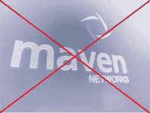

# 雅虎杀死 Maven:从收购到死亡池 17 个月(更新)

> 原文：<https://web.archive.org/web/https://techcrunch.com/2009/06/29/yahoo-kills-maven-from-acquisition-to-deadpool-in-17-months/>

# 雅虎杀死 Maven:17 个月从收购到死亡池(更新)

去年年初，[雅虎](https://web.archive.org/web/20221231013920/http://yahoo.com/)进行了一次相当大的收购，[收购了在线视频分发和广告平台提供商 Maven Networks](https://web.archive.org/web/20221231013920/http://techcrunch.com/2008/02/12/yahoo-confirms-maven-networks-acquisition/) 。根据协议条款，我们[在文件签署的同一天将其作为谣言](https://web.archive.org/web/20221231013920/http://techcrunch.com/2008/01/31/rumor-yahoo-to-announce-large-video-acquisition-today/)报道，该公司以[大约 1 . 6 亿美元](https://web.archive.org/web/20221231013920/http://www.crunchbase.com/company/maven-networks)收购了这家初创公司。当时，新闻稿吹捧此次收购将导致“Yahoo.com 和雅虎领先的优质视频出版商网络上最先进的消费者视频和广告体验”的扩展。

现在我们了解到，雅虎将会杀死 Maven Networks，这是桑尼维尔互联网巨头一系列产品和服务死池的最新一例。一位为一家大型媒体公司工作的线人告诉我们，他多年来一直是 Maven 的客户，上周被告知，雅虎将停止在该平台上的所有开发，并将在 2010 年不再支持该平台。

我们通过另一个消息来源证实，雅虎实际上已经决定搁置 Maven，解雇了大部分员工，这一举动被包装为重组，并已经通知客户，该产品将从明年开始不再受支持。此外，消息来源告诉我们，Maven 技术甚至从未用于雅虎自己的视频属性，这强调了为什么我从这篇文章第一段的[新闻稿](https://web.archive.org/web/20221231013920/http://www.businesswire.com/portal/site/home/index.jsp?epi-content=NEWS_VIEW_POPUP_TYPE&newsId=20080212005624&ndmHsc=v2*A1200229200000*B1202854285000*DgroupByDate*J2*L1*N1000837*Zyahoo&newsLang=en&beanID=202776713&viewID=news_view_popup)中引用的话在今天听起来如此无效。

**更新:**我们收到了雅虎关于此事的声明:

> “自 2008 年收购 Maven Networks 以来，Maven 在我们的视频战略中发挥了重要作用，提供了帮助雅虎的关键人才和核心技术。以增强其消费者和广告产品。Maven 技术用于雅虎视频播放器，以及雅虎视频广告平台，该平台用于为雅虎提供网络内外的广告服务。搭档。
> 
> 虽然视频计划仍然是雅虎的优先事项。为了消费者和广告体验，我们在一些领域增加投资，而在另一些领域缩减投资。经过慎重考虑，雅虎！正计划减少 Maven Networks 的客户群。这一决定将使我们能够将资源集中在持续改进我们的核心视频产品上，例如增强雅虎上的消费者视频体验！。自 2008 年第四季度以来，我们已经关闭或宣布打算关闭近二十家雅虎！服务——如雅虎！360、GeoCities、我的网和雅虎！公文包。我们将继续定期评估我们的产品和服务组合，并计划在未来几个月与使用我们产品的人们分享进一步变化的细节。"

雅虎还表示，关于 Maven 团队大部分被裁的传言是不准确的。

当然，这个平台最终会以不同的所有权存在，但请放心，像 [Brightcove](https://web.archive.org/web/20221231013920/http://www.crunchbase.com/company/brightcove) 、 [Ooyala](https://web.archive.org/web/20221231013920/http://www.crunchbase.com/company/ooyala) 和 [KIT Digital](https://web.archive.org/web/20221231013920/http://www.crunchbase.com/company/kit-digital) 这样的竞争对手目前正在庆祝这个消息。

这是雅虎在不到 8 个月的时间里砍掉的第三个视频资产，此前雅虎已经关闭了两个视频网站。直播视频流媒体服务 Live ，在线视频编辑工具 jump cut[。值得注意的是，雅虎首席执行官卡罗尔·巴茨最近在一次会议的舞台上宣布，该公司实际上仍然有兴趣收购数字视频技术领域的初创公司。](https://web.archive.org/web/20221231013920/http://techcrunch.com/2009/04/15/yahoo-shutting-down-the-rest-of-jumpcut-in-june/)

一个月后，一项价值 1.6 亿美元的视频技术收购案尘埃落定，再次读到这些话简直是滑稽。话说回来，收购时雅虎的前景和财务状况看起来比今天好得多，所以事后来看，或许太容易判断这一举动了。

不管怎样，Maven Networks 现在是[死池](https://web.archive.org/web/20221231013920/http://techcrunch.com/tag/deadpool)俱乐部的成员，尽管雅虎总是有可能将 Maven 出售给想要重振它的人。