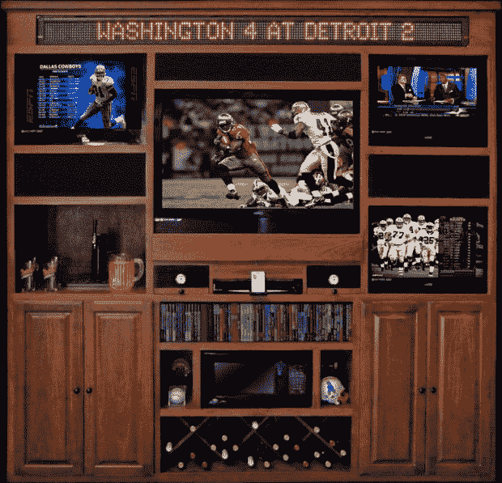

# Man Wall 价值 1.5 万美元-物有所值 TechCrunch

> 原文：<https://web.archive.org/web/http://techcrunch.com/2009/07/01/man-wall-costs-14900-worth-every-penny/>

# Man Wall 价值 1.5 万美元，物有所值

如果你手头有 15，000 美元，而你恰好是一名男性，那么请考虑将人墙作为你的下一个中大型购买目标。为了我们这些没有 15，000 美元花在人墙上的男人。拜托，我求你了。

你也不像是被宰了。你有四台电视、一台 1200 瓦的松下 5.1 家庭影院、带 5 碟换碟机的 DVD 播放器、iPod 音乐基座、一个啤酒桶、微波炉、两个雪茄保湿盒、32 瓶葡萄酒架，还有一个 7 英尺长的内置电脑的运动跑马灯。

请购买它。求你了。

以免你认为上图的人墙不够，该公司可以为你定制更多的电视，你的团队最喜欢的颜色，更大的音响系统，以及你能想到的任何其他东西。

起价 14900 美元外加运费。

[人墙](https://web.archive.org/web/20230203080337/http://www.themanwall.com/the-man-wall/)【途经[未抵达](https://web.archive.org/web/20230203080337/http://www.unplggd.com/unplggd/hot-or-not/hot-or-not-the-man-wall-088947)