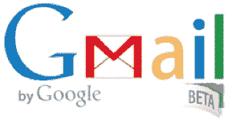
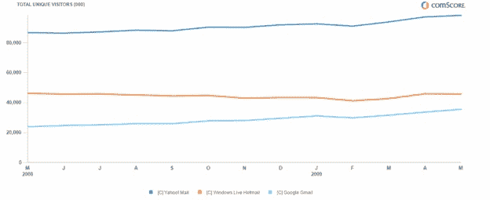

# 谷歌终于撕掉了 Gmail、Docs、Calendar 和 GTalk TechCrunch 的测试标签

> 原文：<https://web.archive.org/web/https://techcrunch.com/2009/07/07/google-finally-peels-the-beta-label-off-gmail-docs-calendar-and-gtalk/>

# 谷歌终于剥离了 Gmail、Docs、Calendar 和 GTalk 的测试标签

谷歌的测试期已经结束，至少对于一些最受欢迎的应用来说是这样。正如我们两个月前[在](https://web.archive.org/web/20230123192638/http://techcrunch.com/2009/05/20/googles-beta-love-may-die-in-fight-for-enterprise-customers/)预测的那样，谷歌今天终于摘掉了 Gmail、谷歌日历、谷歌文档和 GTalk 的测试标签。也是时候了。例如，五年前推出的 Gmail 是谷歌目前最受欢迎的非搜索应用，它已经比许多初创公司都要老。

Gmail 现在是领先的电子邮件服务之一，再也不能躲在测试标签的掩护下了。根据 comScore 的数据，仅在过去的一年里，Gmail 的独立访问者就增长了 48 %,达到 3600 万，迅速超过了 AOL Mail(4000 万，下降了 6 %)和 Windows Live Hotmail(4600 万，下降了 1 %),位居第二，仅次于仍然安全的 Yahoo Mail(9800 万，上升了 13%)。在世界范围内，Gmail 在 5 月份有 1 . 46 亿访问者，大约是雅虎邮箱和 Hotmail 的一半，比 AOL 邮箱多三倍。

Google Docs(2006 年推出)、Calendar(2007 年推出)和 Gtalk (2005 年)没有那么受欢迎，但这三个都是成熟的产品。然而，谷歌做出这一改变的原因纯粹是营销，因为[以 50 美元/用户/年的价格向企业出售这些捆绑在一起的谷歌应用](https://web.archive.org/web/20230123192638/http://techcrunch.com/2009/07/07/what-the-hell-happened-to-the-free-version-of-google-apps/)。谷歌企业产品管理总监马特·格洛茨巴赫(Matt Glotzbach)告诉我，去掉测试版标签实际上是为了商业客户。“消费者真的不在乎，”他说，“对我们的一些商业客户来说，这肯定是个问题。”

谷歌应用程序现在被近 200 万家企业使用，为谷歌带来了数亿美元的收入。随着首席信息官们寻找任何削减成本的方法，它正在成为一个相当不错的小副业，销售一直很活跃。对于企业客户，谷歌今天还增加了两个新功能:将访问电子邮件帐户的权限委托给另一个人(如行政助理)的能力，以及出于合规目的的增强保留功能。

