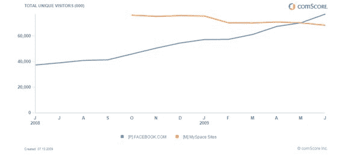

# 差距越来越大:MySpace 在美国吃了脸书的灰尘

> 原文：<https://web.archive.org/web/https://techcrunch.com/2009/07/13/the-gap-grows-wider-myspace-eats-facebooks-dust-in-the-us/>

# 差距越来越大:MySpace 在美国吃了脸书的灰尘

脸书和 MySpace 在美国的差距越来越大。今年 5 月，脸书终于在美国独立访客数量上赶上了 T2，并以微弱优势超过了其竞争对手。根据 comScore 6 月份的数据，上个月，脸书将 MySpace 甩在了身后。脸书 6 月份的独立访客人数达到 7700 万，高于 5 月份的 7028 万。MySpace 月份的独立访客数为 6840 万，低于 5 月份的 7025 万。

脸书在美国稳步增长。该网络在 6 月份增加了不到 700 万独立访客，而 5 月份美国独立访客增加了 280 万。相比之下，MySpace 月份流失了近 400 万独立访客，而 5 月份流失了 70 万独立访客。当脸书在美国和国际市场都在增长时，的 MySpace 似乎停滞不前。

竞争对手社交网络之间差距的扩大正值 MySpace 处于新的管理层之下，最近 T2 解雇了三分之二的国际员工，在 MySpace 被 T4 打败的国家裁员。MySpace 的国际数据令人吃惊。例如，在社交网络发展迅速的印度，脸书 5 月份有 640 万独立访客，而 MySpace 只有 84.8 万独立访客。在我们最近关于社交网络真实价值的模型中，MySpace 从去年的第一名跌落至脸书之后。

MySpace 仍然比脸书产生更多的页面浏览量。今年 6 月，MySpace 在美国的页面浏览量为 324 亿，但这一数字比 5 月份下降了 10%。脸书也在迎头赶上，6 月份的页面浏览量为 213 亿，比 5 月份增长了 12%。在世界范围内，脸书已经领先了。正如我们几个月前[报道的那样](https://web.archive.org/web/20230130134039/http://techcrunch.com/2009/05/18/myspace-is-in-real-trouble-if-these-page-view-declines-dont-)，MySpace 的全球月浏览量从一年前的 474 亿下降到四月份的 380 亿，下降了 20%。在同一时期，脸书的人口从 440 亿增长到 870 亿，大约增长了 100%。MySpace 的用户数量增长也陷入停滞，开发者报告称，MySpace 上的活动正以惊人的速度减少，高达“每周 0.5%”

用户数量的下降并不是 MySpace 面临的唯一困境——有人猜测，这个社交网络可能会在不久的将来失去其主要收入来源之一。2010 年，MySpace 将会收到谷歌的最后一笔“福利金”(源于新闻集团和谷歌在 2006 年达成的一项 T2 广告协议),之后看起来它将会被切断。根据协议条款，如果网络达到特定的搜索页面浏览量要求，MySpace 将在未来一年获得 3 亿美元，考虑到最近的页面浏览量数据，这可能不会发生。

与此同时，脸书没有放缓的迹象。该网络在六月成功地推出了“虚荣网址”，几天之内就有数百万用户注册了这一新功能。该网络还因其在伊朗选举和抗议期间的使用以及围绕其“每个人”按钮的新隐私设置而受到一些关注。