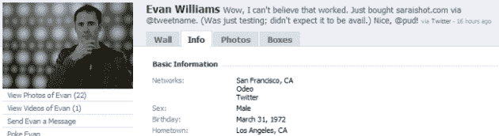
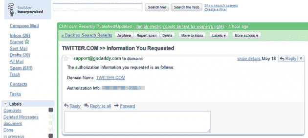
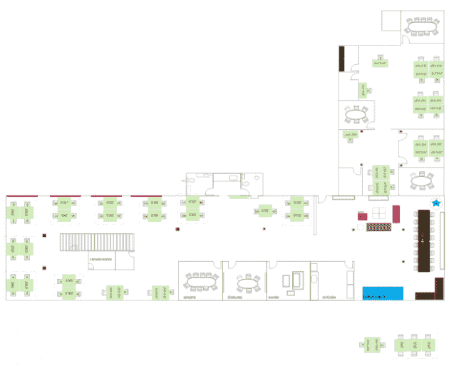

# Twitter 的@Ev 证实黑客锁定了个人账户；攻击是“非常痛苦的”TechCrunch

> 原文：<https://web.archive.org/web/http://techcrunch.com/2009/07/14/twitters-ev-confirms-hacker-targeted-personal-accounts-attack-was-highly-distressing/>

早在五月， [Twitter 被黑客](https://web.archive.org/web/20230216122340/http://www.pcworld.com/businesscenter/article/164182/hacker_i_broke_into_twitter.html)侵入了几名 Twitter 员工的账户，然后获得了布兰妮和阿什顿·库彻等名人的账户。这次入侵是一个名叫 Hacker Croll 的人所为，他在一个法国留言板上发布了泄露的截图。现在，来自同一个黑客的更多截图出现在另一个[法国网站](https://web.archive.org/web/20230216122340/http://www.korben.info/hack-de-twitter-la-suite.html)(此处为[粗略翻译](https://web.archive.org/web/20230216122340/http://blog.landspurg.net/twitter-hacked/))。

据帖子称，黑客克罗尔侵入了创始人[伊万·威廉姆斯](https://web.archive.org/web/20230216122340/http://crunchbase.com/person/evan-williams/)及其妻子和几名员工的推特账户。利用密码恢复技术，黑客克罗尔声称他获得了各种 Paypal、亚马逊、苹果、AT & T、MobileMe 和 Gmail 账户的访问权限。我给伊万·威廉姆斯发了电子邮件，询问违规事件。他证实:

> 是的，我们确实在几周前遭受了一次攻击，并且熟悉这份清单。这与 twitter 被黑无关，在那次事件中，有人获得了用户账户的访问权限。这与[twitter.com](https://web.archive.org/web/20230216122340/http://twitter.com/)的安全没有任何关系，这里也没有用户账户受到损害。
> 
> 一些注释:
> ——他实际上并没有获得我的@ev Twitter 账户(或任何 Twitter 账户)的访问权限，也没有该网站的任何管理功能。也没有证据表明他获得了我的电子邮件。有一名行政人员的电子邮件遭到破坏，我妻子的 Gmail 账户也遭到破坏，他就是通过这个账户获得了我的一些信用卡和其他信息。
> ——他还成功锁定了几个其他员工的个人账户(亚马逊、AT & T、贝宝……)
> 
> 一般来说，大多数敏感信息都是个人的，而不是与公司相关的。显然，这让我自己、我的妻子和其他被攻击的 Twitter 员工非常苦恼。对我们来说，我们成为目标是一个很好的教训，因为我们为 Twitter 工作。我们已经采取了额外的措施来提高我们的安全性，但我们知道我们永远不会完全满意我们通过电子邮件分享的内容。

上面和下面是威廉姆斯在 Twitter、Gmail 和 GoDaddy 上的账户截图。他声称，他能够访问 GoDaddy 上的 Twitter 域名账户，并可以将流量重定向到另一个 IP 地址(我敢肯定，这大约可以工作三分钟)。Gmail 访问，如果是真的，会更麻烦。一旦黑客进入@ev 的 Gmail 账户，其他账户的密码恢复就很容易了。他声称已经获得了一些内部文件，包括 2009 年达到 2500 万用户，2010 年达到 1 亿，2010 年达到 3.5 亿的预测，以及最终成为第一个达到 10 亿用户的互联网服务的古怪目标。所以也许一些公司信息被泄露了。

下面是他声称已经发现的一些其他事情的列表，以及下面的截图，最后一张是 Twitter 的新办公空间的计划，包括一个卧室、一个游戏室、温室、一个冥想室、自行车室、健身房、洗衣机/烘干机、wifi、储物柜、酒窖和一个水族馆。Twitter 在 7 月份搬进了新的住所(账户在 5 月份被泄露，这是所有这些信息的日期):

*   *员工完整名单*
*   *他们的食物偏好*
*   他们的信用卡号码
*   *与诺基亚、三星、戴尔、美国在线、微软和其他公司的一些机密合同*
*   *网络和娱乐圈名人的直接电子邮件*
*   *电话号码*
*   *会议报告(非常有用)*
*   *内部文档模板*
*   *时间表*
*   *申请人简历*
*   *薪资表(我该走了..lol)*

谁知道这些是不是真的(没有实际的公司文件截图)，但这足以让任何高管警惕在公共场合生活太多。

