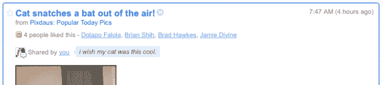
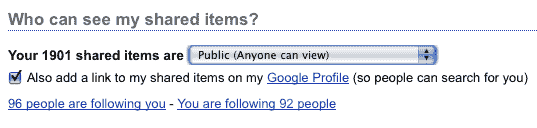

# 谷歌阅读器在人物搜索和“喜欢”方面又迈出了社交化的一步

> 原文：<https://web.archive.org/web/https://techcrunch.com/2009/07/15/google-reader-takes-another-social-step-with-people-search-and-likes/>

# 谷歌阅读器在人物搜索和“喜欢”方面又迈出了社交化的一步

正如我们一段时间以来所注意到的，谷歌阅读器的社交功能[还有很多不足之处](https://web.archive.org/web/20221006010725/http://www.beta.techcrunch.com/2009/05/04/google-reader-still-trying-to-figure-out-this-whole-social-thing-still-failing/)。这个搜索巨头正朝着让朋友之间更容易共享的方向慢慢前进，但它仍然相当笨重。今天，该功能又得到了一次升级，包括一个可能最终刺激社交使用的“喜欢”项目。

从今天开始，您可以搜索通过 Google Reader 共享项目的人。以前，人们要么必须在你的联系人列表中，要么你必须分享你可笑的共享物品网址。比如我的是[http://www.google.com/reader/shared/14881661495900338150](https://web.archive.org/web/20221006010725/https://www.google.com/reader/shared/14881661495900338150)。但是现在，有人可以去搜索“MG Siegler”，我的名字会弹出一个选项，一键订阅我的项目。此外，现在还有一种方法可以从您的 [Google 个人资料页面](https://web.archive.org/web/20221006010725/http://www.beta.techcrunch.com/2009/04/14/google-profiles-take-an-important-social-step-with-vanity-urls/)添加到您的 Google Reader 共享项目的链接。

但是与此同时，谷歌在谷歌阅读器上更多地开放了它的社交功能，同时也允许你更多地锁定它们。另一个新功能是您可以保护您的共享项目，只允许您希望能够看到的人查看它们。这一直是想分享物品的用户的问题，但是[不想与](https://web.archive.org/web/20221006010725/http://www.beta.techcrunch.com/2008/08/13/google-reader-finally-introduces-granular-sharing-control/)[整个世界](https://web.archive.org/web/20221006010725/http://www.beta.techcrunch.com/2007/12/26/is-google-reader-sharing-too-much/)分享它们。例如，现在如果您只想与同事共享项目(比如与工作相关的订阅源项目)，您可以这样做。这都是基于你在谷歌联系人中的联系人过滤器。

但 Google Reader 中分享物品的最大变化是，你现在可以“喜欢”物品了。是的，这是 FriendFeed 早就有的功能，T2·脸书几个月前也实现了这个功能。“喜欢”一个项目就像点击一个鼠标按钮一样简单(或者如果你打开了键盘快捷键，就点击“L”键)。而且由于所有“赞”都是公开的，每个使用谷歌阅读器的人都能看到。我认为这可能是我在很长一段时间里从 Reader 团队看到的第一个新功能，它实际上可能会刺激产品的社交使用，因为“喜欢”某样东西比留下评论容易得多。

值得注意的是，虽然您现在可以更轻松地向任何人开放您的共享项目，但只有您的联系人才能对其发表评论。目前，这些新功能只存在于谷歌阅读器 Google notes 的英文版中。

问题是，这些功能足以扭转，或者至少减缓我们看到的人们通过 Twitter、脸书和 FriendFeed 等网站消费越来越多内容的趋势吗？可能不会，但至少这是朝着正确方向的一个很好的尝试。我们更感兴趣的是[加速 RSS](https://web.archive.org/web/20221006010725/http://www.beta.techcrunch.com/2009/07/09/speeding-up-rss/) 的可能性，新的推送协议称之为 [pubsubhubbub](https://web.archive.org/web/20221006010725/http://code.google.com/p/pubsubhubbub/) ，这在我们的实时流处理活动中展示过。如果谷歌阅读器想要竞争，这是它急需的。

