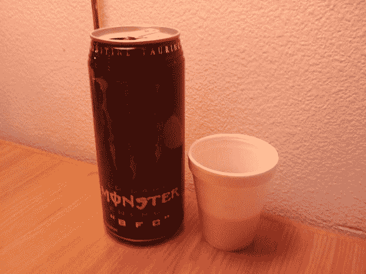
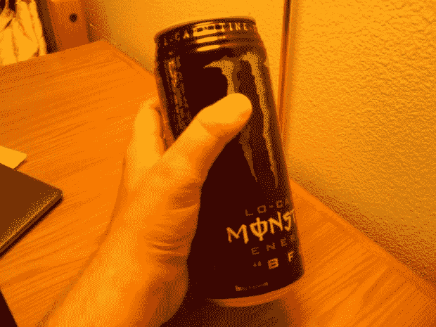
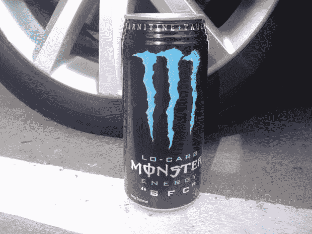
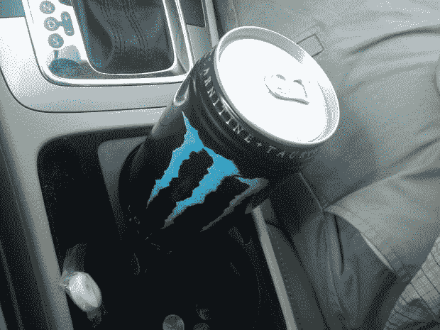

# 怪物“BFC”正式把能量饮料带得太远了

> 原文：<https://web.archive.org/web/https://techcrunch.com/2009/07/16/monster-bfc-officially-takes-energy-drinks-too-far/>

# 怪物“BFC”正式把能量饮料带得太远了

在能量饮料的早期，小小的 8 盎司红牛罐是镇上唯一的游戏。后来，有人决定将罐子的容量增加一倍，达到 16 盎司。太棒了——同样的价格，两倍的效力。然后是 24 盎司能量饮料罐。当然，有点过量，但有时你需要一点额外的，额外的提神饮料，一大罐 24 盎司的饮料总是很好的笑料。

然后是 32 盎司的巨型能源“BFC”——我所见过的最大的 F-ing 罐。

我的手相对来说比较大，BFC 看起来还是很傻。

罐头的侧面是这样写的:

> “是的，你知道‘BFC’代表什么……不，你不应该一口气喝完它！(我们知道你可以，就是不要。相反，放松一下，享受这个星球上最大的最糟糕的能量饮料。尽我们所能。懦夫、健康狂人和忙碌的人不需要申请。推荐使用:每天 1 大罐。”

除了奇怪的随机大写，我从来没有见过这么大的罐子，但显然这不是明尼苏达州亚历山大市的新现象，我在当地的一个加油站购买了 3.99 美元的罐子。

我和店员的对话是这样的:

> 我:这个上市多久了？
> 
> 职员:哦，有一段时间了。大概六个月吧。
> 
> 脖子上有纹身的顾客:不，好像有两年了！
> 
> 职员:嗯，我们已经带了大约六个月了。
> 
> 我:我从没见过这么大的能量饮料。
> 
> 经理:是的，它不是到处都带着的。对它的需求真的不大。一点需求都没有，真的。你实际上是我见过的第一个买的人。
> 
> 脖子上有纹身的顾客:我昨天买了一个！

这就是你要的——BFC 怪兽能源公司。在很少的地方有 3.99 美元的普通和低碳水化合物。哦，还有一个建议:我不建议喝这么大的能量饮料，除非你真的要喝一段时间。我大约六个小时前喝完了这罐，现在我仍然很烦躁不安。还有，我胃疼。

这里还有一些照片。当放在一个汽车轮胎、一些硬币和一颗薄荷糖旁边时，记下罐子的大小。

