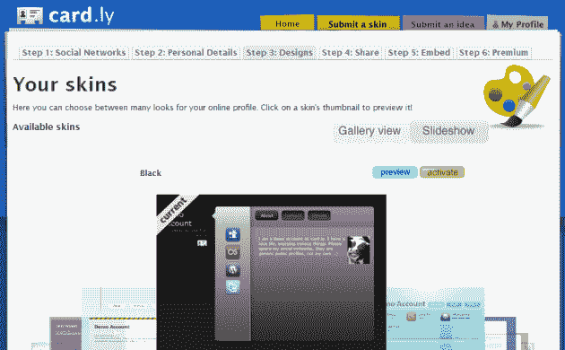
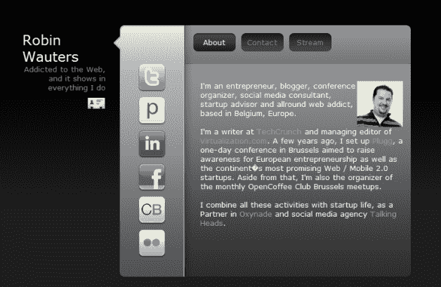
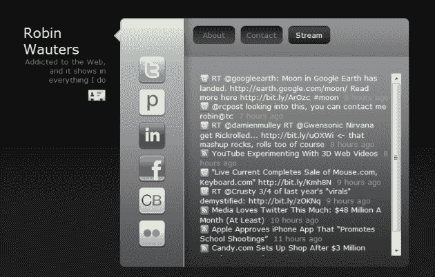

# Card.ly 让您在几分钟内创建酷炫的在线名片 TechCrunch

> 原文：<https://web.archive.org/web/https://techcrunch.com/2009/07/20/cardly-lets-you-create-cool-online-business-cards-in-a-matter-of-minutes/>

# Card.ly 可以让你在几分钟内制作出很酷的在线名片

 有一个个人域名，但不确定是否应该将其重定向到你的博客、脸书个人资料、LinkedIn 或 Twitter 账户？缺乏时间或技能来建立一个你自己的网站，在那里你可以随心所欲地指向他们？[卡莉](https://web.archive.org/web/20221207203735/http://card.ly/)来拯救世界了。

受界面设计师 Tim Van Damme 的个人网页外观的启发，Harkness Labs 的团队开始建立一项服务，人们可以在几分钟内轻松添加他们的在线个人资料，选择主题，并创建一张他们自己的漂亮的在线迷你名片。他们在快速建立和启动轻量级 Web 服务方面有着丰富的经验(查看公司创始人丹尼尔·布莱克的 CrunchBase 简介以获得其他项目的列表)，他们没有花太多时间就想出了一个足够好的概念。

经过一个月左右的编码，Card.ly 现已上线。我喜欢它([这是我的](https://web.archive.org/web/20221207203735/http://card.ly/robinwauters))，我打算把链接发给我的一群朋友。它比[chi . MP](https://web.archive.org/web/20221207203735/http://chi.mp/)([our coverage](https://web.archive.org/web/20221207203735/http://www.beta.techcrunch.com/2009/04/01/chimp-lets-you-own-and-keep-your-web-identity-all-in-one-place/))在范围上更有限，并且与[un hub](https://web.archive.org/web/20221207203735/http://unhub.com/)([our coverage](https://web.archive.org/web/20221207203735/http://www.beta.techcrunch.com/2009/03/17/unhub-offers-a-simple-way-to-showcase-the-online-you/))的方法不同，但我怀疑还有比 Card.ly 更简单的方式来创建看起来如此棒的定制社交中心

一旦你添加了个人信息和各种在线个人资料(目前支持近 50 个，从 LinkedIn 到 Yelp 和我们自己的 CrunchBase)，你就可以从近 30 个提议的设计中挑选一个定制主题——其中大部分是免费的，其他只有高级账户才能使用——并自动发布你的在线名片。它与 hCard 兼容，人们可以通过点击标题下的可识别图标从您的个人 Card.ly 个人资料中下载 vCard。

你也可以为你的个人资料嵌入插件，我已经在这篇文章的顶部做了。最后，一些主题支持“流”标签，它基本上是一个生活流 web 应用程序，可以将你添加到 Card.ly 帐户的个人资料中的所有活动整合在一起。

Card.ly 是免费的，如果你满足于有限的皮肤和 RSS 源选择，以及一些其他限制，但有一个高级版本将花费你每年 24.99 美元。付费账户有更多的主题可供选择，无限的 RSS 流，以及更多像无广告卡这样的好东西。虽然没有我希望的那么便宜，但我付费只是因为我可以链接到我的谷歌分析账户，并在我的个人卡上获得高级统计数据。

你的看法？

