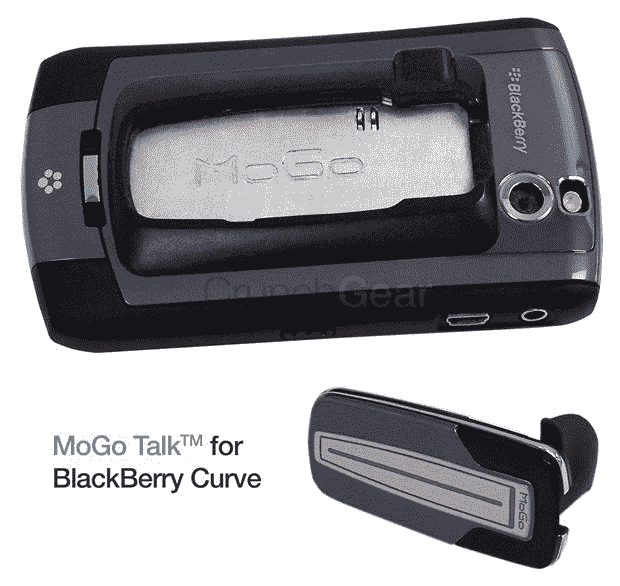
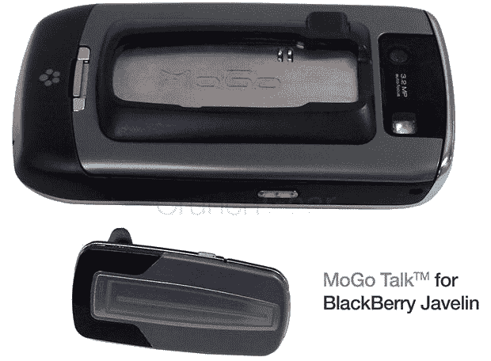
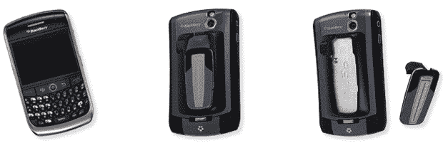

# MoGo Talk 集成折叠式蓝牙耳机系列扩展至黑莓机型，我们将赠送 50 部| TechCrunch

> 原文：<https://web.archive.org/web/https://techcrunch.com/2009/07/21/mogo-talk-5mm-bluetooth-headset-line-expands-to-blackberry-models-and-again-were-giving-50-away/>

# MoGo Talk 集成折叠式蓝牙耳机系列扩展到黑莓机型，我们将赠送 50 部

如果你痛苦地看着非常酷的 MoGo Talk 蓝牙 iPhone 耳机[在 CrunchGear 上宣布并赠送给](https://web.archive.org/web/20230322164155/http://www.crunchgear.com/2009/06/09/exclusive-mogo-talk-bluetooth-headset-for-iphone-folds-down-to-5mm-thin-were-giving-50-away/)，而你的黑莓手机却无所事事地放在你的桌子上，振作起来。BlackBerry Curve 和 BlackBerry Javelin 版本即将推出，我们将赠送 50 款 Curve 型号。

[Newton Peripherals](https://web.archive.org/web/20230322164155/http://www.newtonperipherals.com/) 开发了一款平板折叠蓝牙耳机，厚度仅为 5 毫米，安装在一个微型充电插槽中，该插槽集成在随附的替换黑莓电池盖中。因此，你的耳机一直带在身边，你可以断开手机的充电线，为给耳机充电的微型 USB 端口供电。

MoGo Talk 也将在未来用于 BlackBerry Bold 和 BlackBerry Tour，Newton 正在考虑将实际的耳机充电直接集成到手机中，以便手机本身可以在耳机对接时充电。

据牛顿外围设备公司总裁 Stuart Nixdorff 称:

“我们专门为重视在一台设备上集成电话、电子邮件和蓝牙耳机的黑莓用户设计了这些 MoGo Talk 型号。我们的最终目标是将 MoGo Talk 单元集成到所有手机中；在 RIM 的情况下，这些新的 MoGO Talk 型号在黑莓 Curve 和黑莓 Javelin 型号的背面充电和存储，Bold 和 Tour 型号紧随其后。我们正在探索与 RIM 设备的进一步集成，这将使 MoGo Talk 能够通过一根电源线直接为黑莓手机充电。”

**赠品:**注册即可赢得 50 个用于 BlackBerry Curve 的 MoGo Talk 耳机中的一个[点击此链接](https://web.archive.org/web/20230322164155/http://www.mogotalk.com/)，输入您的姓名和电子邮件地址，将在 8 月 14 日星期五东部时间 4:00 随机抽取 50 个获奖者。

售价 99 美元的曲线和售价 129 美元的标枪型号售价 129 美元，可以预订，大约一个月后开始发货。你真幸运！CrunchGear 的读者在收银台使用促销代码 **crunchgear** 可以在 [MoGo 商店](https://web.archive.org/web/20230322164155/http://mogostore.com/products.asp)购买超过 24.99 美元的任何商品获得 30%的折扣。尽情享受吧！

**链接:** [MoGo 代言黑莓曲线](https://web.archive.org/web/20230322164155/http://mogostore.com/proddetail.asp?prod=MG230-0121) | [MoGo 代言黑莓标枪](https://web.archive.org/web/20230322164155/http://mogostore.com/proddetail.asp?prod=MG230-0122)