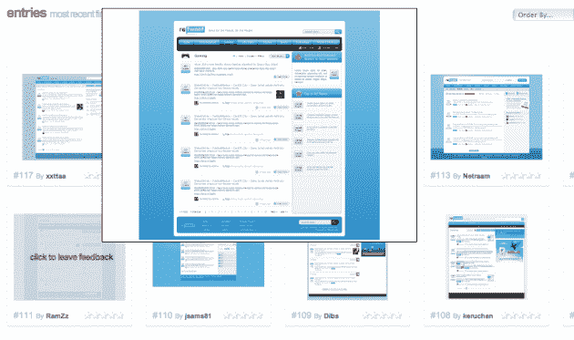

# Retweet.com 看起来是 TweetMeme 的竞争对手，其黑仔域名为 TechCrunch

> 原文：<https://web.archive.org/web/https://techcrunch.com/2009/07/26/retweetcom-looks-to-be-a-tweetmeme-competitor-with-a-killer-domain-name/>

# Retweet.com 看起来像是拥有黑仔域名的 TweetMeme 的竞争对手

你在像这样的网站上看到的那些小小的绿色 reweet 按钮帮助了 T2 在 T4 的受欢迎程度。按钮现在无处不在，这种服务似乎已经成为事实上的网络内容转发机制。但是看起来它将迎来一个挑战者，有一个杀手的名字，[Retweet.com](https://web.archive.org/web/20230220053140/http://retweet.com/)。

Retweet.com 目前只有一个登陆页面，说它“即将推出”，所以很难确切知道它是什么。但是网络上有很多线索指向它是 TweetMeme 的竞争对手。主要的线索来自于在 99designs 举办的一场设计竞赛。设计网站的奖金超过 1000 美元，所有的模型看起来都非常类似于 TweetMeme(公平地说，它的外观很多来自 Digg 等网站)。

还有更多。Retweet.com 背后的团体，Mesiab Labs(它似乎在 Twitter 社区中因为像蜂鸟这样的产品而名声不佳，一些人指责它向其他人发送垃圾邮件)，有几个与 Retweet.com 有关的网站已经上线。一个是网址缩写 [RT.nu](https://web.archive.org/web/20230220053140/http://rt.nu/) ，它显然将被用来发送来自 Retweet.com 的转发。另一个网站 [Checkretweet](https://web.archive.org/web/20230220053140/http://www.checkretweet.com/) ，搜索 Twitter 上任何用户的转发。根据这篇博客文章的说法，[这些都与网站的更大战略有关。下面是这篇文章的关键内容，*“总的来说，这些系统使我们能够比目前任何其他媒体更快地发现和发布突发新闻。”*](https://web.archive.org/web/20230220053140/http://mesiablabs.com/blog/?p=942)

所以看起来他们正在建立转发，不仅是为了接受推特迷，还有 [Digg](https://web.archive.org/web/20230220053140/http://digg.com/) 、 [Google News](https://web.archive.org/web/20230220053140/http://news.google.com/) 、 [Techmeme](https://web.archive.org/web/20230220053140/http://techmeme.com/) 以及 [Bit.ly 正在开发的新服务](https://web.archive.org/web/20230220053140/https://techcrunch.com/2009/06/29/bitlys-grand-plans-and-their-inevitable-clash-with-digg-bitly-now/)。他们所有这些的关键显然是那些被推出来然后被转发的链接。因为后一个词正在进入网络词汇，Retweet.com 有一个非常棒的领域来尝试在这个领域提供新的服务。

标志右上角的小商标也很有趣。这可能只是为了商标，因为他们可能很难在商标上标注“转发”这个词。不过，对于推特迷和所有这些绿色小按钮来说，这可能是一个非常可怕的情况。

不过，我们不要超越自己，Retweet.com 仍需执行——并启动。但这可能是值得关注的事情。

*【感谢】Orli*