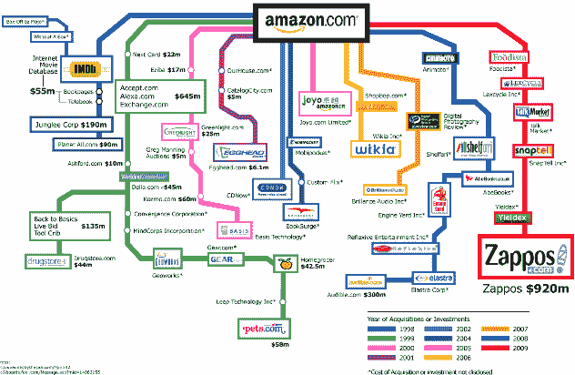

# 酷:亚马逊的收购和投资，可视化 TechCrunch

> 原文：<https://web.archive.org/web/https://techcrunch.com/2009/07/27/coolness-amazons-acquisitions-and-investments-visualized/>

# 酷:亚马逊的收购和投资，可视化

这有多牛逼？所有的荣誉都归功于 [MeetTheBoss](https://web.archive.org/web/20221006011622/http://www.meettheboss.com/amazon-acquisitions-and-investments-zappos.html) 创造了这个可视化效果(当你点击进入时，可以获得更好质量的图像)，但它太好了，不能不与你分享。

这是从 1998 年到最近以 9 . 28 亿美元收购 Zappos 的[的](https://web.archive.org/web/20221006011622/http://www.beta.techcrunch.com/2009/07/22/amazon-buys-zappos/)[亚马逊的](https://web.archive.org/web/20221006011622/http://amazon.com/)收购和投资的可视化展示。

这张图片显示，这家互联网零售巨头在 1999 年和 2001 年非常活跃，在互联网泡沫破裂后大幅缩减了投资和收购，但一直在加快步伐，特别是从去年开始。

地图上的下一个会是谁？