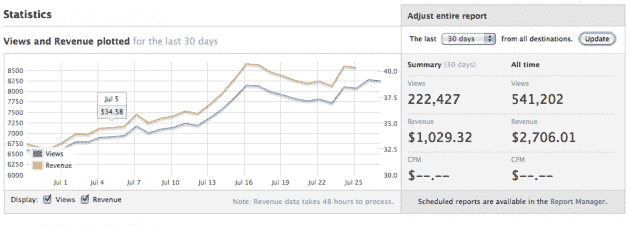
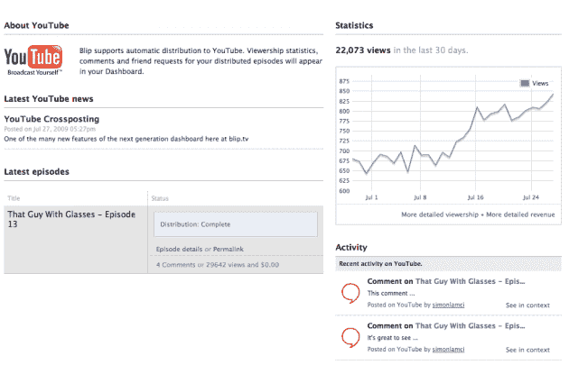
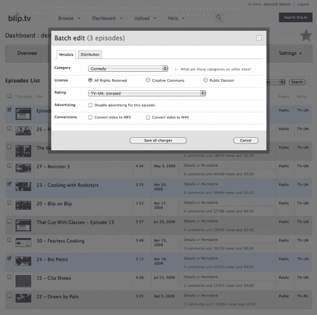

# Blip.tv 与 YouTube 和其他公司达成了一项重大分销协议；重新设计仪表板技术危机

> 原文：<https://web.archive.org/web/https://techcrunch.com/2009/07/28/bliptv-lands-a-big-distribution-deal-with-youtube-and-others-redesigns-dashboard/>

T4 的创始人迈克·哈德克刚刚达成了一系列扩大网络视频网络分销的重要协议。最大的交易是与 YouTube 的交易，这将首次允许 Blip.tv 代表使用 Blip 的网络视频创作者在 YouTube 播放器上投放自己的广告。Hudack 还宣布与 NBC Local Media 就纽约市、Vimeo 和 Roku 机顶盒的常规电视发行达成协议。它还在扩大现有的交易，在威瑞森 FIOS、Tivos 和索尼电视上播放带有以太网插孔的 Blip 视频。

大约 50，000 个不同的节目被上传到了 Blip，视频制作人员可以通过网络、iTunes 和机顶盒传播这些节目。根据该公司的数据，Blip 每月向全球 2200 万观众提供 7200 万个视频流。只有 4%的浏览量是在 Blip.tv 本身。

“我认为，通过这些交易，我们的受众将增加一倍，”胡达克说。仅凭 YouTube，他可能将观众数量翻一番。据 comScore 估计，每月有 66 亿个视频流，仅在美国就有大约 1 亿人收看。在 YouTube 上发布视频并不是什么大事。它能够分享广告收入，并获得跟踪数据。YouTube 逐渐让内容合作伙伴更容易在 YouTube 上销售和投放他们自己的广告，从年初的几个大型媒体合作伙伴扩展到今天的 50 个。

现在，YouTube 正在通过一项由前谷歌员工创建的名为 [FreeWheel](https://web.archive.org/web/20221209014707/http://www.freewheel.tv/) 的视频广告网络的试验，接纳 Blip 等较小的合作伙伴，该网络允许 Blip 和其他人在 YouTube 内提供自己的广告。Blip 仍然需要批准个人会员才能获得 YouTube 的资金，但一旦他们通过，他们可以使用 FreeWheel 设置一次广告，在 YouTube、Vimeo、Blip、 [iTunes](https://web.archive.org/web/20221209014707/http://www.beta.techcrunch.com/2008/10/28/bliptv-figures-out-how-to-serve-ads-in-itunes-videos/) 或任何地方播放。FreeWheel 负责会计和 rev-shares，当资金分成这么多份时，这就变得复杂了。在向 YouTube 和 FreeWheel 等第三方付费后，Blip 与视频创作者对半分成。

随着新的分销合作伙伴关系，Blip 已经完全重新设计了其视频管理仪表板。(参见下面的屏幕截图)。网络视频导演现在可以在一个地方看到他们的视频每集吸引了多少浏览量*和*美元。( [TubeMogul](https://web.archive.org/web/20221209014707/http://www.tubemogul.com/) 为分析提供动力)。仪表板允许他们批量编辑和分发他们的视频。他们可以在剧集列表中拖放视频来重新排序，新的顺序会自动传播到他们的 RSS 源和所有分发点。嵌入式 Blip 视频播放器本身现在也更加可定制。。

所有这些变化应该有助于 Hudack 更接近他今年实现盈利的“延伸”目标。去年 10 月，他从贝恩资本风险投资公司(Bain Capital Ventures)筹集了 520 万美元，帮助它度过了广告业低迷的最糟糕时期。“我们发现第一季度很糟糕，”他说，“但 4 月份开始引领广告收入的复苏。每个月对我们来说都是一个新纪录。”Blip 获得的平均广告费用在每千次点击 10 到 20 美元之间。

YouTube 的这笔交易应该会增加浏览量，同时给 CPM 带来下行压力。但如果浏览量上升的速度快于价格下降的速度，那么 Blip 的结局会更好。

