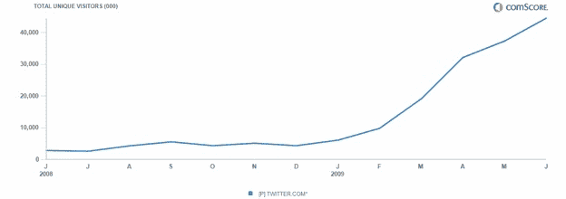

# 6 月，Twitter 全球用户达到 4450 万(comScore)

> 原文：<https://web.archive.org/web/https://techcrunch.com/2009/08/03/twitter-reaches-445-million-people-worldwide-in-june-comscore/?awesm=tcrn.ch_2l4P&utm_campaign=techcrunch&utm_medium=tcrn.ch-twitter&utm_source=twitter.com&utm_content=twitter-publisher-main>

# 6 月，Twitter 全球用户达到 4450 万(comScore)

嗯，推特并没有因为其在今年夏天早些时候发布关于伊朗选举抗议的消息而赢得[诺贝尔和平奖](https://web.archive.org/web/20221002123823/http://www.beta.techcrunch.com/2009/06/22/former-deputy-national-security-advisor-twitter-founders-should-get-nobel-peace-prize/)，但是它确实在 6 月份增加了大约 700 万新访客。根据 comScore 的数据，2009 年 6 月，Twitter 网站在全球共吸引了 4450 万独立访客。

从 2009 年 5 月[到 2009 年 5 月](https://web.archive.org/web/20221002123823/http://www.beta.techcrunch.com/2009/06/25/the-twitter-cycle-curiosity-abandonment-addiction-global-visitors-hit-37-million/)，Twitter 的全球受众健康地增长了 19%(比 2008 年 6 月更健康地增长了 1460%，当时其全球受众只有 290 万)。

推特上有 2000 万来自美国的访问者，其中 55%是国际用户。ComScore 现在认为它是世界上第 52 大网站(比 ESPN 大，仅次于 BBC 和 Craigslist)。

这些估计只计算了去 Twitter.com 的交通流量。由于超过一半的 Twitter 用户甚至不去网站，而是使用 Twitter 应用程序来消费和发布推文，Twitter 的总受众人数甚至更大。但 comScore 提供了一个衡量其增长的一致标准。