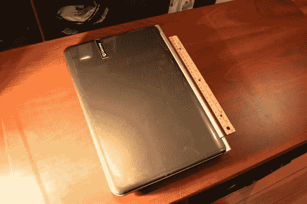
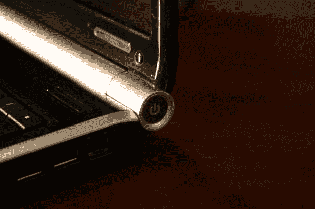
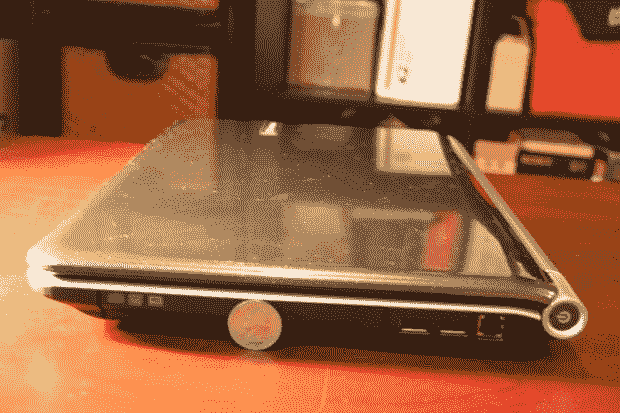
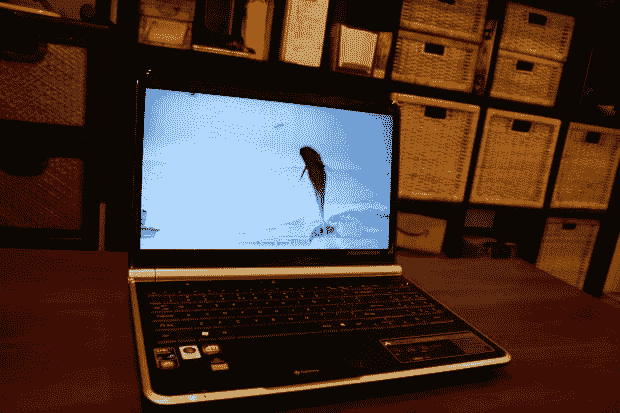
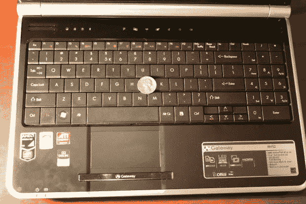
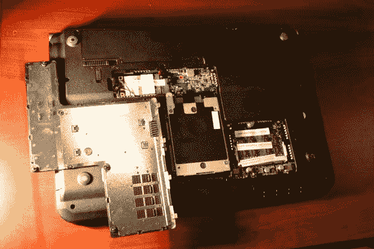

# 点评:Gateway NV5214u 15.6 英寸笔记本电脑 TechCrunch

> 原文：<https://web.archive.org/web/https://techcrunch.com/2009/08/04/review-gateway-nv5214u-156-inch-notebook/>

**快速版:** Gateway 面向学生的新 NV 系列产品性价比很高，尽管这款机器几乎太重太笨重，无法作为真正的便携式计算机使用。不过，如果它大部分时间都呆在桌子上，你就能以一台昂贵的上网本的价格买到一台功能齐全的电脑。

**特点及规格:**

*   AMD 速龙 64 X2 QL-64 双核 CPU (2.1GHz)
*   15.6 英寸屏幕(1366×768 分辨率)
*   64 位 Vista 家庭高级版
*   4GB DDR2 内存
*   320GB SATA 硬盘
*   802.11b/g/n
*   ATI 镭龙高清 3200 显卡
*   六芯电池
*   8x DVD 刻录机
*   四个 USB 端口、HDMI、VGA 输出、读卡器
*   重量:6.82 磅
*   建议零售价:329 美元

设计:对于一台 530 美元的电脑来说，外观和感觉都很不错。它仍然主要是塑料，但它有一种人造拉丝铝装饰，盖子上有一个微小的联锁六边形装饰。触控板按钮是一个很酷的细长反光条，电源按钮位于右铰链内。

就便携性而言，这东西是个庞然大物，重量接近 7 磅。它的占地面积也很大，宽 14 英寸，长 10 英寸，厚 1.25 英寸。

我真的不知道为什么 Gateway 会将这台电脑作为返校产品的一部分，因为作为一个仍然记得学生时代的人，除非绝对必要，否则我不会在校园里拖着它。

**屏幕:**15.6 英寸的屏幕足够大，足够亮。这里没有抱怨。视频播放流畅，液晶显示器足够明亮，可以防止眩光和反光。分辨率是标准的 1366×768，720p 视频看起来很棒。Gateway 可能会在这里挤一个 1400×900 的面板，但这会大大提高整体价格。

键盘:我会第一个承认我不是大笔记本的粉丝。然而，大笔记本通常会有大而宽敞的键盘。因此，Gateway 决定在 NV 系列的键盘上添加一个 10 键数字小键盘有点令人沮丧。

我更喜欢一个巨大的、伸开的键盘。相反，有一个不错的键盘，位置稍微偏离中心。如果你能相信的话，按键感觉有点拥挤。过一段时间你会习惯的，但是对于那些要一直打字的人来说，这不是一个很好的键盘。再次，有点挫败了向学生推销这台电脑的想法。

关于 Gateway 笔记本键盘的有趣事实:我在 2006 年初花 600 美元买了一个 [Gateway MX3215](https://web.archive.org/web/20230129141919/http://support.gateway.com/s/Mobile/Q106/Magic/5948nv.shtml) ，直到今天，它仍然是我用过的最好的笔记本键盘。我把它给了我妈妈，现在她打字很快！

**电池:**电池续航时间还可以——虽然不是很好。我能够管理平均近两个半小时的实际计算。那是上网冲浪、听音乐、看电影短片和玩一些老游戏的混合。关闭 Wi-Fi，亮度调低到 50%左右，你应该能坚持近三个小时。无论是哪种情况，你可能都想随身携带充电器。

**性能:** Gateway 做了正确的事情，在这台机器上标准配置了 4g 内存(实际上在 Fry's 上有一个特殊的 3GB 版本)。Windows 体验指数为 3.7，受到图形的困扰，但 64 位版本的 Windows Vista Home Premium 表现良好。免费升级到 Windows 7 应该会让事情变得更顺利，升级内存和硬盘不会花太多时间。

你不会用 ATI 3200 图形芯片玩任何严肃的游戏，但旧游戏和当前的休闲游戏都可以玩得很好。反正你应该在做作业！

其他功能: HDMI out 是一大优势，可以轻松将笔记本电脑连接到高清电视。蓝牙是一个受欢迎的附加功能，但有时会被低价笔记本排除在外。音频系统由杜比驱动，音量足够大，尽管音乐和视频在最大音量下会发出劈啪声、爆裂声和爆裂声，所以你应该保持 80%左右的音量。但是，如果没有外部扬声器，你就无法在家庭聚会(甚至宿舍聚会)上大放异彩。

**总体而言:**就价格而言，这是一个配置不错的系统。你得到了一个快速的处理器，大量的内存，一个像样的图形芯片，一个漂亮的屏幕，以及像 HDMI out 和蓝牙这样体贴的附加功能。然而，作为一台便携式电脑，它一点也不便携。近 7 磅的 NV 系列即使是最轻的背包也会让人感到不舒服，同时还会占用大量空间。不过，如果它注定要在办公桌上度过大半辈子的话，NV 系列还是很划算的。

【Gateway.com】网关 NV 系列