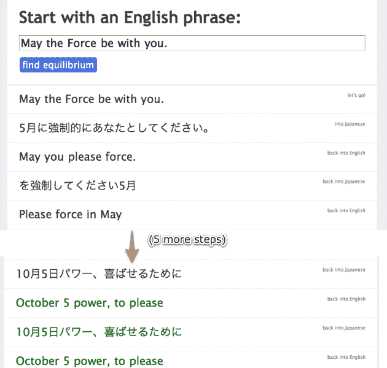

# 翻译党:挖掘谷歌翻译不为人知的创意天才

> 原文：<https://web.archive.org/web/https://techcrunch.com/2009/08/07/translation-party-tapping-into-google-translates-untold-creative-genius/>

# 翻译党:挖掘谷歌翻译不为人知的创造性天才

任何使用过谷歌自动翻译服务的人都知道它并不完美——通常你会找到与你开始时非常接近的词，但谷歌不可避免地决定改变至少几个句子的意思，只是为了好玩。今天，有一个新网站挖掘了谷歌翻译被低估的创造力，并将其放大到伟大的地步:[翻译党！](https://web.archive.org/web/20230326033907/http://translationparty.com/)。

这个网站简单得令人难以置信:你输入任何你能想到的英语短语，它就会使用谷歌的自动翻译程序将其转换成日语。然后它把它翻译回英语。又变回日语。在这个过程中的每一步，你开始用的词逐渐成形，形成完全不同的东西，而且(希望)很棒。重译会持续下去，直到你达到该网站所说的“平衡”，即英语和日语单词来回翻译成完全相同的东西。幸运的是，你的话通常至少需要几步才能达到平衡，由此产生的句子往往令人捧腹。

在这个网站上真的没什么别的事可做，但这绝对是消磨时间的好方法。电影台词和歌词似乎效果最好。你也可以点击页面底部的“崩溃其他方”来查看其他人生成的一些结果列表。

好好享受吧。和 10 月 5 日的权力，来取悦。
