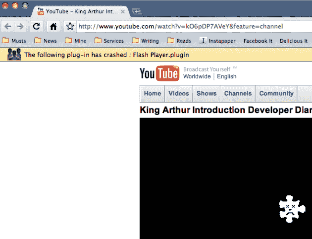

# Mac 版 Chrome 继续前进，推出书签和更好的 Flash TechCrunch

> 原文：<https://web.archive.org/web/https://techcrunch.com/2009/08/12/chrome-for-mac-continues-march-forward-with-bookmarks-and-better-flash/>

# Mac 版 Chrome 继续前进，推出书签和更好的 Flash

关于谷歌 Chrome 浏览器的 Mac 版如何继续朝着完全可以日常使用的[方向发展，我们已经写了大约六次了。今天又带来了这方面的新进展。](https://web.archive.org/web/20221006105557/http://www.beta.techcrunch.com/2009/07/16/chrome-for-mac-starting-to-look-polished/)

最新版本的 [Chromium for Mac](https://web.archive.org/web/20221006105557/http://build.chromium.org/buildbot/snapshots/) 增加了对书签导入的支持，现在默认情况下有一个书签栏。这是许多用户在开始全职使用它之前一直声称需要的功能之一。现在这些用户可以。

另一方面也有好消息:Flash 现在在 Mac 版 Chrome 中更容易使用了。以前，我们写的是当[开始工作的时候](https://web.archive.org/web/20221006105557/http://www.beta.techcrunch.com/2009/08/01/dont-look-now-but-flash-is-kind-of-working-on-chrome-for-mac/)在 YouTube 上播放视频，但是现在你实际上可以暂停和跳转这些视频，就像在任何其他网络浏览器上一样。

需要注意的是，进入 YouTube 视频的高清模式会导致 Flash 插件崩溃。但是，正如谷歌一直吹捧的那样，崩溃并没有使整个浏览器崩溃，相反，我只是收到了一个小的下拉通知，即 to 插件被关闭。打开一个新标签，重新启用它。

在这些最新版本中，还有一个稍微新的选项卡主页。现在可以恢复您之前在该选项卡页面上删除的缩略图，这很好。虽然我不完全确定这是不是新功能，但是您也可以设置默认的搜索引擎。不过，有趣的是，Bing 不是一个选项，只有 Live Search 是。

虽然我一直断断续续地使用这些 Chromium 版本进行随意浏览，主要是为了测试它们，但我认为我已经到了准备全职使用它的时候了。我只是很难找到对它不起作用的东西。当然，插件支持还没有完全成熟，但是作为一个非 Firefox 用户，我并不真的使用插件。是的，[许多主题都很可怕](https://web.archive.org/web/20221006105557/http://www.beta.techcrunch.com/2009/08/04/google-chrome-official-themes-collect-all-29-but-some-make-your-eyes-bleed/)，但是默认的看起来很好——尽管我希望看到更好看的书签文件夹。黄色的让我想起了 Windows 3.1。

正如 [DownloadSquad 今天早些时候提到的](https://web.archive.org/web/20221006105557/http://www.downloadsquad.com/2009/08/12/google-chrome-to-reach-v4-before-firefox-work-begins-on-chromiu/)，这些最新版本的 Chromium 被标记为 4.0+版本。当 Chrome for Mac 准备推出 4.0 版本时，我们会看到它正式公开发布吗？这看起来是可能的，我敢打赌，这将是迟早的事。

