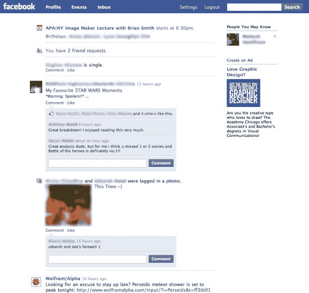
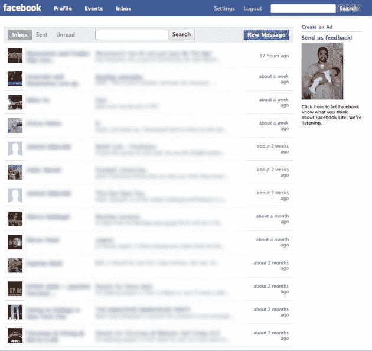
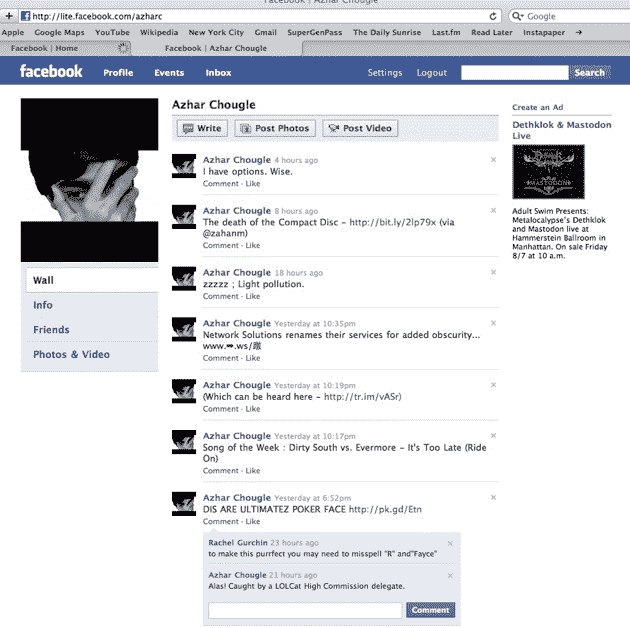
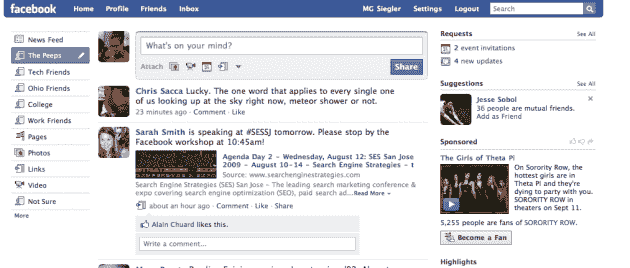

# 图片中的脸书。用户 TechCrunch 说:“快多了。”

> 原文：<https://web.archive.org/web/https://techcrunch.com/2009/08/12/facebook-lite-in-pictures-so-much-damn-faster-says-user/>

# 图片中的脸书。“快多了，”用户说

所以，我们已经解释了为什么[新发布的](https://web.archive.org/web/20230218160520/https://techcrunch.com/2009/08/11/facebook-begins-testing-facebook-lite-a-faster-simpler-version-of-the-service/)“脸书精简版”至少[没有被认为是一个“推特杀手”，](https://web.archive.org/web/20230218160520/https://techcrunch.com/2009/08/12/what-facebook-lite-actually-is-hint-its-not-twitter/)但它看起来确实很有趣。这项服务目前正在印度进行测试(遗憾的是，尽管昨晚发出了消息，但没有在美国进行测试)，它的外观和感觉都非常干净，让人想起脸书的旧时光，当时它简化的外观将用户从杂乱的 MySpace 吸引过来。当然现在，脸书本身就是堆满了设置、应用程序和工具栏的[。因此，对许多人来说，这种脸书精简版设计会受到欢迎。](https://web.archive.org/web/20230218160520/https://techcrunch.com/2009/04/28/keep-it-simple-stupid/)

看看我们从用户[阿兹哈尔·乔格尔](https://web.archive.org/web/20230218160520/http://www.azharc.com/)那里收到的图片吧，他正在印度测试。他指出，当你试图进入活动和场景时，会出现第三张图片(显示有东西损坏的那张),这显然还没有为脸书精简版做好准备。你还会注意到“事件”现在出现在顶部的导航栏中，这在当前版本的脸书上是没有的。

也许最重要的是，Chougle 指出，“让我告诉你，它比普通的脸书快多了。”尽管他和我们都不明白图 2 中那个“向我们发送反馈”的家伙是怎么回事(他实际上是脸书移动和国际业务增长副总裁查马斯·帕里哈皮蒂亚)。最后一张照片是我自己的，明显比现在的脸书主页更杂乱。

