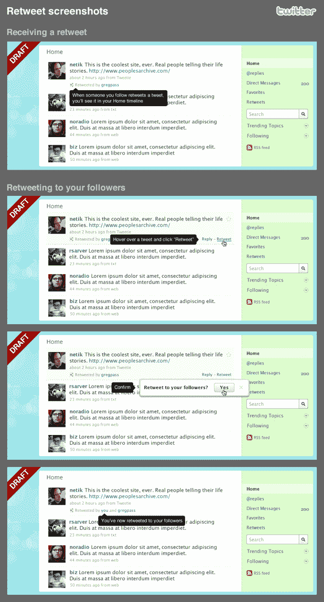

# 推特正在改造转发，推出转发应用编程接口|技术危机

> 原文：<https://web.archive.org/web/https://techcrunch.com/2009/08/13/twitter-announces-a-retweeting-api/>

# 推特正在改造转发，推出转发应用编程接口

在开发者谷歌集团中，推特刚刚发布了 T2 公告 T3，它将发布一个全新 API 的早期预览:转发 API。这还不是全部，推特正在彻底改造其转发功能。

从表面上看，这可能意味着推特上一些相当大的变化。正如您在上面和下面的模型中所看到的，转发(在大多数推文中写为“RT”)不再是实际推文本身的一部分，而是推文下方的一个链接。虽然这肯定是一种更干净的做事方式，但有趣的是，这是否会让转发变得更少或更有吸引力。它可能有助于用户找到新的关注对象(更多信息见下文)。

但是正如联合创始人[比兹·斯通](https://web.archive.org/web/20230314041722/http://www.crunchbase.com/person/biz-stone)在推特[博客](https://web.archive.org/web/20230314041722/http://blog.twitter.com/2009/08/project-retweet-phase-one.html)上指出的，目前在 twitter.com 转发的方法是一个繁琐的复制和粘贴过程。他们想改变这一点。他称这个为“项目转发”的“第一阶段”，并指出它首先将被发送给开发者，这样他们就可以为这个变化做好准备，并指出它还没有为黄金时段做好准备:

> 我们仍然在勾画这个特性和它的 API 对应物是如何工作的。发布前分享我们的想法意味着开发者将有机会准备他们的应用程序。几周后，我们将在我们的网站上发布该功能，因为应用程序开发人员有机会做好准备，它应该会在同一时间在推特生态系统的大部分地方发布。这样，我们都可以享受转发——无论我们选择如何访问推特。

此事的影响可能会更大。有了这种新方法，你所有的朋友都会在他们的时间线中看到你转发的原始推文(除非他们关闭了这个选项)。因此，如果我没有关注斯通向右画的例子中的 [@ev](https://web.archive.org/web/20230314041722/http://twitter.com/ev) (Twitter 联合创始人[伊万·威廉姆斯](https://web.archive.org/web/20230314041722/http://www.crunchbase.com/person/evan-williams))，我仍然会在我的信息流中看到他的推文，因为斯通转发了它。这似乎是一个发现新追随者的好主意。

Stone 指出，新的 retweet 外观将首先在一段时间内向有限的用户群推出，以便团队可以测试它在系统上的工作情况。几周后，它将在更大范围内推广。

Twitter 开发者 Marcel Molina 在 Twitter 开发者 Google Group 中写道:

> 转发已经成为推特体验中的文化惯例之一。这是 Twitter 用户发现使用这项服务的创新方式的又一个例子。我们喜欢。很快，它将成为 twitter.com 的一个本地支持功能。看起来我们只需要几个星期就可以准备好发布它了。我们希望向平台开发者社区展示我们为转发而设计的 API，这样那些希望在其应用程序中支持它的人就有足够的时间在发布日之前准备好。我们计划为开发者提供一种创建转发的方式，在你的时间线中识别转发，并在其他推文中突出显示。我们还为几个转发时间线提供了 API:你创建的转发，你关注的用户创建的转发，以及你的推文被其他人转发。

下面找到一些截图样机，这将是什么样子。

