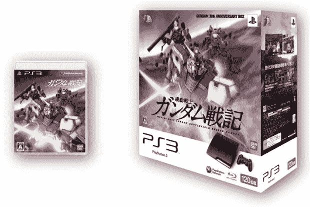

# 高达将成为第一款索尼 PS3 超薄套装 TechCrunch

> 原文：<https://web.archive.org/web/https://techcrunch.com/2009/08/19/gundam-to-be-the-very-first-sony-ps3-slim-bundle/>

# 高达是第一款索尼 PS3 超薄套装

索尼喜欢他们的一些捆绑包，高达专营权将是第一个优雅的盒子里的 [PS3 超薄](https://web.archive.org/web/20221007185201/http://www.crunchgear.com/tag/ps3-slim/)。日本独有的盒子将包括 *Kidou Senshi Gundam Senki* 并将为玩家节省几日元。但该包还包括 FA-78-3 全装甲高达和 RX-81AS 突击装甲 DLC 包的产品代码，以及一部原创高清动画高达电影。

该套装将于 9 月 3 日与标准 PS3 Slim 一起上市。它的售价为 38，359 日元，比主机和游戏分开的价格低 50 日元。顺便说一句，那只是大约 53 美分。但是，嘿，如果你是一个高达迷，并且你知道你是谁，这个盒子可能就是你想要的东西，可以和你收藏的玩偶一起展示。也许你可以用它做一个漂亮的洋娃娃房子。那会很酷。先问问你妈妈你能不能用剪刀。

[[andriasang](https://web.archive.org/web/20221007185201/http://www.andriasang.com/e/blog/2009/08/19/ps3_gundam_bundle/)via[Destructoid](https://web.archive.org/web/20221007185201/http://www.destructoid.com/gundam-gets-the-honor-of-hosting-the-ps3-slim-s-first-bundle-144957.phtml)