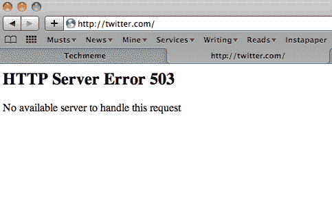
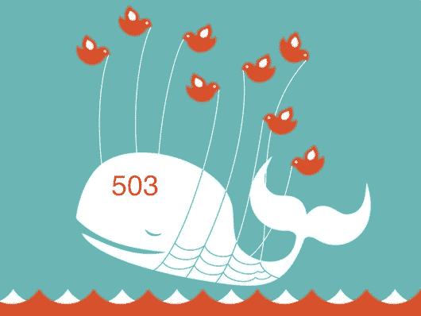

# 老失败鲸鱼可爱多了

> 原文：<https://web.archive.org/web/https://techcrunch.com/2009/08/24/the-old-fail-whale-was-so-much-cuter/>

# 老失败的鲸鱼可爱多了

503 错误？我们是认真的吗，推特？是的，这个有着辉煌历史的服务又一次失败了。但是，不是返回可爱的，令人想抱抱的失败的鲸鱼，我们都知道和爱，每个人都得到一个无聊的老 503 错误。

对于那些不精通服务器语言的人来说，503 [的意思是](https://web.archive.org/web/20230403232734/http://www.checkupdown.com/status/E503.html):

> 由于临时过载或服务器维护，Web 服务器(运行网站)当前无法处理 HTTP 请求。这意味着这是一种暂时的情况，经过一段时间后会得到缓解。处于这种状态的一些服务器也可能简单地拒绝套接字连接，在这种情况下，由于套接字创建超时，可能会生成不同的错误。

我们能不能至少用 503 Whale 重新路由到另一个服务器？

一如既往，这里是我们的建议列表，当推特关闭时该怎么做。

**更新**:这是来自 Twitter 的[更新](https://web.archive.org/web/20230403232734/http://status.twitter.com/post/170695014/we-are-responding-to-an-unexpected-service-interruption)，除了显而易见的(我们被淘汰)之外，没有任何其他信息。

**更新 2** :我们回来了。目前还不知道是什么问题。