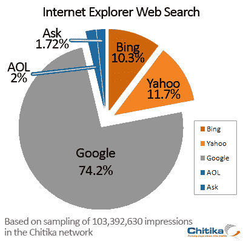

# 谈到搜索，将必应捆绑在 IE 中几乎不会给它带来优势|技术危机

> 原文：<https://web.archive.org/web/https://techcrunch.com/2009/08/25/when-it-comes-to-search-bundling-bing-in-ie-barely-gives-it-an-advantage/>

# 谈到搜索，将必应捆绑在 IE 中几乎不会给它带来优势

回到 20 世纪 90 年代，在网景和互联网浏览器之间的原始浏览器战争中，微软的主要武器之一是能够将 IE 捆绑到 Windows 中作为默认浏览器。捆绑销售带来了市场份额，或者说政府在针对雷德蒙的反垄断案中也是如此。

快进到今天的搜索大战。你会认为将搜索引擎捆绑到浏览器中会对市场份额产生一些 T2 效应。但是搜索广告网络 [Chitika](https://web.archive.org/web/20230315095322/http://chitika.com/) 提供的一些新数据表明，至少对必应来说，与 IE 捆绑在一起并没有起到多大的作用。

Chitika 之前发现必应搜索者对 click-happy(T6)非常满意，并通过其 5 万个网站的网络查看了超过 1 亿条搜索广告，以确定人们使用的是哪种浏览器和搜索引擎。虽然必应作为默认搜索引擎与 IE 捆绑在一起，但只有 10.3%的 IE 用户使用必应进行搜索。相比之下，87%的火狐用户使用谷歌搜索，92%的 Safari 用户使用谷歌搜索。谷歌是这两种浏览器的默认搜索引擎。它在工业工程上也占有 74%的份额，表明大多数人在转换上没有困难。

所以捆绑销售显然没有给必应在 IE 用户中带来太大优势。10.3%的份额仅略高于 comScore 衡量的必应在美国的总搜索份额[8.9%](https://web.archive.org/web/20230315095322/https://techcrunch.com/2009/08/17/bings-marketshare-continued-to-creep-upwards-in-july/)，我提到这一点只是作为参考。(这些数字并不真正具有可比性，因为它们来自两项不同的研究，而且 Chitika 数字包括加拿大和美国)。好吧，至少反垄断警察不能再提起捆绑销售的老话题了。

**更新**:必应只是你第一次下载的默认搜索引擎。与任何浏览器一样，当您升级时，您的设置会被传输。此外，个人电脑制造商与搜索引擎达成双赢的协议，并可以提供他们想要的默认搜索引擎。目前，必应是戴尔(全球)、惠普(美国和加拿大)和联想(全球)电脑的默认搜索引擎。