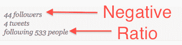

# Twitter 的黄金比例(没人喜欢谈论这个比例)

> 原文：<https://web.archive.org/web/https://techcrunch.com/2009/08/26/twitters-golden-ratio-that-no-one-likes-to-talk-about/>

如果你是 Twitter 新手，生活很简单。有人通知你有人在跟踪你，你可能会跟踪他们回来。毕竟，你会希望你的信息流中有一些推文。这样做了几十次后，你可能会开始更加谨慎，查看这个人的个人资料和他们最近的推文。但这也很快就过时了，你不可避免地会使用几乎所有人都知道的秘密比率(不管他们是否意识到)来确定谁值得追随:“追随者”与“追随”。

如果一个人的关注者比他们正在关注的人多，他们可能是一个至少可以考虑关注的好人。如果他们追随的人比他们拥有更多的追随者，情况可能正好相反。这两个数字之间的差异越大，这两个数字越有可能是真实的——在某种程度上，因为像奥普拉这样的名人打破了这个系统。但是对于普通的非好莱坞名人来说，这个系统作为一个过滤器非常有效。

这种方法如此有效的一个原因是，每当你有了新的追随者，你就会收到电子邮件通知，把这些信息放在最前面和最中心。在他们的个人资料图片旁边，这些电子邮件列出了:

1–用户拥有的关注者数量

2–他们发布的推文数量

3–用户关注的人数

如果 1 大于 3(姑且称之为“正比率”)，就值得点击进入这个人的个人资料。如果 1 比 3 大得多，它们至少是值得一看的。如果 3 远远大于 1(“负比率”)，那么他们很有可能是垃圾邮件发送者或营销者(因此，可能是你不想关注的人)。如果他们的比率接近相等，他们可能值得在个案的基础上观察。

显然，总有例外。在逐个用户的基础上，人们会有负比率的朋友，但他们显然会追随他们而不管比率如何。但是在大范围内，当你收到需要过滤的多个请求时，系统工作得相当好。

也就是说，这个帖子无疑会惹怒很多人。

事实是，虽然大多数人在某种程度上意识到这个比例是真实的，但很多人不喜欢谈论它。原因是它违背了社交网络的一个基本信念:如果你追随某人，不管你承认与否，你都希望他们追随你。但事实是，在 Twitter 上，由于其不对称的社交图谱，这种情况往往不会发生。

因此，我们有一个 Twitter 生态系统，它的负比率用户比其他用户多。没有人喜欢被人说它们不是美丽独特的雪花，所以如果这让你们有些人不高兴，我可以理解。但这并没有减少它的真实性。

自从 Twitter 诞生以来，人们就一直在抱怨巨大的正比例:“他只关注 10 个人”，等等。言下之意是，如果很多人关注你，但你没有关注很多人，你就不是一个“真正的”Twitter 用户。这种言论已经有所减少，现在 Twitter 上的一些名人不可能被指望关注数百万人，但许多用户仍然抱怨关注者/关注不平等。

但事实是，一个人在 Twitter 上只能关注这么多人，关注的想法才会变得毫无意义。因为 Twitter 没有内置的关系过滤器，也不能只搜索你正在关注的人(FriendFeed 和其他一些具有 Twitter 功能的服务都提供这两种功能)，如果你在关注成千上万的人，你从任何一个关注者那里获得有意义的体验的可能性都很小。

但是如果你只关注 20 个人，而且你在 Twitter 上很活跃，你可能会看到这 20 个人说的每一句话。这就是为什么人们开始建立单独的账户来关注他们真正想关注的人(T2)。从某种意义上来说，这是一种过滤方法。

追随成千上万人的想法简直太荒谬了。就我所见，正如我上面提到的，最经常这样做的人要么是垃圾邮件发送者，要么是试图推广某些东西的人。这个想法是，你追随的人越多，就越有可能追随你，你推广的东西就越有影响力(即使是你自己)。

现在，再一次，在每个人开始在评论中尖叫之前，我知道这个规则有例外。当然，对于尝试使用 Twitter 并积累粉丝的新用户来说，这个比例并不适用。但是当我们开始拥有成百上千的粉丝时，这个比例就开始起作用了。

此外，我只是指出一个你可能已经在使用的系统，不管你是否意识到(或者承认)。