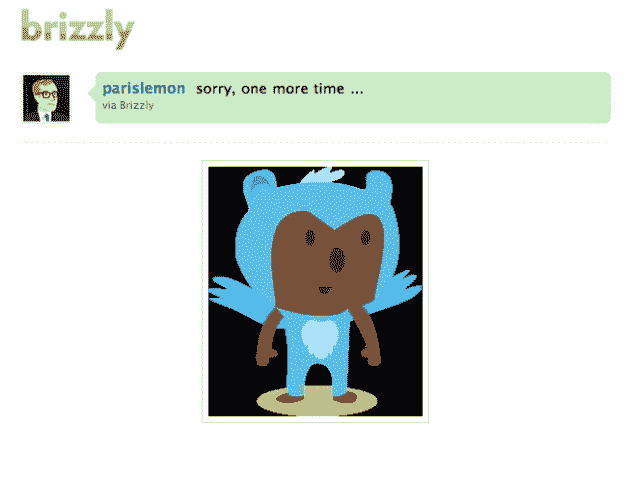
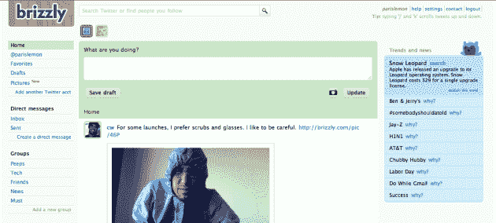

# Brizzly 增加了照片上传。TC 读者 500 个邀请。TechCrunch

> 原文：<https://web.archive.org/web/https://techcrunch.com/2009/09/01/brizzly-adds-photo-uploads-500-invites-for-tc-readers/>

# Brizzly 增加了照片上传。TC 读者 500 个邀请。

 [Brizzly](https://web.archive.org/web/20230213113617/http://brizzly.com/) ，新的基于网络的 Twitter 客户端[在 7 月份我们的实时流处理上首次推出](https://web.archive.org/web/20230213113617/https://techcrunch.com/2009/07/10/brizzly-a-twitter-reader-from-the-people-who-brought-you-google-reader/)，今天增加了一个新功能:照片上传。用户现在可以将图片上传到 Brizzly 的服务器上，他们会将你输入的任何信息发送出去。这是对 Brizzly 的一个很好的补充，因为它的关键特性之一是图像的内联显示。

除了这项新功能，Brizzly 还宣布今天将推出更大范围的测试版。因此，他们给了我们 500 份邀请函，发给 TechCrunch 的读者。只需前往 brizzly.com，使用代码:'**多功能图书馆【T6]'进行注册。**

除了流内图像，Brizzly 还显示来自用户推文流的视频。虽然联合创始人杰森·谢伦告诉我们，他们今天没有视频宣布，但它正在工作中。我们被告知，现在，这些图片将会被放在亚马逊的服务器上。

当这些照片被发送到其他 Twitter 服务上时，它们使用 brizzly.com 的网址，将用户导向一个特别的华丽的照片页面。在这个页面上，你可以看到照片被浏览了多少次，什么时候上传的，是谁上传的，这些都是很标准的东西，但它的界面比其他 Twitter 照片分享服务更好。

在 Brizzly 的左侧菜单中还有一个新的区域，只用于查看通过该服务上传的照片。

我们已经试用 Brizzly 几个星期了，这是一个非常好的与 Twitter 交互的界面。除了内嵌的图像和视频，它还提供了一种很好的方式来查看和回复收到的直接消息，并向你解释为什么 Twitter 上的某些项目是热门话题。最重要的是，如果你关注很多人，你可以将你关注的人分组在一起，以减少 Twitter 上的混乱。还支持多个 Twitter 账户。

Brizzly 为如何使用它整理了一份评论指南[在这里](https://web.archive.org/web/20230213113617/http://blog.thinglabs.com/press/brizzly-reviewers-guide/)。你也可以在下面的视频中了解更多(注意，从这个视频开始，界面略有更新)。

