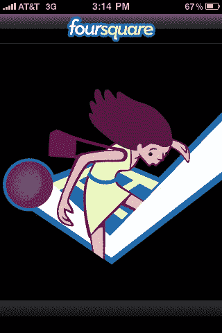

# 已证实:Foursquare 从联合广场和奥莱利 AlphaTech | TechCrunch 获得 135 万美元

> 原文：<https://web.archive.org/web/https://techcrunch.com/2009/09/04/confirmed-foursquare-gets-135-million-to-play-with/>

# 已证实:Foursquare 从联合广场和奥赖利阿尔法技术公司获得 135 万美元

正如我们[两天前提到的](https://web.archive.org/web/20230225055501/https://techcrunch.com/2009/09/02/android-now-plays-foursquare-too/)，基于位置的社交网络 [Foursquare](https://web.archive.org/web/20230225055501/http://playfoursquare.com/) 刚刚筹集了第一轮资金。PaidContent [通过一份 SEC 文件发现了](https://web.archive.org/web/20230225055501/http://paidcontent.org/article/419-socisl-app-foursquare-takes-in-1.35-million-in-funding-from-unionsquare/)关于种子轮的消息，我们已经与该公司确认了该轮融资。

不出所料， [Union Square Ventures](https://web.archive.org/web/20230225055501/http://www.crunchbase.com/financial-organization/union-square-ventures) 是投资者之一，但参与这轮投资的还有[O ' Reilly alpha tech Ventures](https://web.archive.org/web/20230225055501/http://www.crunchbase.com/financial-organization/o-reilly-alphatech-ventures)，以及一些天使投资者，联合创始人[丹尼斯克劳利](https://web.archive.org/web/20230225055501/http://www.crunchbase.com/person/dennis-crowley)目前还不准备透露。这一轮实际上是 135 万美元。

几周以来，有很多关于联合广场的弗雷德·威尔逊如何喜欢上这家总部位于纽约的公司的谈论。但加入 Foursquare 董事会的不是威尔逊，而是联合广场的阿尔伯特·温格。

Foursquare 在一些科技早期采用者中是一个热门的创业公司，特别是在旧金山和纽约这样的城市。该服务目前主要通过其 iPhone 应用程序使用，但正如我们两天前首次报道的那样，它刚刚推出了 Android 版本。黑莓应用程序也将在未来几周推出，Windows Mobile 应用程序最早可能在下个月推出。还有一个用户可以使用的移动网络界面。

最近，Foursquare 已经开始用它的应用程序做一些事情来展示利用位置进行商业模式的潜力。该公司已经[开始提醒用户](https://web.archive.org/web/20230225055501/https://techcrunch.com/2009/08/20/free-beer-foursquare-starts-alerting-users-of-nearby-mayor-deals/)附近的某个场地有交易。目前，这些交易主要集中在“市长”身上，也就是说，如果一个人在一个地方签到次数最多。一些场馆开始向市长们提供类似[免费啤酒](https://web.archive.org/web/20230225055501/https://techcrunch.com/2009/05/29/foursquare-to-serve-up-api-more-mobile-apps-free-beer/)的优惠，因为这显然有利于他们吸引更多想要入住的人回来。

Foursquare 在定位领域是一个有趣的玩家，因为它和其他任何东西一样都是一个游戏。用户竞争市长职位，并试图赚取徽章和获得更多地方的检查点。“签到”而不是不断更新的[背景位置](https://web.archive.org/web/20230225055501/https://techcrunch.com/2009/09/04/background-location-finds-a-loopthole-on-the-iphone/)的想法也使它与众不同，并使一些人对位置跟踪方面不那么不安，因为你必须在一个位置明确地签到。

Foursquare 是由克劳利和纳文·塞尔瓦杜莱创办的，克劳利离开谷歌是因为他们买下了谷歌之前的(类似的)创业公司 Dodgeball，并决定放弃它。今年一月，谷歌[正式放弃了它](https://web.archive.org/web/20230225055501/https://techcrunch.com/2009/01/14/google-axes-dodgeball-jaiku-video-and-more/)。克劳利坚持说，不管发生了什么，他现在与谷歌有着良好的关系。