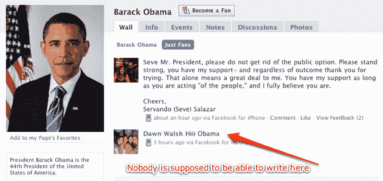

# 新的脸书 iPhone 应用程序带来了新的隐私漏洞

> 原文：<https://web.archive.org/web/http://techcrunch.com/2009/09/08/new-facebook-iphone-app-brings-new-privacy-bugs-with-it/>

脸书的隐私漏洞并不新鲜，但这并没有让它们变得更容易被接受。上周，我们听到了一种相对温和的新病毒，但这可能是恶作剧制造者和垃圾邮件制造者的大展身手之日。别担心，它不会让任何人接触到你的个人信息——但它确实让你可以在任何你想要的脸书页面上发帖，这对脸书的主要品牌或竭尽全力保持原始公众形象的政治家来说可不是什么好消息。上周，我们与脸书讨论了这个问题，并在今天晚上发布修复程序之前一直保持这个帖子。

这个最新的漏洞源于脸书令人印象深刻的新 iPhone 应用程序，该应用程序于一周前在 T2 发布。这款新应用复制了脸书主页上的许多功能，包括浏览新闻源和脸书页面，以及向这些源发布内容。不幸的是，该应用程序未能注意到这些操作所涉及的一些隐私设置。

在脸书上，页面管理员可以控制谁可以在他们的墙上发帖，如果你想保持页面整洁，只显示你的更新，你可以阻止用户发表评论。或者，你可以让用户评论到一个“只为粉丝”的区域，或者你可以在同一个 feed 中显示粉丝评论和页面更新。大多数品牌使用第一个或第二个选项，因此新访客只能看到他们默认控制的内容(如共享链接和状态更新)。

iPhone 应用程序忽略了这些设置，允许你发布到一个页面，即使它只是应该显示来自页面管理员的帖子。因此，举例来说，你可以访问奥巴马总统的页面，这可以理解，不允许任何评论，并写任何你想他的饲料。当然，这不会像他的更新那样被联合发布给其他用户，但任何访问过 Facebook.com/BarackObama 的人都会看到你的信息隐藏在奥巴马总统的共享链接之间。

当然，这并不是第一次出现这样的漏洞——在过去的几年里，我们已经看到了许多[利用](https://web.archive.org/web/20230204195741/https://techcrunch.com/2009/03/20/facebook-bug-reveals-private-photos-wall-posts/)让用户访问他们本不应该看到的数据。事实上，这款 iPhone 应用程序之前就有问题:发布后不久，用户发现该应用程序[忽略了](https://web.archive.org/web/20230204195741/http://twitter.com/iKurt/statuses/3589461932)他们状态更新的隐私设置，这意味着原本应该被阻止查看更新的朋友无论如何都会看到。这很快通过服务器端的修复得到解决，但是很可怕的是，它可能首先发生。鉴于这些漏洞的频率，很明显脸书的安全和隐私设置绝不是坚如磐石，我们看到更严重的违规似乎只是时间问题。

感谢 [Seve Salazar](https://web.archive.org/web/20230204195741/http://www.fauxtobox.com/) 的提示。