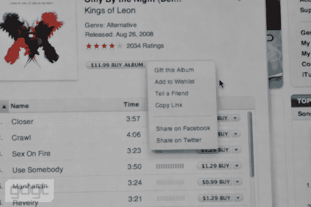

# iTunes 连接脸书和推特技术危机

> 原文：<https://web.archive.org/web/https://techcrunch.com/2009/09/09/itunes-connects-with-facebook-and-twitter/>

# iTunes 与脸书和推特相连

苹果的摇滚活动正在如火如荼地进行，他们刚刚宣布，你可以通过脸书和推特分享你感兴趣的专辑。这并不完全是一个独特的功能——我们已经看到像[拉拉](https://web.archive.org/web/20221006004733/http://www.lala.com/)这样的音乐网站以及很多其他网站进入脸书互联和推特已经有一段时间了。但这就是苹果公司的*，在将合作方集成到他们自己的应用程序方面，它的进展是出了名的缓慢。当然，iTunes 现在是世界上最大的音乐零售商，有超过 1 亿个用户，下载了 85 亿首歌曲，这意味着即使一小部分 iTunes 用户利用了新的共享功能，它仍然会代表大量的共享。*

 *请注意，这个版本的 iTunes 显然不具备在今天事件前几周传言的社交播放列表功能。

**更新** : iTunes 9 现在已经可以[直播](https://web.archive.org/web/20221006004733/http://www.apple.com/itunes/overview/?cid=OAS-US-DOMAINS-itunes.com)下载了，我们刚刚为自己试用了新的共享功能。简而言之，这是非常基本的。在推特上，共享项目包括歌曲标题、艺术家、iTunes #标签和 iTunes 商店的链接(这并不奇怪)。但是，即使是脸书的共享项目也很基本——不像你通过拉拉或类似的应用程序分享一首歌时看到的那样，拉拉或类似的应用程序允许你从嵌入式播放器中播放歌曲节选或整首歌，有了 iTunes，你的朋友们只会看到一首歌的专辑封面。如果他们想听，他们必须打开 iTunes。

另外请注意，显然没有办法直接从您的 iTunes 资料库共享歌曲——如果您想将歌曲发布到脸书或推特，您必须加载 iTunes 音乐商店并从那里共享歌曲。

*图像通过 [GDGT](https://web.archive.org/web/20221006004733/http://www.gdgt.com/)*

*