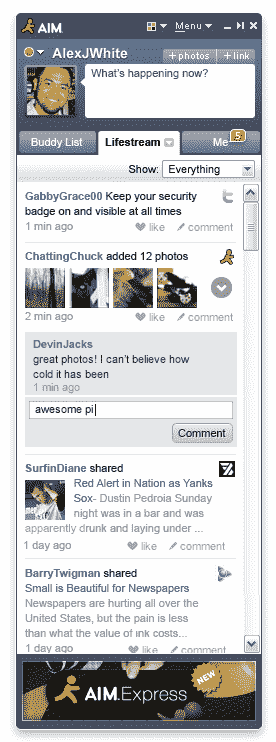

# AIM 现在更快、更好、更流畅 TechCrunch

> 原文：<https://web.archive.org/web/https://techcrunch.com/2009/09/15/aim-is-now-faster-better-more-streamy/>

# AIM 现在更快、更好、更流畅

几个月来，AOL 一直在为 AIM 和 AIM Connect(T4)的各种测试版认真测试生活流(T2)。在 TechCrunch50 上，AOL 刚刚宣布 lifestreaming 将于 9 月 22 日结束测试，并将成为 Windows、MAC、Web、iPhones 和 Windows Mobile 上 AIM 产品组合的一部分。

上周，iPhone 的付费版 [AIM 更新了](https://web.archive.org/web/20221006205834/http://www.beta.techcrunch.com/2009/09/10/aim-update-brings-your-lifestream-to-the-iphone/)生活流功能。今天，生活流正在从 Windows 的 AIM 7、Mac 的 AIM、Web 的 AIM 和 Windows Mobile 的 AIM 中测试出来。

lifestream 是 AOL 将即时消息与来自 Twitter、脸书、YouTube Digg 和 Flickr 的社交流相结合的方式。最初它只是单向的，但最近 AOL 在 AIM 测试版中为 Twitter 和脸书开通了双向通信，这样你就可以在 AIM 中更新你在这两个服务上的状态。大约有 150，000 人在使用测试版。9 月 22 日，这些功能将在 AIM 的 2000 万用户群中推出。

美国在线负责生活流业务的高级副总裁刘中达指出，平均而言，AIM 7 测试版用户发送的即时消息比其他用户多 20%。参与度的增加部分是因为 lifestream 吸引了他们，给了他们另一个打开应用的理由。但是新的目标也更加灵活。刘(Yahoo Messenger、Windows Live Messenger 和 Skype 等竞争对手)声称:“通过实验室测试，它比所有主要竞争对手都更快、更轻。”。

作为发布的一部分，AIM Connect 还将与所有 AOL 媒体网站的 AddThis 整合，以挂钩回他们在 AIM 上的生活流，以便他们可以与 AIM 好友共享内容和网页。

**视频:**
[http://www.ustream.tv/flash/video/2167124](https://web.archive.org/web/20221006205834/http://www.ustream.tv/flash/video/2167124)

其他报道:
[AOL 拥抱 Twitter，脸书拥抱 AIM Lifestream](https://web.archive.org/web/20221006205834/http://news.cnet.com/8301-19882_3-10352848-250.html) CNET。
[AOL 将 LifeStream 整合进 AIM](https://web.archive.org/web/20221006205834/http://www.appscout.com/2009/09/aol_integrates_lifestream_into.php) AppScout。
[TC50: AIM 开启；将未来寄托在移动应用上。](https://web.archive.org/web/20221006205834/http://venturebeat.com/2009/09/15/aim-opens-up-pegs-its-future-on-mobile-apps/) [AIM 首次推出 Lifestream Twitter 客户端](https://web.archive.org/web/20221006205834/http://www.readwriteweb.com/archives/aim_debuts_lifestream_twitter_client.php)读写网。