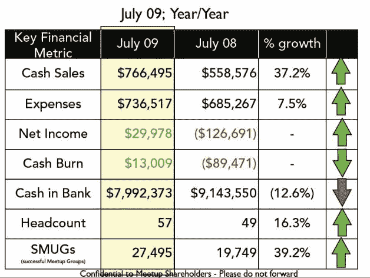

# 泄露的股东文件:Meetup 实现盈利，收入 900 万美元 TechCrunch

> 原文：<https://web.archive.org/web/https://techcrunch.com/2009/09/15/leaked-shareholder-docs-meetup-hits-profitability-and-9-million-in-revenues/>

# 泄露的股东文件:Meetup 盈利能力和 900 万美元的收入

Meetup ，一个让人们能够组织和管理真实生活聚会的网络服务，已经被证明是一个受欢迎的工具，人们愿意为它付费。TechCrunch 获得了一张幻灯片，该公司在 2009 年 8 月的股东更新中使用了这张幻灯片，展示了其当前的财务状况和过去的收入预测。该文件显示，这家总部位于纽约的公司表现良好，去年 7 月报告了首个(温和)盈利月。

财务结果实际上低于去年提出的预测，当时 Meetup 的目标是到今年夏天 Meetup 和收入都增长 50%。尽管其主要指标实际上比 2008 年增长了 35-40%，但 Meetup(出乎意料地)**去年 7 月实现了盈利，净收入为 3 万美元。**

有趣的是，该公司告诉投资者，它实际上并不打算这么快实现盈利，称这是“努力工作的副产品”，并对未来盈利月份的预测保持谨慎。事实上，他们明确表示，在这一点上，增加“成功的聚会团体”(SMUGs)比收入和利润更重要。公司目前最大的挑战是什么？招聘员工的速度足以跟上增长的步伐。

让我们深入研究一下这些数字。

年复一年，Meetup 的**现金销售额增长了 37.2%** ，从 2008 年 7 月的 558，576 美元增长到今年 7 月的 776，495 美元。按年运行率计算，这意味着 Meetup 目前净赚约 920 万美元的收入。过去一年，meetup 群组的数量从大约 19700 个增加到 27500 个，这是有意义的，因为组织者费用构成了公司收入的大部分。大约 85%的收入来自为服务付费的 Meetup 组织者；其余来自赞助和现场文字广告。

自 2002 年首轮融资以来，Meetup 已经筹集了 2010 万美元的风险投资，目前银行存款仍有 800 万美元。

Meetup 首席执行官斯科特·海夫曼早些时候在推特上确认了一些数字。

