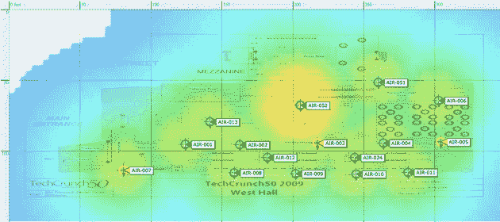

# TechCrunch50 有互联网，还有更多。玛丽埃特系统有限公司。TechCrunch

> 原文：<https://web.archive.org/web/http://techcrunch.com/2009/09/20/techcrunch50-had-internet-and-then-some-mariette-systems-ftw/>

科技会议应该有网络。大多数人不知道。事实上，观众被训练成对哪怕是一点点带宽都心存感激。也许足够发一两条微博了。但是上传照片和视频是你以后要做的事情，在活动结束之后。因为这可能需要几天时间。

这些年来这一直是我们的一个大问题。我们已经在这个问题上投入了大量资金。我们尝试了新的供应商和技术。我们祈祷过了。被诅咒了。我已经向供应商提供了 TechCrunch 上的一个帖子，如果他们能做好的话。他们从来没有。

去年，在 TechCrunch50 大会上，我们有一整天的互联网[中断](https://web.archive.org/web/20230205002852/http://www.wired.com/epicenter/2008/09/techcrunch50-no/)，第二天也没有好转。互联网中断的唯一好处是，大多数与会者无法就此写博客或发微博，因为他们无法上网。

让 2000 个互联网核心用户从一个地方同时访问是非常非常困难的。我见过成年人在尝试失败后哭泣。

然而今年，哇。TechCrunch50 上的互联网多得让你目不暇接。为此，[玛丽雅特系统](https://web.archive.org/web/20230205002852/http://www.mariette.com/)得到了我承诺的那个大大的湿吻。

团队:厄尼·马里耶特、克里夫·斯科尔尼克和蒂姆·波扎尔。他们进来了，带来了带宽(100 Mbps 视距微波链路来自 [WiLine](https://web.archive.org/web/20230205002852/http://wiline.com/) 和 30 Mbps 来自 [Telekenex](https://web.archive.org/web/20230205002852/http://www.telekenex.com/) )，将其接入 BSD 路由器，并通过 100 多个思科交换机和 28 个 wifi 接入点将其分配到整个建筑。与会者的桌子上有数百个以太网连接(和电源板)。加上 Ustream、演示区和主舞台的专用带宽。总的来说，很多与会者都非常高兴。

峰值时有超过 1，200 个同时连接，入站带宽使用量高达 88 Mbps。但是没有人被削减。我注意到观众中有很多人在他们的笔记本电脑上观看 Ustream 的直播。其他人在看美国公开赛直播。换句话说，观众完全是在浪费带宽。太棒了。

事实上，我有点失望，观众没能让我们的互联网失败。他们尽了最大努力，但还是有所欠缺。

非常感谢马里耶特系统公司。我们欠你的。我们爱你。继续参加苹果的 WWDC 和其他大型活动，但也要为我们的会议安排好日程。我不想和任何人一起工作。

