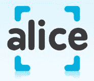

# Alice.com 为家居用品购物平台 TechCrunch 融资 400 万美元

> 原文：<https://web.archive.org/web/https://techcrunch.com/2009/09/21/alice-com-raises-4-million-for-household-goods-shopping-platform/>

# Alice.com 为家居用品购物平台融资 400 万美元

[Alice.com，](https://web.archive.org/web/20221209134921/http://alice.com/)家居用品零售平台，根据一份 [SEC 文件，已经在 B 轮融资中筹集了 400 万美元。](https://web.archive.org/web/20221209134921/http://www.sec.gov/Archives/edgar/data/1450545/000089706909001404/xslFormDX01/primary_doc.xml)根据文件，该公司正试图在本轮融资中再筹集 200 万美元。2008 年 11 月，这家初创公司[已经从](https://web.archive.org/web/20221209134921/http://www.beta.techcrunch.com/2008/11/11/the-jellyfish-guys-are-at-it-again-raise-43-million-for-online-retail-service-alicecom/) [Kengonsa Capital Partners](https://web.archive.org/web/20221209134921/http://www.crunchbase.com/financial-organization/kegonsa-capital-partners) 和 [DaneVest Capital](https://web.archive.org/web/20221209134921/http://www.crunchbase.com/financial-organization/danevest-capital) 获得了 430 万美元的首轮融资。

Alice.com 于 6 月推出，是宝洁(Procter & Gamble)等包装消费品制造商直接向消费者销售的开放平台，而不是通过塔吉特(Target)或沃尔玛(Wal-Mart)等零售渠道。在消费者方面，Alice.com 允许用户创建一个家庭档案(即有多少成人、小孩、婴儿)，然后网站会跟踪商品，并在商品快用完需要再订购时用电子邮件提醒用户。每批货物都被打包在一个“爱丽丝”盒子里，直接送到消费者家门口，没有运输成本。

正如我们在评论中所写的，我们认为 Alice.com 有起飞的潜力，这要归功于有竞争力的价格、充分理解的商业模式(该网站通过广告赚钱)以及经验丰富的企业家掌舵这家初创公司。联合创始人和连续创业者[布莱恩·韦根](https://web.archive.org/web/20221209134921/http://www.crunchbase.com/person/brian-wiegand)和[马克·麦奎尔](https://web.archive.org/web/20221209134921/http://www.crunchbase.com/person/mark-mcguire)在过去的 10 年里成功出售了三家公司，最近[将社交购物服务水母卖给了微软](https://web.archive.org/web/20221209134921/http://www.beta.techcrunch.com/2007/10/02/microsoft-acquires-discount-shopping-site-jellyfishcom/)(微软后来用它创建了 [Live Search Cashback](https://web.archive.org/web/20221209134921/http://www.beta.techcrunch.com/2008/05/20/microsoft-to-offer-cash-back-to-search-engine-users/) )。