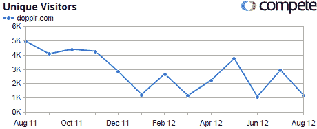

# 恭喜多普勒？也许吧。但在喝香槟之前，先来点背景知识

> 原文：<https://web.archive.org/web/https://techcrunch.com/2009/09/24/congrats-to-dopplr-maybe-but-before-the-champagne-some-context/>

因此，在我们进入这个话题之前，让我们先来为被告辩护。最近，[诺基亚收购了](https://web.archive.org/web/20230307084152/http://crunchbase.com/company/nokia)许多小型创业公司(今年是 Plum、Cellity 和 Bit-Side ), TechCrunch.com 现在[有消息来源](https://web.archive.org/web/20230307084152/https://techcrunch.com/2009/09/23/nokia-to-acqure-uk-startup-dopplr/)称他们已经收购了精品旅游社交网络 [Dopplr](https://web.archive.org/web/20230307084152/http://www.dopplr.com/) 。这似乎发生在 Dopplr 筹资的时候——这是在谈判达成交易时经常发生的事情。Dopplr 没有对这个故事发表评论。

Dopplr 的总部设在伦敦，但由芬兰赫尔辛基的 Dopplr 有限公司拥有和经营。这项服务是基于“意图广播”的想法，你发布你未来去某个地方的意图，从而使你社交网络中的快乐巧合越来越少(从而更快乐，更高效)。最初的想法来自哪里或来自谁，都湮没在时间的迷雾中(也许有人可以在评论中启发我们？).

反正收购价据说在€1000 万到€1500 万之间。我们第一次报道 Dopplr 是在 2007 年，当时 Dopplr 关闭了种子基金。

据说它在总资金中只为€筹集了 125 万英镑左右，尽管确切的数字从未公布，尽管他们聚集了一大批资金雄厚的支持者。

看看这些:马丁·瓦萨夫斯基(Martin Varsavsky)、伊藤穰一、(LinkedIn)、索尔·克莱因(Saul Klein)、埃丝特·戴森(Angel)、泰勒·布雷(Tyler brlé)、托马斯·格洛瑟(Thomas Glocer)和拉尔斯·辛里奇(Lars Hinrichs)。我的意思是，天哪，大多数创业公司都希望拥有这样的董事会。尽管这个所谓的出口很好，但显然这些人认为 Dopplr 会比€15 米出口大得多。

为什么是诺基亚？嗯，这里有一个想法:该团队的一个重要组成部分是前诺基亚。Dopplr 联合创始人兼首席执行官 [Marko Ahtisaari](https://web.archive.org/web/20230307084152/http://crunchbase.com/person/marko-ahtisaari) 曾是诺基亚的设计战略总监。许多技术人员来自诺基亚，最近离职的界面设计师马特·琼斯是前诺基亚人。

等等，我说最近离开了吗？是的，我做到了。就在上个月，琼斯[离开](https://web.archive.org/web/20230307084152/http://www.guardian.co.uk/media/pda/2009/aug/27/startups-digital-media)去了杰克·舒尔茨和马特·韦伯的设计机构——舒尔茨·韦伯，后来改名为 Berg(英国实验火箭集团)。

那么，为什么琼斯知道该公司正在融资，这将导致更高的估值或潜在的出售(如果谈判取得进展)，却跳槽了呢？为什么要错过一个非常有利可图的退出机会呢？我敢说琼斯保留了公司的股份，从理论上说，他不需要实际上仍然在那里受益。但是当香槟酒被打开的时候，去那里肯定是有意义的吧？也许他很久以前就知道这个(还有待证实)销售。

让我们弄清楚这一点:该网站从未增长到巨大的使用量，但其核心用户对 Dopplr 充满热情。它是伦敦[硅环岛](https://web.archive.org/web/20230307084152/http://blogs.ft.com/techblog/2008/07/silicon-roundabout-is-this-the-heart-of-the-uks-new-dotcom-boom/)的宠儿之一。让我们承认 Dopplr 是一个惊人的想法，设计精美，执行近乎完美。

但是关于 Dopplr 有一些事情困扰着我。几个月前，当我与 Marko Ahtisaari 会面时，我问为什么在 [Tripit](https://web.archive.org/web/20230307084152/http://tripit.com/) 上，我可以通过电子邮件向他们发送我的航空公司发送的飞行计划，它会自动记录提示，但在 Dopplr 上，我必须手动输入。他对这种比较不太满意，更倾向于强调 fast 拥有大量高端用户，而不是我推断的大众市场 Tripit 中的大老粗。

最近让我感到奇怪的第二件事是，他们推出的 iPhone 应用似乎有点“又快又脏”。它使用了免费的 OpenStreetMap，至少在这个应用程序上，我发现非常不准确(向所有 OSM 粉丝道歉)，最重要的是，你不能在应用程序上添加旅行。试图获得一些牵引力有点半成品的味道。

然后你看看他们的竞争数据，这些数据是不完整的。这不是 J 曲线:

此外，其他事情也说不通:最近的非 J 曲线表现，在这篇 TechCrunch 报道后，我的收件箱里没有一篇新闻稿尖叫着“澄清事实”；博客上没有公告；没有首席执行官发微博，也没有联合创始人马特·比德尔夫发微博在推特上。公司不予置评。无(截至 9 月 24 日上午 10.40)。因此，要么出售并没有真的发生，[就像一些人认为的](https://web.archive.org/web/20230307084152/http://www.arcticstartup.com/2009/09/24/dopplr-acquisition-a-false-rumour/)(我对此表示怀疑)，要么已经发生了，他们只是不想谈论它，因为这不是他们最终想要的退出方式。

但之前与诺基亚和一位高调的首席执行官的联系看起来确实为创始人带来了一个整洁而简单的退出。如果是这样的话，对他们来说很公平。

我觉得他们已经开始新的生活了。好吧，我祝他们好运。