# Twitter 数据分析:投资者的视角 TechCrunch

> 原文：<https://web.archive.org/web/https://techcrunch.com/2009/10/05/twitter-data-analysis-an-investors-perspective-2/?utm_source=twitterfeed&utm_medium=twitter>

*这是[罗伯特·j·摩尔](https://web.archive.org/web/20230204112343/http://www.crunchbase.com/person/robert-j-moore)的客座博文，罗伯特·j·摩尔是 [RJMetrics](https://web.archive.org/web/20230204112343/http://www.rjmetrics.com/) 的首席执行官和联合创始人，这是一家按需数据库分析和商业智能初创公司，帮助在线企业更好地衡量、管理和货币化。他之前是一名风险投资分析师，目前担任几家纽约初创公司的顾问。罗伯特在[的公制系统](https://web.archive.org/web/20230204112343/http://themetricsystem.rjmetrics.com/)上写博客，可以在 Twitter 上关注 [@RJMetrics](https://web.archive.org/web/20230204112343/http://www.twitter.com/RJMetrics) 。*

几周前，[我的前雇主](https://web.archive.org/web/20230204112343/http://www.insightpartners.com/)领投了一笔[1 亿美元的投资](https://web.archive.org/web/20230204112343/http://blogs.wsj.com/deals/2009/09/24/breaking-news-twitter-to-raise-100-million-from-insight-t-rowe-price-other-investors/)到 Twitter，我必须承认我相当嫉妒我以前的同事。他们有机会对 Twitter 的数据进行一些非常酷的分析。

我不想去想我错过了什么，而是决定找出我能从外面看到什么。利用一些统计技巧，Twitter API 和我的 [RJMetrics](https://web.archive.org/web/20230204112343/http://www.rjmetrics.com/) 仪表盘，我发现了大量关于 Twitter 的惊人的新信息。以下是一些亮点:

*   Twitter 的用户增长不再加速。新用户获取率稳定在每月 800 万左右。
*   超过 14%的用户没有一个关注者，超过 75%的用户只有 10 个或更少的关注者。
*   38%的用户从未发过一条推文，超过 75%的用户发的推文少于 10 条。
*   每四个注册用户中就有一个在任何一个月发推文。
*   一旦用户发了一条微博，他们有 65%的几率会再次发微博。然而，在第二条推文之后，第三条推文的几率上升到 81%。
*   如果有人在成为用户的第二周还在发微博，那么他极有可能会作为长期用户留在 Twitter 上。
*   与过去的用户相比，最近几个月加入的用户不太可能停止使用该服务，更有可能更频繁地发推特。

请继续阅读一些详细的图表，深入了解这些数据。

## 我们是如何做到的

在大多数情况下，这种由外向内的练习是不可能的。然而，Twitter 是一个特例，原因如下:

*   该公司是预营收公司，因此其价值在于用户活动和参与度
*   默认情况下，Twitter 用户的活动数据(推文、关注者等)都是公开的
*   Twitter 的 API 允许我每小时自动下载多达 20，000 个数据点
*   Twitter 为用户和推文使用自动递增的 ID 号(1，2，3，4…)
*   [中心极限定理](https://web.archive.org/web/20230204112343/http://en.wikipedia.org/wiki/Central_limit_theorem)告诉我们，一个大型数据集的足够大的随机子集将像其父集一样表现出高度的统计置信度

最终，我们的样本规模由大约 85，000 名用户和 300 多万条推文组成。通过将所有这些东西拼凑在一起，并将数据拉入[的 RJMetrics 仪表板](https://web.archive.org/web/20230204112343/http://www.rjmetrics.com/)，我能够绘制出关于 Twitter 用户群和用户行为的大量信息。我四处看了看，这似乎是对 Twitter 在线用户群最大的公开分析。尽情享受吧！

## 推特用户数量

这个分析利用了 Twitter 对用户和推文使用自动递增的 ID 号这一事实。我们确定了系统在任何给定月份消耗的 id 的范围，以及它们实际上与真实 Twitter 帐户相关联的百分比。(“死的”id 可能是已取消的帐户、垃圾邮件帐户、测试帐户等。)综合起来，这些数字给了我们一个每月有多少新用户加入 Twitter 的可靠近似值:

[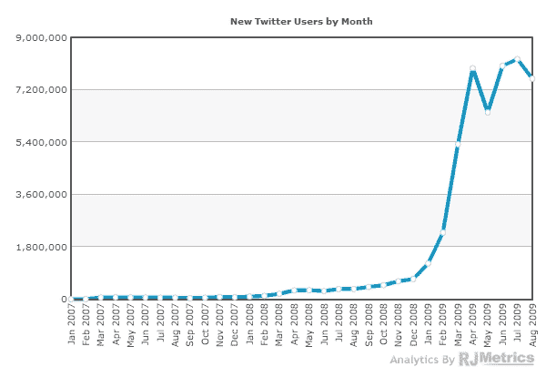](https://web.archive.org/web/20230204112343/http://themetricsystem.files.wordpress.com/2009/10/newusers.jpg)

这向我们展示了 Twitter 在 2009 年经历的指数级增长。在第 3 季度，这一数字稳定在每月约 800 万新用户的水平。总累积用户图表如下:

[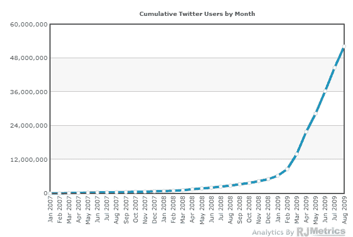](https://web.archive.org/web/20230204112343/http://themetricsystem.files.wordpress.com/2009/10/cumulativeusers.jpg)

有人喜欢曲棍球吗？截至 9 月 1 日，**Twitter 实际活跃账户数量刚刚超过 5000 万。**

## 关注者的平均数量

根据数据显示，平均每个推特用户有 42 个关注者。通过关注用户的人数来观察用户的分布很有意思:

【T2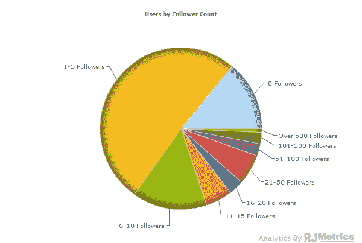

如你所见，绝大多数用户只有十个或更少的关注者，超过 20%的用户根本没有关注者！众所周知，大多数用户使用该系统不到一年，如下图所示，关注者的数量与用户加入该系统的时间成正比:

[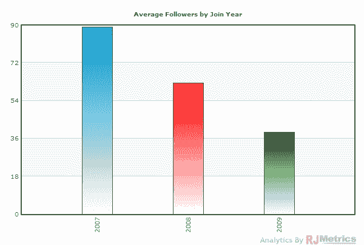](https://web.archive.org/web/20230204112343/http://themetricsystem.files.wordpress.com/2009/10/avgfollowers.jpg)

## 推文数量

观察普通用户的状态更新或“推文”数量也很有趣。显然，任何给定用户的推文数量都会随着时间的推移而增长(如下图所示的趋势):

[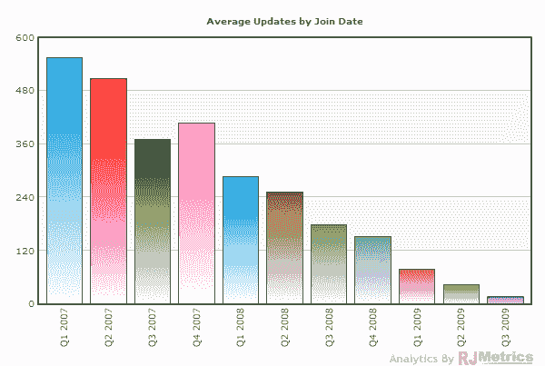](https://web.archive.org/web/20230204112343/http://themetricsystem.files.wordpress.com/2009/10/updatesjoindate.jpg)

当我们按用户查看推文的分布时，我们看到一个非常令人惊讶的趋势:**超过 75%的 Twitter 用户的推文次数少于 10 次**。

[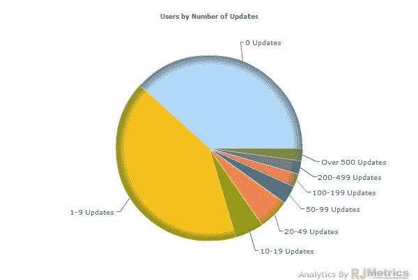](https://web.archive.org/web/20230204112343/http://themetricsystem.files.wordpress.com/2009/10/updatespie.jpg)

## “受保护的”(私人)Twitter 个人资料

在进行推文层面的分析之前，重要的是要注意，我们发现的一些用户已经“保护”了他们的推文，这意味着我们能够看到他们有多少粉丝和他们发了多少次推文，但无法下载特定的推文(更重要的是，推文次数)。

下图显示了我们的数据集中有多少用户在他们加入的那个月受到了“保护”。总人数约为 10%(还在下降):

[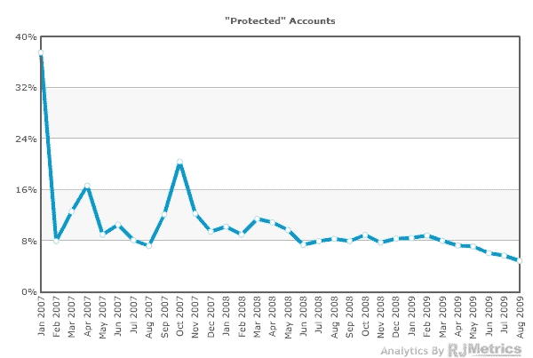](https://web.archive.org/web/20230204112343/http://themetricsystem.files.wordpress.com/2009/10/protectedaccounts.jpg)

同样有趣的是，“受保护”的 Twitter 用户与公众用户有什么不同。如下图所示，受保护的用户倾向于更频繁地发微博，但关注者却少得多:

[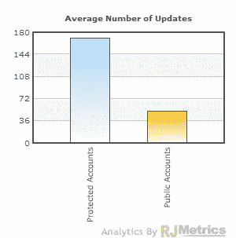](https://web.archive.org/web/20230204112343/http://themetricsystem.files.wordpress.com/2009/10/avgupdates-protected.jpg)[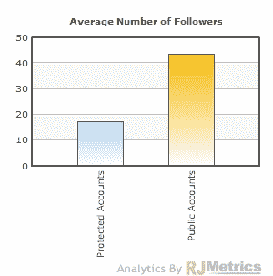](https://web.archive.org/web/20230204112343/http://themetricsystem.files.wordpress.com/2009/10/avgfollowers-protected.jpg)

## 电力用户

该 API 的另一个限制是，它只能为任何给定用户返回 3200 条最近的推文。对于大多数用户来说，这显然没什么大不了的，但是确实有一些用户已经超过了这个标准。我们的样本数据集显示，不到 0.02%的 Twitter 用户发送了超过 3200 条推文。在我们的研究中，这些用户将拥有不完整的数据集，但人口如此之少，他们应该不会对我们的结论产生任何有意义的影响。

## 按来源分类的推文

有趣的是，随着时间的推移，不同的推特方式逐渐兴起。下面我展示了最流行的方法，以及自 2007 年以来每月通过这些方法的 Twitter 流量的百分比:

[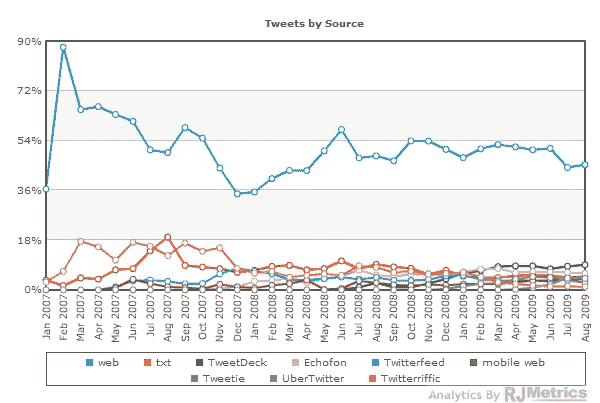](https://web.archive.org/web/20230204112343/http://themetricsystem.files.wordpress.com/2009/10/tweetsbysource4.jpg)

网络显然在这个列表中占据了主导地位。让我们把它排除在外，以便更仔细地看看还有哪些来源在推动推文:

[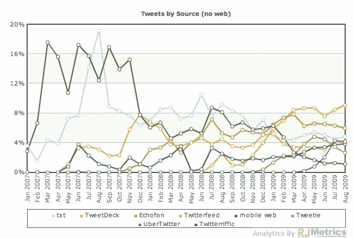](https://web.archive.org/web/20230204112343/http://themetricsystem.files.wordpress.com/2009/10/tweetsbysourcenoweb.jpg)

Twitterriffic 显然经历了更好的日子，短信(txt)作为一种渠道也在走下坡路。与此同时，TweetDeck 似乎正在大举吞噬市场份额。

## 推文间隔时间

因为我们知道样本数据集中每条推文的时间戳，所以我们可以研究推文之间的时间和来自用户群的推文的新近度。

值得注意的是，**来自同一个用户的任何两条推文之间的平均时间正好是 24 小时**。

下图显示了用户前十条推文的平均时间间隔(如果适用)。x 轴包含有问题的推文的时间，该值是自上一条推文以来的平均时间量。

[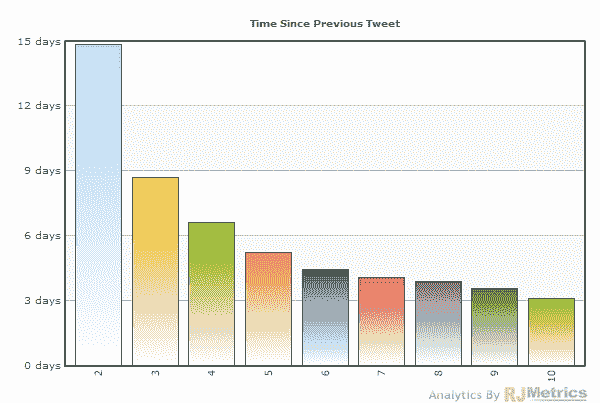](https://web.archive.org/web/20230204112343/http://themetricsystem.files.wordpress.com/2009/10/timesinceprevioustweet.jpg)

令人惊讶的是，随着用户发更多的微博，发微博的时间间隔实际上缩短了。然而，这可能是有偏见的，因为大多数用户发推特的次数不到十次。为了搞清楚，让我们根据用户发推的次数来看一下发推的平均间隔时间:

[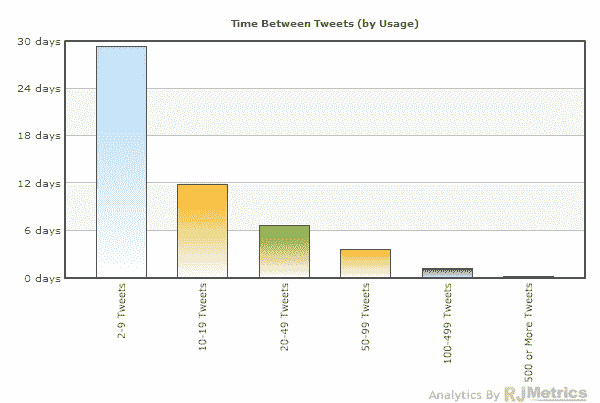](https://web.archive.org/web/20230204112343/http://themetricsystem.files.wordpress.com/2009/10/tbtusage.jpg)

事实上，正如你所料，发微博越多的用户发微博也越频繁，这种下降是相当显著的。

## 增量推文的概率

由于在 10 条推文之前，推文活动有如此巨大的下降，我们认为根据给定用户完成的推文数量来看“增量推文的概率”可能会很有趣。只需在 [RJMetrics](https://web.archive.org/web/20230204112343/http://www.rjmetrics.com/) 中点击几下，即可计算出来:

[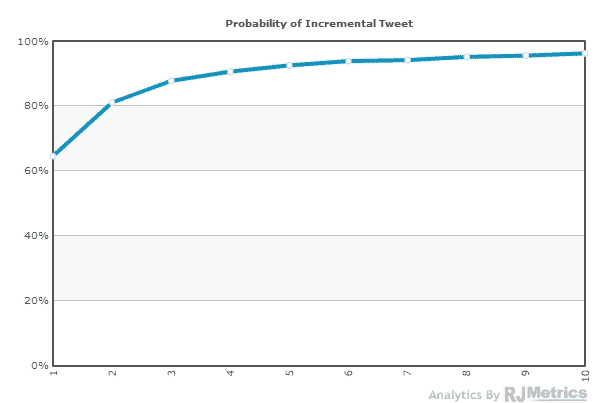](https://web.archive.org/web/20230204112343/http://themetricsystem.files.wordpress.com/2009/10/probinc.jpg)

正如你所料，用户每发一条微博，他们再次发微博的机会就会增加。

## 活跃的推特用户

我们知道 Twitter 有 5000 万注册用户，但我们也知道他们中的绝大多数人发微博的次数不到十次。让我们调查一下这些注册用户中有多少人实际上在积极地发微博。

使用我们的 tweet 数据，我们可以确定在任何给定的月份中至少发出一条 tweet 的用户群的百分比。这个“独特的 tweeters”统计数据如下图所示(为了获得公平的统计数据，我们从分母中排除了受保护的帐户):

[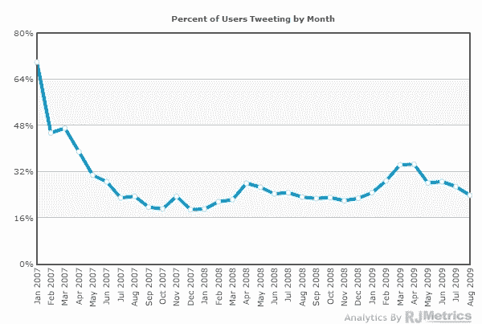](https://web.archive.org/web/20230204112343/http://themetricsystem.files.wordpress.com/2009/10/percenttweeting1.jpg)

这个数字似乎徘徊在 25%的范围内。换句话说，**在任何给定的月份**，只有大约四分之一的注册用户在发微博。(尽管值得注意的是，一些用户可能只是在使用 Twitter 阅读其他人的推文，这意味着他们不是完全意义上的“僵尸”账户。)

请注意 2009 年初的增长，当时正是新用户增长开始大幅加速的时候。这表明了一个显而易见的事实:平均而言，新用户比老用户更有可能发微博。当新用户增长在 2009 年初爆炸式增长时，新用户的密度变得更高，推动了这一平均水平的上升。为了说明这一点(并更好地了解用户在其一生中的行为)，我们转向群组分析。

## 断代分析

[群组分析](https://web.archive.org/web/20230204112343/http://themetricsystem.rjmetrics.com/2009/09/09/cohort-analysis-in-rjmetrics/)是一种观察用户行为和忠诚度的好方法。下图中的每条线都代表了不同的 Twitter 用户“群组”，基于他们加入的月份(为了避免混乱，我们选择了不同时间段的 7 个群组)。在下面的图表中，我们监测了每个群组中在第一个月发完微博后每个月又回来发微博的用户的百分比。显然，根据定义，第 1 个月是 100%:

[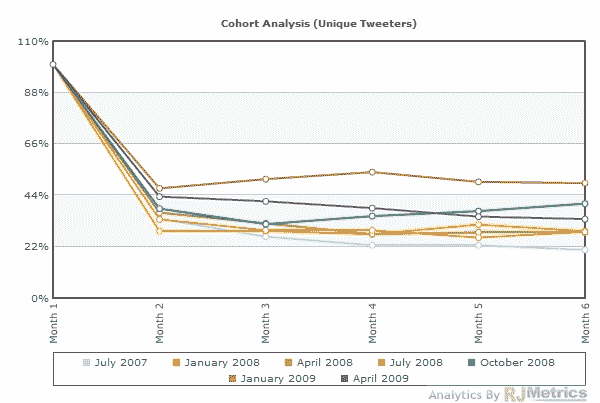](https://web.archive.org/web/20230204112343/http://themetricsystem.files.wordpress.com/2009/10/monthlycohort.jpg)

这张图表很能说明问题:

*   预计在第 2 个月使用量会下降，但此后**使用量会保持稳定**。对于任何试图在新用户生命周期早期预测用户活动的人来说，这是一个好消息。
*   新的群体，尽管在规模上明显更大，实际上由更忠诚的用户组成。最高的两条线也是最近的两条，这意味着 2009 年加入的**用户实际上比 2008 年同月加入的用户更有可能在第一个月之后继续发微博。**

由于第 2 个月的下降非常明显，让我们放大并查看每周的群组，看看我们是否可以看到每周的使用量是如何下降的:

[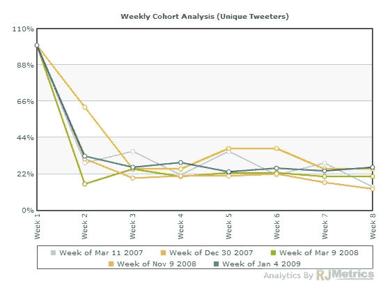](https://web.archive.org/web/20230204112343/http://themetricsystem.files.wordpress.com/2009/10/weeklycohort.jpg)

我们在这里看到了类似的模式，尽管最近的队列没有在月度分析中那么突出。然而，第二阶段的下降似乎不会随着时间的推移而进一步下降。**这意味着，在一个群体生命的第二周，Twitter 可以可靠地预测其用户作为一个群体的未来行为。**

另一个可能很有趣的群组分析是，观察一个群组在加入后每个月发多少条推文。这一指标将包括第一个月流失用户的使用量下降和留在平台上的用户的活跃度上升:

[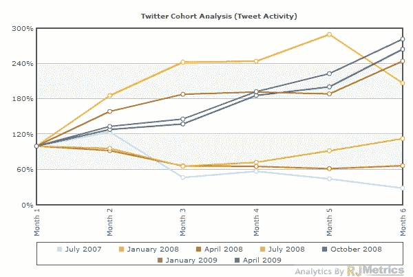](https://web.archive.org/web/20230204112343/http://themetricsystem.files.wordpress.com/2009/10/tweetcohorts.jpg)

哇！这是一幅非凡的图像。尽管第一个月之后用户数量大幅下降，但剩余用户的推文活动量如此之大，以至于每个群组的“每月推文”平均超过 100%(和以前一样，最近的群组越忠诚)！

换句话说，留下来的用户实际上如此频繁地发微博(和他们第一个月相比，速度如此之快)，以至于他们远远弥补了那些在第一个月之后流失的用户的活动。这是一个非常有力且出乎意料的统计数据。

## 结论

对于 Twitter[报道的](https://web.archive.org/web/20230204112343/https://techcrunch.com/2009/09/16/twitter-closing-new-venture-round-with-1-billion-valuation/)10 亿美元估值，每个人都有自己的感受。我希望这篇文章能让你了解新投资者在得出这个数字之前可能会考虑些什么。

要了解更多关于 RJMetrics 和我们的原始博客帖子，包括[商业智能说唱](https://web.archive.org/web/20230204112343/http://themetricsystem.rjmetrics.com/2009/05/26/business-intelligence-rap-video/)和我们的 [twitter 追随者指南](https://web.archive.org/web/20230204112343/http://themetricsystem.rjmetrics.com/2009/07/21/how-to-get-twitter-followers-the-definitive-guide/)，请查看[我们的网站](https://web.archive.org/web/20230204112343/http://www.rjmetrics.com/)并在 twitter 上关注我们 [@RJMetrics](https://web.archive.org/web/20230204112343/http://www.twitter.com/RJMetrics) 。