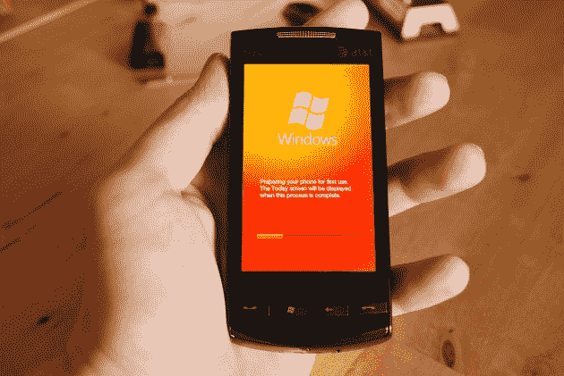

# Windows Mobile 6.5 评测:还是很烂。TechCrunch

> 原文：<https://web.archive.org/web/https://techcrunch.com/2009/10/06/windows-mobile-6-5-review-it-still-sucks/>

Windows Mobile 6.5，我们想爱你。我们希望你来洗去过去，带走所有我们已经厌倦了的过时的 6.1 的痕迹。

我们满怀希望地进行了这次审查，希望看到一个总体上积极的前景。抱歉，Windows Mobile 6.5——这是不可能的。

 **将军:**

![Screen shot 2009-10-06 at [ October 6 ] 9.58.13 AM](img/3af2b61aa1b6793ab7b670ddde174799.png "Screen shot 2009-10-06 at [ October 6 ] 9.58.13 AM")

开一辆别克 Lasabre。不，不，不是 20 世纪 50 年代末的那种。从 90 年代早期开始，就像他们在警匪片里用的那种。现在，在上面绑一个扰流板。最大的亮点是 Windows Mobile。剧透是 6.5 带来的所有东西。

6.5 带来了一个有着奇妙新功能的手提包，并继续把它绑在我们多年来所知的同样的混乱之上。这方面最突出的例子是整体设计:操作系统的很小一部分(即主屏幕和开始屏幕——后面会有更多介绍)已经过了手指友好性的彻底检查。然而，如果你真的想*做*任何事情，你可以直接使用手写笔。想打字？手写笔。想要浏览设置屏幕吗？手写笔。除了启动应用程序，你还想做什么？是的——拿起手写笔。

作为参考，我们在两个版本的 HTC Touch Diamond 上测试了 Windows Mobile 6.5 一个没有运营商品牌，另一个是美国电话电报公司的 Pure。

**WinMo 6.5 中的新东西:**

Windows Mobile 6.5 并非没有技巧。以下是它带来的一些好处:

*   **新的开始屏幕:**WinMo 新“蜂巢”屏幕的泄露是一个新版本正在工作的最初迹象之一。它让人们对未出生的释放充满了希望；通过交错排列图标，它给了陈旧的主屏幕一个全新的外观，同时也让点击错误的图标变得更加困难。
*   新的 ie 浏览器:他们改进了引擎，开放了屏幕空间，并努力更好地接受网络标准。有帮助吗？这个我们稍后再谈(简答:不尽然。)
*   **新的“今日”主屏幕:**为了给他们的移动设备和媒体设备带来某种程度的标准，新的“今日”主屏幕在很大程度上受到了 Zune 整体 UI 设计的影响。在“今日”屏幕的每个标签(图片、音乐、入门、电话、语音邮件、时钟、文本、电子邮件、日历和收藏夹)上滚动可以让用户稍微了解一些功能(例如，点击“音乐”标签可以开始音乐播放——几乎每个人第一次使用该操作系统时都会不小心这样做)。
*   **新的锁屏:**虽然可能很琐碎，但这实际上是新操作系统中我们最喜欢的一个方面。微软现在提供了一系列基于警告的解锁图标，而不仅仅是在开放的闲置空间中提供一个解锁图标和大量的细节。例如，如果你有一条未读短信等着你，一个标有未读短信数量的解锁图标就会出现在标准解锁图标的正下方。如果你滑动这个图标，而不是标准图标，你会直接跳到你的收件箱。

**界面:**

![Screen shot 2009-10-06 at [ October 6 ] 9.58.26 AM](img/ddea0bf74cb64ef993b64d1d278ec5bb.png "Screen shot 2009-10-06 at [ October 6 ] 9.58.26 AM")

如上所述，这里有两个主要的 UI 元素发生了变化:开始屏幕(保存所有应用程序的地方)和今天屏幕(每次使用手机时看到的第一个屏幕)。与 Windows Mobile 6.1 相比，两者都是非常非常好的改进。与其他手机相比，它仍然非常糟糕。

第一，设计流程本身。我们与一些手机新手分享了这款手机，主要是想看看他们拿起它有多快。他们中的每一个人最初都被“今日屏幕/开始屏幕”的设置搞糊涂了，以为他们只是同一件事情的两个版本。

几乎所有的竞争都倾向于把应用程序放在优先位置，一旦手机解锁，就把它们放在最显眼的位置。Windows Mobile 的设计理念是将“今日”屏幕作为启动平台，将大部分应用程序放在“开始”菜单中。人们似乎在期待他们从其他手机上了解到的信息流，从而相应地与手机互动。这当然不是 Windows Mobile 的错——但值得注意的是:与我们分享这款手机的人没有一个立刻感到舒服。绝不是直观的。你可以给一个该死的孩子一部 iPhone 或 Android 手机，他们会在几秒钟内弄明白。

“但是没有！”WinMo 人群大声疾呼，“Windows Mobile 不是为儿童或外行人设计的！这是为商务人士打造的！”不。这个界面的复杂性并没有提高它对任何人的可用性，更不用说那些用它来做生意的人了。

我们可以通过指出一个缺陷来总结整个问题:假设你想在开始菜单中移动一个应用程序。你点击并按住一个图标，希望它允许你把它拖到一个新的位置。弹出一个菜单，只有一个选项:移到顶部。您不能在此手动重新排列图标。一点也不。如果你想移动一个图标到一个特定的位置，你可以移动它周围的每一个图标。这是一个非常明显的用例，但却没有得到解决。这种缺乏远见的现象在大多数操作系统中都存在。

**最大的明显缺陷:打字很糟糕。可怕地。**

![Screen shot 2009-10-06 at [ October 6 ] 10.03.20 AM](img/9eb21eb66c50fc96c1ee3d2961bb0d39.png "Screen shot 2009-10-06 at [ October 6 ] 10.03.20 AM")

看——在一个现在完全充斥着触摸屏的市场，其中很大一部分没有物理键盘，有一件事你需要在你的手机上制造摇滚——或者在这种情况下，你的操作系统:打字。

在 Windows Mobile 6.5 上打字绝对是一件痛苦的差事。有多糟？每次我们坐下来复习这个东西时，我们都会对键盘感到非常沮丧，以至于不得不停下来。我们。讨厌。这个。键盘。在这个键盘上打字就像用脚缝东西一样。即使使用手写笔(不要尝试在没有手写笔的情况下打字。你不能。你的手指会按下每个按钮，除了你想按的那个)，字母之间的尴尬滞后和整体的沉闷让我们想揪头发。如果没有别的办法，输入 Windows Mobile 6.5 对我们来说立刻就扼杀了整个操作系统。

**移动互联网浏览器 6**

![Screen shot 2009-10-06 at [ October 6 ] 9.57.38 AM](img/5725f1e258691956176fef3f039708cd.png "Screen shot 2009-10-06 at [ October 6 ] 9.57.38 AM")

万岁！巨大的互联网浏览器大修！那意味着现在很棒，对吗？

不。还是很糟糕。是的——比以前稍微快了一点。见鬼，我们可能会说明显更快，而不是说谎。它甚至增加了平滑平移和滚动！但这仍然是一团乱麻。页面呈现不正确，页面停止。这个界面感觉像是某人在 2002 年根据 2009 年的流行趋势设计的。我们可以说的一件好事是:我们还没有看到浏览器崩溃，这本质上意味着这是上一次迭代的一大进步。

测试结束后，我们立即赶回 Opera。幸运的是，HTC 很好地在手机上提供了 Opera。其他制造商，注意了——你可能也想这么做。如果你的制造商没有想到给你提供一个替代品，那就赶快行动吧。你应该在移动 IE 6 中花费的唯一时间是下载另一个浏览器所需的时间。

**Windows Mobile market place:**

![Screen shot 2009-10-06 at [ October 6 ] 9.58.43 AM](img/28ce9fac1e80e2dabf10a06cc1f06b48.png "Screen shot 2009-10-06 at [ October 6 ] 9.58.43 AM")

我们将只轻轻触及这一点，因为这不是 6.5 独有的特性。虽然它在 6.5 上首次亮相，但预计在未来几个月内将推出 6.1 及更高版本。

不言而喻:Windows Mobile 需要一个应用商店。几乎每个主要竞争对手，从苹果到 RIM 到 Palm 到谷歌，都有自己的应用商店。Windows Mobile 是这个派对的最后一个——值得等待吗？

老实说，是的。这是少数几个微软没有的地方之一..嗯，他们没有搞砸。Windows Mobile Marketplace 中的界面显然是在复制主屏幕的 Zune 式用户界面——虽然它们在美学方面有所欠缺，但在其他地方总体来说还是不错的。据我们所知，他们只有几百个应用程序，但考虑到这只是第一天，Windows Mobile 已经通过其他方式提供了几千个应用程序，我们预计这个数字将会激增。

所有帐户购买都通过您的 Windows Live ID 处理，并且可以从您的信用卡或理论上的运营商账单中扣除。然而，据我们所知，目前没有运营商支持它。

![Screen shot 2009-10-06 at [ October 6 ] 9.58.54 AM](img/8b50b0c1525fd9773c1ab320d246e107.png "Screen shot 2009-10-06 at [ October 6 ] 9.58.54 AM")
结论:

Windows Mobile 6.5 是在 6.1 的基础上改进的，不多也不少。这是一种让人们坚持到 Windows Mobile 7 的方式——至少，我们希望如此。Windows Mobile 6.5 中的每一个变化都让人觉得是由一个自制程序或修改程序的团队做出的，而不是一个拥有大量资金来投资旗舰产品的大公司。绝对没有一个看起来像是为操作系统的其他部分考虑的；一个屏幕是手指友好的，下一个屏幕需要手写笔，然后返回。一个将从边缘到边缘充满华丽的渐变，而下一个将退回到 WinMo 6.1 可怕的陈旧视觉效果。

如果您的制造商提供从 6.1 到 6.5 的升级路径，请接受它。这些变化虽然有些琐碎，执行起来也不尽如人意，但确实改善了体验。

如果你不喜欢 Windows Mobile 6.1(或者如果你从未使用过它)，老实说，我们不建议你购买 Windows Mobile 6.5 手机。

**我们喜欢的:**

*   新的锁屏，带有上下文感应锁，很棒——实际上可能是所有智能手机平台中我们最喜欢的。
*   Windows Mobile Marketplace 虽然一点也不时髦，但已经完成了任务，应该会很快充满应用程序

**我们没有的:**

*   Internet Explorer 仍然非常糟糕
*   整个操作系统的设计流程已经过时很久了；在这一点上，这是荒谬的。
*   我们讨厌键盘。在我试图给某人发短信之前，我会走到他们家和他们交谈
*   操作系统的其余部分