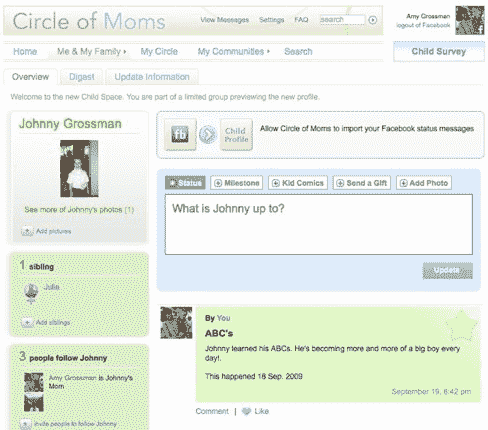

# 随着妈妈圈子的扩大，迷你货车上的功能越来越多

> 原文：<https://web.archive.org/web/https://techcrunch.com/2009/10/08/more-features-piling-in-the-minivan-as-circle-of-moms-expands/>

# 随着妈妈圈子的扩大，更多的功能堆积在小货车上

随着父母转向社交网络分享故事和征求抚养孩子的建议，育儿社区在网上变得越来越普遍。[妈妈圈，](https://web.archive.org/web/20221215215928/http://www.circleofmoms.com/)是妈妈们的社交网络，正在庆祝其周年纪念日，稳步增长的数字和一些新功能。这个网站正如你从它的名字中所期待的那样——一个让妈妈们与朋友联系、谈论她们的孩子、加入热门问答社区的社区，主题从食谱交换、特殊需要儿童和幼儿纪律。

据该网站的联合创始人兼首席执行官 Ephraim Luft 称，自去年 10 月网站推出以来，Circle of Moms 已经积累了 700 万注册妈妈，并且每周增加 15 万名新妈妈。根据 [Quantcast 的数据，该社交网络上个月有 210 万独立访客。](https://web.archive.org/web/20221215215928/http://www.quantcast.com/p-a4Krtd_1KEeto#traffic)

帮助 Circle of Mom 成长的一个强有力的策略是它的[脸书应用程序。Luft 说，在过去的一年里，脸书无疑为网站的病毒式增长做出了贡献。该网站的脸书应用每月有 2，362，352 名活跃用户，与该网站的社交网络有大量互动，也有助于吸引网站上的朋友，反之亦然。](<a href=)

今天，妈妈圈推出了其受欢迎的功能“儿童空间”的升级版，这是网络中的一个集中在线空间，妈妈们可以在这里与亲密的朋友和家人在线分享孩子的特殊时刻、照片和回忆。在过去的一年里，创建了超过 500 万个“儿童空间”。现在，你可以通过脸书和 Twitter 从网站上分享更新，定义一组“关注者”，他们可以定期获得孩子生活中发生的事情的更新，并对谁可以访问网站拥有更大的隐私控制权限。Luft 说，该网络将增加增强的定制功能，如个性化模板和虚荣网址；以及从其他社交媒体网站(如 Flickr、Picassa 和 YouTube)导入内容的能力。该网站将很快让妈妈们打印照片并制作其他照片产品(即记忆和剪贴簿)。

妈妈圈通过网站上的广告创造收入，Luft 说，由于人口统计的原因，像 Nickelodeon、Old Navy 和 Nestle 这样的知名公司都是定期的广告商。由 [Maples Investments、](https://web.archive.org/web/20221215215928/http://www.crunchbase.com/financial-organization/maples-investments) [SoftTech VC](https://web.archive.org/web/20221215215928/http://www.crunchbase.com/financial-organization/softtech-vc) 和多家天使投资人出资。妈妈圈面临着另一个流行的妈妈社交网络 [CafeMom 的竞争。](https://web.archive.org/web/20221215215928/http://www.cafemom.com/)但 Luft 坚持认为，尽管只获得了种子基金，但妈妈圈已经获得了忠诚且不断增长的追随者。在过去的三年里，CafeMom 已经获得了 1700 万美元的资助。勒夫特发现了一些东西。令人印象深刻的是，像“妈妈圈”这样的利基社交网络能够在一年内看到病毒式增长。

图片来源: [Flickr/gsf747](https://web.archive.org/web/20221215215928/http://www.flickr.com/photos/moil/414096864/)