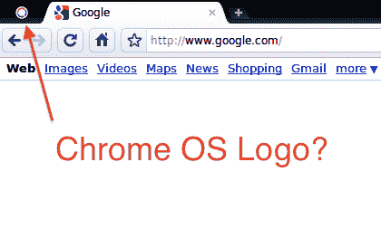
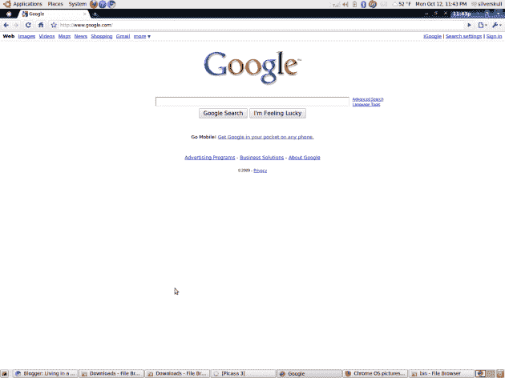
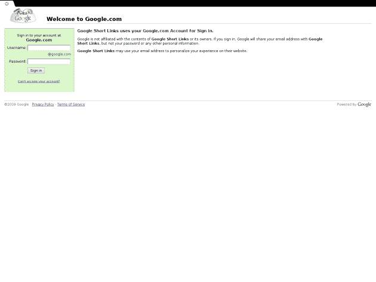
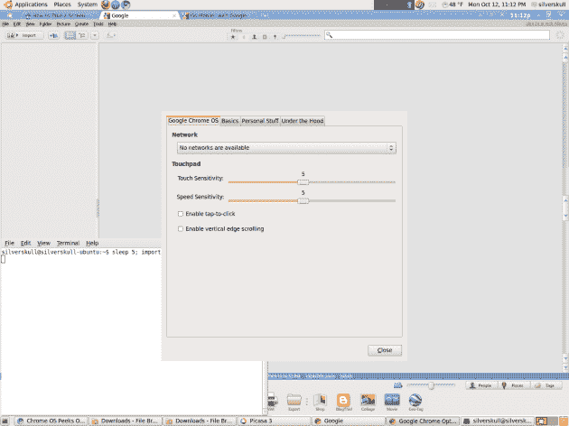
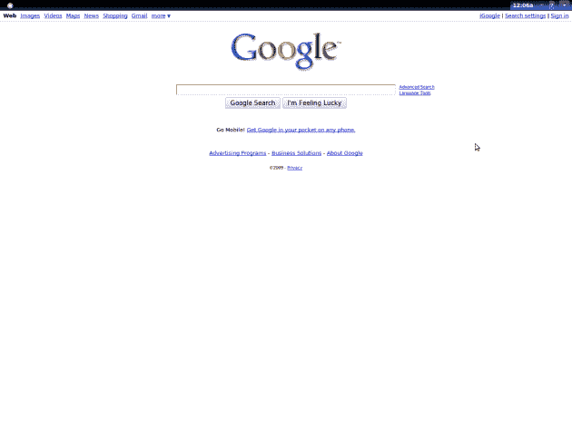
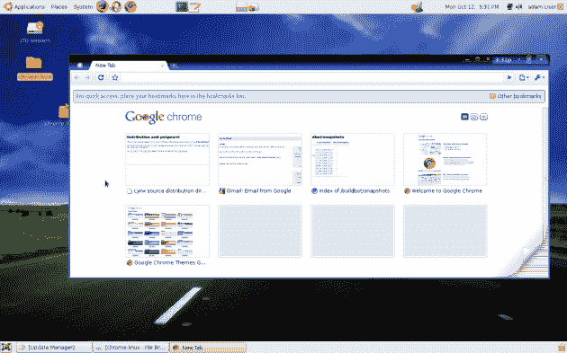
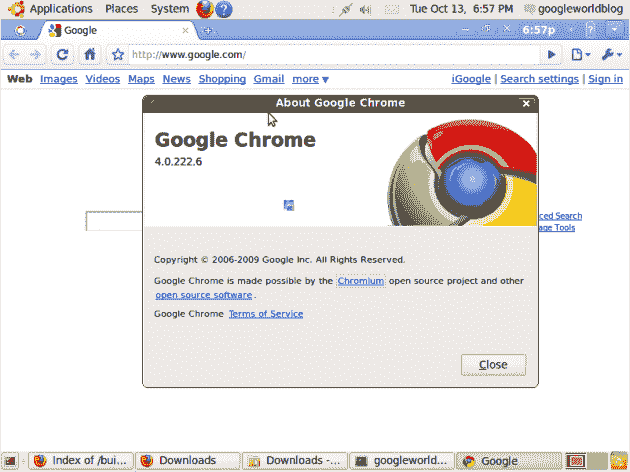
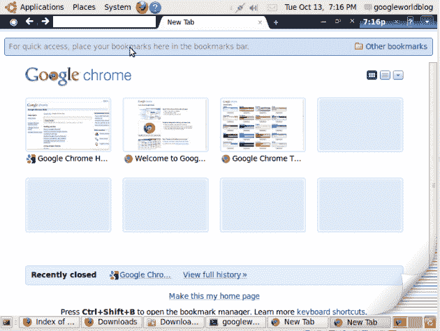

# Chrome 操作系统的第一瞥

> 原文：<https://web.archive.org/web/https://techcrunch.com/2009/10/13/a-first-glimpse-of-chrome-os-in-the-flesh-at-least-the-browser-part/>

继我们昨天关于 chromeos 的帖子之后，看起来谷歌的那些老谋深算的家伙已经从[Chrome build 文件夹](https://web.archive.org/web/20230404184307/http://build.chromium.org/buildbot/snapshots/)中删除了“Chrome OS”文件夹。太糟糕了。但幸运的是，在他们这样做之前，TechCrunch reader 和 Linux 用户 Jonathan Frederickson 已经能够抓取代码并设法安装了它。他在我们的评论区发布了一些结果，在他的博客上发布了更多的结果。

结果似乎是运行在 Linux 内部的 Chrome 操作系统的浏览器方面。正如你可以在下面的截图中看到的，它看起来非常类似于视窗系统上的浏览器 Chrome(仍然是 Chrome 唯一正式发布的版本)，但是有一些关键的区别。

首先，它看起来像是有某种新的标志。如果你看左上角，你会看到一个中心为白色的彩色圆圈。这显然不同于 Chrome 浏览器的标志，它看起来像是儿童游戏[西蒙](https://web.archive.org/web/20230404184307/http://images.google.com/images?q=simon%20game&oe=utf-8&um=1&ie=UTF-8&sa=N&hl=en&tab=wi)。

根据弗雷德里克森的说法，点击这个标志会打开一个谷歌短链接窗口。不幸的是，你需要一个 Google.com 域名(他显然没有)来更进一步。假设这个页面包含所有主要谷歌应用的简单链接页面似乎是合理的。但奇怪的是这样的措辞:“*谷歌不隶属于谷歌短链接的内容或其所有者。*“不知道那是什么意思，但也许那只是占位符文本。

同时，在窗口的对面，最右边，你会看到一个时钟，一个网络状态指示器(“X”)，和一个电池电量指示器。其中，目前似乎只有时钟在工作。但是所有这些都与 Chrome 操作系统的代码一致。

还有一个下拉菜单按钮。在这里，你可以找到 Chrome 浏览器用户熟悉的选项。但你也会注意到新的“Chrome OS”标签。在这里，您可以找到网络选项，以及触摸板设置。好吧，在这一点上，我承认认为“触摸板”可能是某种设备，而不仅仅是笔记本触控板是愚蠢的。我注意到这可能是昨天的情况，但我也让我的想象力有点飘飘然。

太糟糕了，我们吓走了谷歌的“chromeos”文件夹，这越来越有趣了！

*点击大图(显然，不要注意图片背景中的 Linux 操作系统(Ubuntu)*

【T2

**更新**:另一位读者[亚当·香农](https://web.archive.org/web/20230404184307/http://twitter.com/adamdecaf)拍下了下图。他还分享了以下信息:

> 还有，一些基本事实。
> –频繁崩溃
> –html 5 工作
> –仅支持。ogg(没有 H.264 爱)
> 
> 浏览器信息:
> 
> 内部代号:Mozilla
> 浏览器名称:网景
> 浏览器版本:5.0(X11；u；CrOS i686 9 . 4 . 0；en-US)
> apple WebKit/532.2(KHTML，像壁虎一样)Chrome/4 . 0 . 222 . 5 Safari/532.2
> 用户代理字符串:Mozilla/5.0(X11；u；CrOS i686 9 . 4 . 0；en-US)
> apple WebKit/532.2(KHTML，像壁虎一样)Chrome/4 . 0 . 222 . 5 Safari/532.2
> 浏览器语言:en-US
> 电脑平台:Linux i686

**更新 2** :但是等等，还有。弗雷德里克松在被拆除之前，得到了一个稍微新一点的版本(带有“紧凑型导航条”)。下面更多图片。

