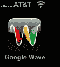
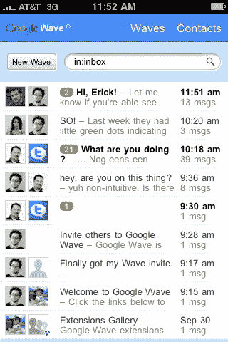
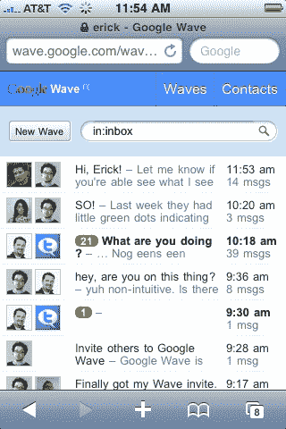

# Google Wave 的小秘密:它已经在 iPhone | TechCrunch 上运行了

> 原文：<https://web.archive.org/web/https://techcrunch.com/2009/10/13/google-waves-little-secret-it-already-works-on-the-iphone/>

搜索巨头谷歌 Wave 在 T2 的最新电子邮件通信实验还没有开始，首批 10 万名私人测试者中的一些人仍在等待他们的邀请。(我今天终于拿到了我的，在发布两周后)。但是 Google Wave 已经有了一些秘密。让我感到惊讶的是，尽管还没有多少人可以使用它，但 Google Wave 已经可以在 iPhone 上运行了。

有两种方法可以让 Google Wave 在你的 iPhone 上运行。第一种方法是在 iPhone 上的移动 Safari 中直接进入[wave.google.com](https://web.archive.org/web/20230404210811/https://wave.google.com/)。它警告你在预览时没有使用支持的浏览器，但是如果你点击通过，它工作得很好。该网站显然已经针对基于 Webkit 的浏览器进行了优化，比如 iPhone 和谷歌自己的 Android 手机上的浏览器(我在 Android 上试过，它在那里也能工作)。您可以选择不同的对话“波”(或线索)和联系人，或者进入特定的波。

但有趣的地方就在这里。除了通过移动 Safari 浏览器的 Web 应用程序，您还可以完全摆脱 Safari 包装。就像 iPhone 上的任何网页一样，你可以在主屏幕上保存一个书签，它会创建一个小图标，启动移动 Safari 访问该页面。然而，当您将 Wave 书签保存到主屏幕时，会发生一些不同的事情。你使用 Wave，但是没有 Safari 的包装器，无法导航到另一个页面或者搜索网页。相反，它看起来更像一个普通的应用程序，没有办法离开它。其他一切都与移动浏览器版本相同。

至少对我和我们的一位读者拉斐尔·巴尔加斯来说是这样，他引起了我的注意。对于其他人来说，比如 TechCrunch 作家 MG Siegler，这个图标实际上启动了 Safari 版本。所以这可能是个 bug，也可能 MG 只是被祝福了。不管怎样，Google Wave 团队显然正在努力让 Wave 在移动浏览器中工作。

如果我看到的不是一个 bug，这表明了在 iPhone 上制作移动应用程序的不同方法。它们变成了移动网站的定制版本，不需要经过苹果曲折的应用程序批准过程。鉴于两家公司在 iPhone 上的一些谷歌应用(语音和纬度)被拒绝后的紧张关系，在应用商店周围做一次收尾工作可能不是一个坏主意。

上面的截图显示了 Google Wave 从主屏幕上的图标启动时的样子。下面是它在 Safari 中的样子。看到顶部和底部带有导航选项的灰色栏了吗？**更新**:也许谷歌正在利用这个[功能](https://web.archive.org/web/20230404210811/http://www.appleinsider.com/articles/08/10/03/latest_iphone_software_supports_full_screen_web_apps.html)创建全屏网络应用。**更新 2** :谷歌证实确实如此。当你将 Wave 加入书签时，它会以“应用模式”启动，这是 iPhone 上开发人员的现有选项。

