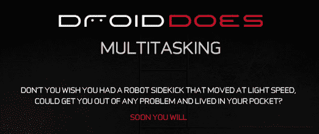
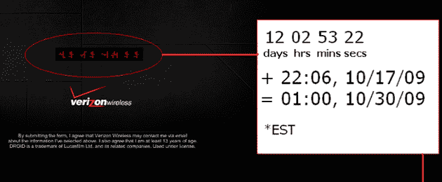
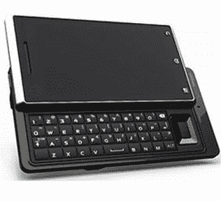
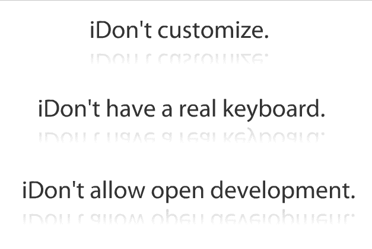

# 威瑞森用摩托罗拉 Droid TechCrunch 的广告直接攻击 iPhone

> 原文：<https://web.archive.org/web/https://techcrunch.com/2009/10/17/verizon-launches-direct-attack-against-the-iphone-with-ads-for-the-motorola-droid/>

# 威瑞森用摩托罗拉 Droid 的广告直接攻击 iPhone

过去几周，越来越多的人在谈论一款未发布的摩托罗拉智能手机，这款手机将于 10 月底至 12 月初推出。传闻中的[规格](https://web.archive.org/web/20221209124317/http://www.mobilecrunch.com/2009/10/01/verizon-to-announce-moto-tao-next-week-phone-to-drop-dec-1/)包括强大的 OMAP3430 处理器、500 万像素摄像头、滑出式 QWERTY 键盘和触摸屏，所有这些都封装在一个超级紧凑的封装中，运行 Android 2.0。一些潜在的名字已经出现，包括 Sholes 和 Tao，但今晚威瑞森已经非常清楚地表明了即将到来的手机将被称为: *Droid* 。在 DroidDoes.com[网站发起的新广告活动中，威瑞森将其定位为对 iPhone 的直接威胁。](https://web.archive.org/web/20221209124317/http://www.droiddoes.com/)

威瑞森没有手下留情:它基本上指出了 iPhone 的每一个主要弱点，从无法运行后台应用程序到 App Store 的围墙花园。该网站以一系列 iPhone 不能做的事情开始，模仿苹果广告中常见的白底黑字，但用类似*我不能同时运行应用程序*的声明来代替。几个之后，网站会把你踢到一个标题为“DroidDoes”的页面，上面有一个横幅，介绍 Droid 的许多功能，包括 Android 2.0、后台任务和视频录制支持。提到的一些差异，如 Droid 包含物理键盘，实际上是个人偏好的问题。其他人则不然。首先，Droid 可以声称运行在“网络”上，它在& T。

这款手机还没有正式公布，发布日期也很模糊(传闻是 10 月 31 日午夜推出)。但是我们从一些有机会简要测试它的人那里听说，他们非常*印象深刻(一个反应是它“完全棒极了”)。我不会傻到称之为 iPhone 杀手，因为不管 droid 有多好，iPhone 的开发者群体仍然比 Android 领先几英里。但是，如果你开始听说有人放弃 iPhone 而选择 Droid，不要感到惊讶。毕竟，即使这款手机没有 iPhone 那么完美，它运行的网络也能让用户始终如一地接通电话。*

最后要注意的一点是:鉴于威瑞森对 iPhone 的直接攻击，听起来 iPhone 肯定不会很快转向威瑞森。

评论员 Christopher Daggett 试图计算出倒计时的准确时间，透露(可能的)发射日期为美国东部时间 10/30/09 凌晨 1:00。

*视频通过 [BGR 的](https://web.archive.org/web/20221209124317/http://boygeniusreport.com/)推特发布。*

