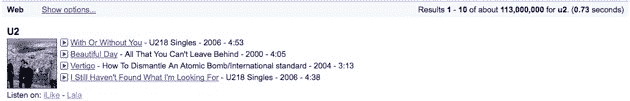
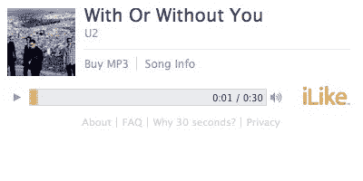
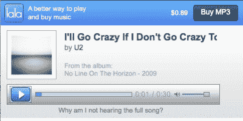

# 谷歌音乐服务:截图 TechCrunch

> 原文：<https://web.archive.org/web/https://techcrunch.com/2009/10/21/google-music-service-the-screenshots/>

# 谷歌音乐服务:截图

没有一家相关公司会证实[新的谷歌音乐服务](https://web.archive.org/web/20230213203440/https://techcrunch.com/2009/10/21/new-google-music-service-launch-imminent/)——谷歌、[拉拉](https://web.archive.org/web/20230213203440/http://www.lala.com/)、MySpace 和 [iLike](https://web.archive.org/web/20230213203440/http://www.ilike.com/) 都“不予置评”或保持绝对沉默。但是这项新服务几乎已经确定了。我们有截图显示这项将于 10 月 28 日发布的服务将如何证明这一点。

我们从一位消息人士处获悉，谷歌产品营销经理 Matt Ghering 是与四大唱片公司谈论这项新服务的人之一。据说他已经把谷歌音乐搜索的外观和感觉的截图发给了各种权利人和潜在的合作伙伴。

第一个截图展示了在谷歌上搜索“U2”的结果。乐队的图片位于各种歌曲的四个流媒体选项的左侧，用户可以选择通过 iLike 或 LaLa 收听。点击其中一个结果，就会从播放歌曲的服务中弹出一个播放器，以及一个购买歌曲供下载的选项。

我们不知道这是否是这项服务的最终外观，但它肯定是谷歌一直在向人们展示的东西。

随着我们对所有信息的消化，稍后会有更多的想法。但有一点是明确的——这是拉拉和伊利克的巨大胜利。双方都将从这笔交易中获得巨大的流量。尽管我们批评 MySpace，但他们对 iLike 的收购开始看起来有些精彩。

搜索结果:

iLike 播放器:

拉拉队员:

