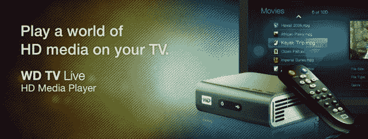
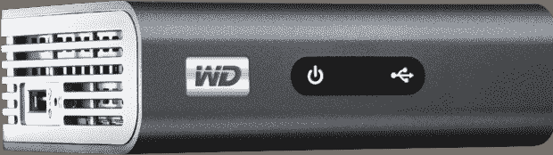
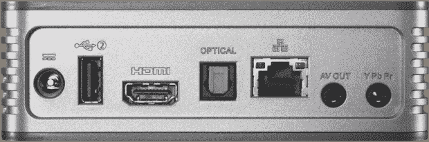
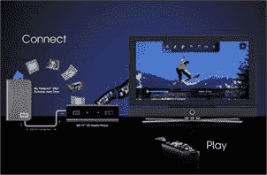
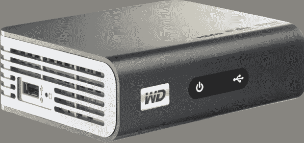

# 回顾:WD TV 直播高清媒体播放器技术危机

> 原文：<https://web.archive.org/web/http://techcrunch.com/2009/10/22/review-wd-tv-live-hd-media-player/>

**更新:** [新固件 1.01.11 现已上市，加上 Wi-Fi 测试结果均在](https://web.archive.org/web/20230203071348/http://www.crunchgear.com/2009/11/18/wd-tv-live-new-1-01-11-firmware-update-available-plus-our-wi-fi-test-results/)。

**短版本:**西方数字在其不断增长的媒体播放器阵容[中的最新成员](https://web.archive.org/web/20230203071348/http://www.crunchgear.com/2009/08/18/western-digital-shrinks-the-wd-tv-down-to-a-portable-size-with-the-mini/)WD TV Live 基本上继承了其老兄弟(伟大的 [WD TV](https://web.archive.org/web/20230203071348/http://www.crunchgear.com/2008/12/14/review-western-digital-wd-tv-hd-media-player/) )的传统。凭借通过内置以太网端口或 USB Wi-Fi 适配器(单独出售)新增的网络功能，WD TV Live 将 Western Digital 的小黑盒推向了一个新的高度。无论是照片、音乐、视频(用几乎任何一种编码解码器编码)，还是对 YouTube、Flickr、Pandora 和 Live365 的新访问，WD TV Live 几乎可以处理任何类型的媒体。总体而言，这是一款功能强大、易于使用且相对便宜的全方位高清媒体播放器。

**长版:**原版 [WD TV](https://web.archive.org/web/20230203071348/http://www.crunchgear.com/2008/12/14/review-western-digital-wd-tv-hd-media-player/) HD Media Player 是西方数字的一次伟大的首次尝试。不幸的是，缺乏网络和互联网接入，使得该设备不太受一大群潜在客户的欢迎。幸运的是，WD 似乎在整合新的 [WD TV Live](https://web.archive.org/web/20230203071348/http://www.crunchgear.com/2009/10/13/western-digital-announces-wd-tv-live-hd-media-player/) 的同时，也倾听了日益增长的 WD TV 粉丝群体的心声，并增加了网络和互联网连接功能。

**硬件:**

虽然 WD TV Live 从技术上来说是一个新设备，但实际上它只是对其老化的兄弟姐妹，最初的 WD TV 的一个适度的大修。因此，我会试着更多地关注新的变化，而不是那些保持不变的特性。

【T2

除了新增加的网络和互联网连接，新旧 WD TV Live 之间最明显的差异是设备的实际颜色。原来的外壳是防尘的，指纹吸引闪亮的黑色塑料，新的 Live 有着更光滑、哑光的碳灰色表面。

该设备的尺寸为 1.57 英寸 x 3.94 英寸 x 4.94 英寸，重量为 0.67 磅。它包括两个 USB 端口(一个在侧面，一个在背面)，一个 HDMI 1.3 端口，光学音频输出，以太网，复合输出和分量输出。随附的*迷你*遥控器(如下)与原始版本相同，交流适配器相对较小且独立(即无电源“模块”)。除了遥控器和电源适配器，该设备还附带复合电缆和分量电缆(HDMI、光学音频和 USB 存储设备单独销售)。WD TV Live 还兼容各种“通用”遥控器，如罗技的 Harmony 系列。

**安装:**

 安装 WD TV Live 再简单不过了(假设你用的是 HDMI 线)。一旦您将小的粘性橡胶支脚连接到设备底部，只需插入交流电源适配器，将 HDMI 电缆连接到设备和 HDTV，并将任何类型的 USB 存储设备(即外部硬盘驱动器或闪存驱动器)插入侧面和/或背面的 USB 端口。就是这样。现在，打开您漂亮的电视，打开随附的 WD TV Live 遥控器，瞧，您已经拥有了一台高清媒体播放器。

**界面/功能:**

就像旧的 WD TV 界面一样，稍微更新的 UI 让人想起许多媒体播放器应用程序(想想 Windows Media Center、XBMC 等)。本质上，您可以通过一个视觉导航系统在视频、照片、音乐和系统设置之间进行选择。这里不是试图解释所有不同的屏幕和选项，而是一个不太简短(有点不必要的长)的一些功能的视频概述:

【YouTube = http://www . YouTube . com/watch？v=wGJEcV1xPNQ&w=640&h=385]

我忘记在视频中包括的一件事是新的“预览”模式，它加入了以前包括的列表、缩略图和搜索模式。预览功能允许您查看文件的信息(如大小、类型等)，同时还可以显示/播放视频、照片或音轨的剪辑。这很好，例如，如果你的媒体文件标签不好，或者你不太记得你看过的发展受阻的最后一集是哪一集。

又是一声“哎呀！我忘记了”功能是新增加的在连接的 USB 存储驱动器和/或网络存储/计算机之间复制、移动或删除文件的功能。如果像我一样，你的 DVD 翻录机(也就是你的电脑)在 X 房间，而你的 WD TV Live 在 Y 房间，这真的很方便；现在，您可以通过网络(耐心点，尤其是通过 Wi-Fi)将最新的媒体文件从您的机器移动到您连接的 USB 存储设备。

至于兼容性，WD TV Live 支持以下(大量)文件类型:

*   视频–AVI(Xvid、AVC、MPEG1/2/4)、MPG/MPEG、VOB、MKV (h.264、x.264、AVC、MPEG1/2/4、VC-1)、TS/TP/M2T (MPEG1/2/4、AVC、VC-1)、MP4/MOV (MPEG4、h.264)、M2TS、WMV9
*   照片–JPEG、GIF、TIF/TIFF、BMP、PNG
*   音频–MP3、WAV/PCM/LPCM、WMA、AAC、FLAC、MKA、AIF/AIFF、OGG、杜比数字、DTS
*   播放列表–PLS、M3U、WPL
*   副标题——SRT、ASS、SSA、SUB、SMI

**结论:**

WD 电视直播相对于它的老兄弟(非直播)来说是一个明显的进步。如果您正在寻找一种高清媒体解决方案，能够播放人类已知的几乎所有类型的媒体(见上面的列表)，具有非常小的物理占用空间、网络/互联网连接性，并且具有无限的存储空间(即，它仅受您拥有的存储量的限制)，那么您真的无法比 WD TV Live 高清媒体播放器做得更好。

对于那些喜欢列表的人来说，这里是新媒体播放器中所有亮点和改进的快速回顾:

*   更快——启动、缩略图加载和整体操作
*   网络访问–通过以太网或 USB Wi-Fi 适配器访问家庭网络中的内容
*   互联网-访问 YouTube、Flickr、Pandora 和 Live365 上的内容
*   固件更新–直接通过互联网更新媒体播放器的固件
*   文件管理–在 USB 存储设备之间传输文件，从网络上下载文件，并删除不需要的文件
*   预览模式–除了列表和缩略图视图，预览模式还显示文件信息并播放媒体
*   分量视频–除 HDMI 和复合视频之外的新连接选择
*   颜色–全新哑光木炭外壳

虽然新的 WD 电视直播很好，但仍有改进的空间。我希望未来的固件更新能给网飞带来“立即观看”功能，访问 Hulu 等网站，像在 DVD 上一样通过“章节”导航(VOB、MKV 等)，甚至是 Wii 上的某种互联网浏览器。就未来的硬件改进而言，如果设备内置 Wi-Fi 和蓝牙功能就好了，从而提供更好的网络/互联网体验，并能够使用键盘和假想的互联网浏览器。如果你(暂时)丢失了遥控器，内置在 WD TV 中的物理开/关按钮将会很方便(阅读:设备本身没有实际的按钮/控件)。

尽管如此，对于大多数人的媒体中心来说，WD TV Live HD Media Player 只需 149.99 美元的 MSRP(或“网上更便宜的东西)，是一款功能强大且物有所值的产品。一个警告:如果您已经有了 PS3 和/或 XBOX 360(我两个都没有)，那么您可能是少数不会从 WD TV Live 中受益良多的人之一。无论如何，随着速度、实用性和功能性的提高，WD TV Live 无疑是 WD 高清媒体播放器系列中受欢迎的一款产品，也是原 WD TV 的一款有价值的替代品。更多信息，请查看新的[WDTVLive.com](https://web.archive.org/web/20230203071348/http://wdtvlive.com/products/wdtv_live)。