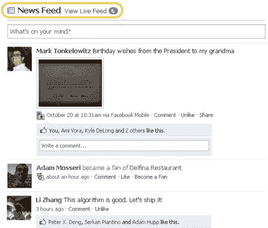

# 脸书将“亮点”合并到你的新闻提要中

> 原文：<https://web.archive.org/web/https://techcrunch.com/2009/10/23/facebook-merges-highlights-back-into-your-news-feed/>

# 脸书将“亮点”合并到你的新闻提要中

脸书刚刚[宣布](https://web.archive.org/web/20230304144009/http://blog.facebook.com/blog.php?post=162536657130)开始推出其主页的修改版，将“亮点”部分纳入新闻提要。现在，您可以在两个不同版本的订阅源之间切换:实时订阅源，实时显示您朋友的更新；新闻订阅源，显示您朋友在过去几天发布的热门内容(这些通常是评论最多/最受欢迎的故事)。

新设计是“旧”新闻源和脸书[在 3 月份推出的](https://web.archive.org/web/20230304144009/https://techcrunch.com/2009/03/11/facebooks-real-time-homepage-goes-live-today/)新闻源之间的妥协，前者使用算法呈现脸书认为你会感兴趣的故事，后者由类似 Twitter 的最新更新组成。自今年重新设计以来，脸书一直使用屏幕右侧的“亮点”部分来呈现你可能错过的项目，但这从来都不是一个理想的解决方案:首先，你看不到你朋友对这些帖子的评论，而亮点的小空间很容易被忽略。

今天的更改将使精彩部分变得多余，因此将被删除(它下面的所有内容也将在页面上上移，这意味着“生日”和“活动”部分将不再被隐藏)。脸书的帖子还指出，新闻提要将包括更多的事件，包括当你的朋友成为页面的粉丝时，添加朋友，或对某个事件进行回复。

这种变化已经到来很久了——早在 6 月份就有[报道称](https://web.archive.org/web/20230304144009/http://venturebeat.com/2009/06/12/against-real-time-facebook-to-sort-of-bring-back-the-old-site-design/)将精彩内容重新整合到 feed 中。