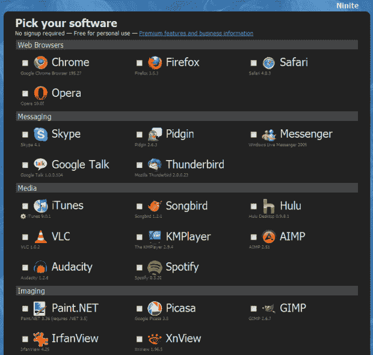

# 升级到 Windows 7？使用 ni nite TechCrunch 轻松安装多个软件程序

> 原文：<https://web.archive.org/web/https://techcrunch.com/2009/10/23/upgrading-to-windows-7-easily-install-multiple-software-programs-with-ninite/>

# 升级到 Windows 7？使用 Ninite 轻松安装多个软件程序

既然 Windows 7 得到了软件专业人士的积极评价和批准，毫无疑问，许多人将在未来几周内转向微软的新操作系统。如果你坚持使用 Windows XP 并完全跳过 Vista，这是一个有点痛苦的问题,因为你最好的做法是在备份数据和程序后进行一次完全的全新安装。

清除数据是一回事，但一旦你在电脑上安装并运行了 Windows 7，你还需要从头开始安装所有的应用程序。当然，对于那些买了一台新电脑，开始时只预装了几个程序，或者根本没有预装程序的人来说，情况也是如此。

安装多个软件应用程序可能是一件非常辛苦、耗时的苦差事，但一家由 Y Combinator 资助的初创公司刚刚推出了一款工具，旨在让这个过程变得非常非常简单。最重要的是免费的。

认识一下 [Ninite](https://web.archive.org/web/20221207200904/http://ninite.com/) ，一个实用而简单的多应用安装工具。

Ninite 在其网站上聚集了一系列类别的流行 PC 应用程序，并允许您一次检查多个软件程序并运行每个程序的设置过程。不需要安装额外的软件，Ninite 甚至会自动避免在你选择安装的软件中包含工具栏等等。我能看到的唯一缺点实际上是一个功能:你选择安装的软件程序的默认设置将被自动选择，所以在安装过程中你几乎不能进行定制。

一旦你选择了所有你想要的应用程序，你会得到一个单独的可执行文件，当你去喝一杯浓咖啡的时候，它会一次性运行所有的安装程序。

Ninite，在私下测试时被称作“T0”Volery“T1”，是由 YC 投资的初创公司 Secure by Design 开发的产品，该公司在营销“T2”base shield 应用商店“T3”时发现人们对这种工具非常向往，该商店本质上是 Windows 应用的“T4”应用商店“T5”。

该公司旨在通过提供[高级功能](https://web.archive.org/web/20221207200904/http://ninite.com/accounts/premium)从 Ninite 赚钱，比如本地下载缓存、网络共享下载缓存和付费用户的静音模式。

(通过[黑客新闻](https://web.archive.org/web/20221207200904/http://news.ycombinator.com/item?id=897848))

