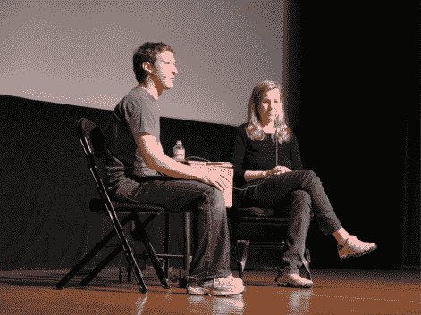

# 创业学校:马克·扎克伯格访谈

> 原文：<https://web.archive.org/web/https://techcrunch.com/2009/10/24/startup-school-an-interview-with-mark-zuckerberg/>

脸书创始人兼首席执行官[马克·扎克伯格](https://web.archive.org/web/20230404150300/http://www.crunchbase.com/person/mark-zuckerberg)登上了创业学校的讲台，Y Combinator 的[杰西卡·利文斯顿](https://web.archive.org/web/20230404150300/http://www.crunchbase.com/person/jessica-livingston)正在面试他。我正在直播下面的采访。

马克·扎克伯格:“我喜欢呆在这里。这些就像，我的人民。”

问:我想回到脸书之前。你从那些经历中学到了什么？答:我主要构建我喜欢的东西。当我上大学的时候，我开始尝试其他的项目。有这样一个故事——期末考试前一周，我正在制作《脸书》,有一门课，你必须学习所有这些艺术作品。我本来应该学习，但我却在制作脸书。考试前几天，我被搞砸了。我拿了所有的图片，做了一个网站，你可以给每张图片添加注释，这是一个“学习工具”,每个人都可以填写我需要通过这门课的所有注释。在那之后，教授说这是他给过的所有期末考试中最好的成绩。这是我第一次社交黑客。和脸书一起，我想让哈佛变得更加开放。

问:第一批用户如何使用脸书？查找人，但是很简单。没有留言。你可以看看资料，戳戳别人。其他一切都是随着时间的推移建立起来的。人们说要尽早发布和迭代，脸书显然是一个很好的例子。YC 的球衣上写着“做人们想做的事”，我认为这是一个很好的诠释方式。

问:告诉我们你做过的所有蠢事。你想从哪里开始？*暂停*你想从哪方面入手？
我们一开始甚至还不是一家公司。我在哈佛和不同的朋友一起开始，他们都很聪明，但他们的投入程度不同。我搬到了硅谷，很多人不想搬走。很多早期的创始人团队都是分裂的。我一点也不想参与创业。我们有个叫爱德华多的家伙。我们没有成立标准公司，而是成立了佛罗里达有限责任公司。我不知道这有什么问题，但律师说这是放松的第一选择。一开始，我们并没有试图把它做得越大越好。我们想提供价值。我们没有开办最容易接受的学校，而是开办了最不容易接受的学校。我们在斯坦福大学、哥伦比亚大学、耶鲁大学开办了这个项目，这些学校都已经有了自己的社区。当我们在这些学校推出脸书并取得成功时，我们意识到投入时间是值得的。我的朋友都是喜欢建造酷东西的人。我们总是有这样一个笑话，关于那些只想开公司而不想做出有价值的东西的人。在硅谷有很多这样的事情。我们希望这是有价值的。

问:但这对初创公司来说是个问题——直到人们开始使用它，它才变得有价值(鸡/蛋问题)。
答:脸书天生就是病毒。有很多网站都有进口商联系方式，但对很多网站来说，这并没有什么意义。对脸书来说，这非常合适。直到几年后，我们才开始开发一些工具，让把朋友导入网站变得更加容易。这是一件推动增长的大事。在有机食品在校园传播之前。一件令人惊奇的事情，我们在大多数人要求的情况下在学校推出。我们没有足够的钱给所有的学校，我们有每月 85 美元的服务器，并根据我们的需要不断增加。在达特茅斯，一半的学生在一夜之间就注册了。

问:你的第一批投资者是谁？你是如何向他们推销的？答:我不擅长投球。我从未真正投过球。爱德华多做了一些。搬到这里，彼得·泰尔是我们的第一个投资者。肖恩·帕克帮助我们建立了第一家外包会计事务所，把我们介绍给了彼得。已经有成千上万的用户了。很明显，如果我们执行，我们会继续做得很好。我当时 19 岁，我怀疑自己是否给人留下深刻印象。头两年，他给我的唯一建议是“别搞砸了”。回到“制造人们想要的东西”的座右铭。早期我们一无所知，我们所有人都来自拥有用户并以可持续的速度增长。当我们第一次见到彼得时，我们还没有 Facebook.com。我们是脸书。那是一个胜利者。

问:你现在会做什么不同？我会得到正确的域名。寓意是我们可以得到这个领域。我们最终获得了“成千上万”的域名。我认为我们用了 Register.com，这也是一个错误。公司的核心人员很多仍在机智应对。随着时间的推移，管理团队得到了改善。早期很难找到擅长管理企业的人。现在我们有了谢丽尔，但在早期我们不可能得到她。犯这些错误并没有错，在前进的每一步都没有做对。

问:在脸书你做了什么不同的事情？
答:我们没有意识到我们的做法有什么不同，因为我们没有上下文。我看到一些自称为技术公司的公司，有很多经理并不是技术人员。所以我们一直致力于留住公司的技术人员。我们的主要营销角色之一是工程师。这种技术文化在公司的 DNA 中非常重要。谷歌是一家我非常钦佩的科技公司。随着我们的成长，我们变得越来越不同。我看着谷歌，觉得他们有很强的学术文化。复杂问题的优雅解决方案。我们以强大的黑客文化为荣，为很多人快速构建东西。我们的团队很小——工程师与用户的比率远远高于任何其他公司(每个工程师超过 100 万)。

问:你是如何保持这种环境的？
答:我们的确试图吸引人，但我们的目标不一定是永远留住人。有些公司真的很擅长培训人。很长一段时间里，很多人都去了 IBM，因为学习销售很棒。我们希望脸书成为人们学习建筑的最佳去处之一。如果你想创建一家公司，没有什么比投身其中并努力创建一家更好的了。但是脸书也是企业家/黑客的天堂。如果人们想来几年，继续前进，创造一些伟大的东西，这是我们引以为豪的事情。当陈士骏开始在 YouTube 上工作时，他正在脸书工作。他们离开了，做了些很酷的事。我不鼓励在脸书工作的人离开。我们并没有假装我们正在建立一家黑客们想永远呆下去的公司。

问:我问很多成功的创始人，你知道它会有这么大吗？告诉我你去的时候，哇，这可能是个大事件。我想它一直在增长，所以我们的期望也在增长。脸书故事的有趣之处在于。许多创始人说他们有远大的愿景。我在哈佛结交的许多人都认为，越来越多的信息变得可用是一种趋势，这导致了越来越多的开放性。没想到我们有机会影响它。所以我做了这个小项目，随着时间的推移，它越来越大。几年后，我们坐在一起，说这可能会影响到这个。所以我想大概是在人们大学毕业后继续使用脸书的时候。我们开始意识到这是一个相当普遍的现象。

问:你遇到过缩放问题吗？是的。我们一开始限制了增长，因为我们没有钱。当我们有更多的钱时，我们会以每月 85 美元的价格租用更多的服务器。当我们第一次拿钱的时候，我们决定我们能做的最大的事情就是加速用户增长。当经济不景气时，我们决定让现金流为正。我们在早期解决了很多问题，但有意限制了增长。有些东西，比如照片，相当疯狂。照片显示，有两个月的时间，人们在公司里睡得不多。这有点疯狂。

问:关于经营一家大公司，你学到了什么？
答:不清楚我学到了多少(开玩笑)。科技公司规模小的时候可以走得更快。即使我们变得越来越大，我们仍然需要快速前进。否则惯性会减慢速度。上次在创业学校。人们告诉你“你不能这么做，有很多东西你必须知道”。我上次的信息是，不，不要让那些人告诉你。我觉得是断章取义说我一点都不看重经验。我想你们中的很多人在这里是因为你们想要尝试一些东西，建立一些东西。

—
接受提问

问:因为脸书，我们对人们的历史了解得如此之多。我想知道从现在起 2000 年后你将如何让人们得到这个。只是一点点。当一切都数字化的时候，怎么会有人知道我们在做什么？答:我喜欢为自己考虑得相当长远而自豪，但不是那么长远。所以你赢了。马克·安德森很久以前告诉我，当他还是网景公司的时候，微软有更长的时间跨度，这帮助他们取得了胜利。回到你的问题。我们觉得我们是这场变得更加开放的运动的一部分。我认为很多公司都有这种使命感，但这可能不会永远存在。微软刚刚发布了 Windows 7。操作系统有多少创新？在很长一段时间里，操作系统创新是最重要的。现在我认为推动更多的开放将是最重要的。我认为你的问题的答案是，如果技术保持强大，人们将会在未来很长一段时间内建立公司。

问:我听说的一个关于你的故事是当你做出改变的时候。据报道，你说“最具颠覆性的公司做他们需要做的事情。背后的理由是什么"
答:有一种说法是，我们说得太多是你可以承担的最大风险，那就是不承担风险。在不断发展的世界里，如果你不改变，你就会失败。变化对人们来说确实是破坏性的，特别是当它是一个网络服务时，人们不会选择改变。在一个网站上，你不希望继续分叉你的代码。你想让人们使用一个版本。当我之前谈到让公司快速发展时。我听说除非有争议，否则价值观一文不值。我们愿意放弃很多，以确保我们能够快速前进。我们希望有一个代码库(我们做了脸书 Lite，是一群 Y Combinator 的人做的)。

问:你能说说它是什么样子的，以便在公共场合说话，这样人们就不会扑向你？自 2006 年以来，你似乎变了。
答:我说的冒犯的话还不够多吗？这样就没那么有趣了吗？
问:是的……可能没那么有趣(人群中发出的呜声)
答:也许我们需要更多有争议的问题。