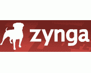
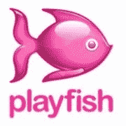

# 社交游戏:三巨头如何赚到数百万

> 原文：<https://web.archive.org/web/https://techcrunch.com/2009/10/26/social-games-how-the-big-three-make-millions/>

|  |  |  |  |
| **CrunchBase Profile** | Zynga | [Playfish](https://web.archive.org/web/20230124223534/http://www.crunchbase.com/company/playfish) | [游戏世界](https://web.archive.org/web/20230124223534/http://www.crunchbase.com/company/playdom) |
| **地点:** | 加利福尼亚州旧金山 | 英国伦敦 | 加利福尼亚州山景城 |
| **募集资金:** | 3900 万美元 | 2100 万美元 | $0 |
| **收入:** | 估计 2 亿美元 | 估计 7500 万美元 | [估计 6000 万美元](https://web.archive.org/web/20230124223534/http://www.insidesocialgames.com/2009/10/01/playdom-upwards-of-50-million-in-annual-revenue-and-growing/) |
| **谣言:** | 2010 年 IPO 的有力候选人 | [可能与 EA 进行收购谈判](https://web.archive.org/web/20230124223534/http://eu.beta.techcrunch.com/2009/10/23/hold-everything-playfish-is-still-in-play/) | 筹集风险资本 |
| **关键应用:** | **脸书:**
法姆维尔-61M
黑手党战争-25.8M
约维尔-19.8M
德克萨斯扑克-18.3M | **脸书:**
宠物社会-2050 万
餐饮城-1730 万
乡村故事-800 万
所有游戏总安装量 1.35 亿 | **Myspace:**
杜月笙-14M
保险杠贴纸-11.7M
拥有你的朋友-10.1m；
**脸书:**
姐妹会生活-7.1M
杜月笙 2-3.5M
扑克宫- 1.5M |

第一代大型脸书/MySpace 社交应用初创公司到此为止。Slide 和 RockYou 都在风险投资中获得了巨额估值。但是新一代的应用程序开发者已经占据了中心舞台，他们正在获得巨额收入和令人瞠目的估值: [Zynga](https://web.archive.org/web/20230124223534/http://www.zynga.com/) 、 [Playfish](https://web.archive.org/web/20230124223534/http://www.playfish.com/) 和 [Playdom](https://web.archive.org/web/20230124223534/http://www.playdom.com/) 。

这三家公司都在脸书和 MySpace 上拥有流行的社交游戏。Zynga 的 Farmville 拥有 6100 万月用户。Playfish 的宠物社区在脸书上每月有 2100 万用户。Playdom 在 MySpace 和脸书上每月有超过 1600 万的用户。

这三家公司都得到了媒体和投资者的大量关注。Zynga 希望明年上市。Playfish 可能已经被 EA 以 4 亿美元或更多的价格收购了。Playdom 可能在今年夏天筹集了一大笔未公布的风险资本。

这三家公司每年在虚拟商品销售上的收入可能高达 3 亿美元。需要一把散弹枪来对付黑帮吗？没问题。用信用卡、paypal 或手机支付，一切都是你的了。而人们显然非常愿意购买这些虚拟商品。没有什么新东西。

所有这些游戏的目标都是为了达到更高的水平，并且通常比你的朋友更快地种植或杀死东西。沉迷于免费版本，然后开始花钱让事情进展得更快。一旦人们做出承诺，就很容易让他们付钱。你可以在《商业周刊》上读到所有相关内容。

只不过《商业周刊》根本没有提到这个行业的阴暗面。

三家公司都愿意用游戏币来换取优惠。报名参加网飞。购买铃声订阅。或者能量饮料。注册信用卡。买汽车保险。参加一项智商调查，需要每月 9.99 美元的移动订阅才能看到结果。我们甚至找到了一种治疗关节炎的药物。下面是[这一切看起来的样子](https://web.archive.org/web/20230124223534/http://www.cdixon.org/?p=1220)。我们采访的一位高管说，这些应用程序总收入的 70%可能来自销售线索挖掘，而不是直接支付。仅网飞一个国家就要为免费试用支付 30-40 美元(需要信用卡)。

三家公司控制了这些潜在客户的大部分报价:TrialPay(似乎有最合法的报价)、Offerpal 和 SuperRewards。

将业务建立在潜在客户的基础上并没有错，尽管有些提议相当粗略(长期信用卡或移动订阅很少或没有价值)。联邦贸易委员会确实倾向于[定期对他们进行打击。但是更大的问题是](https://web.archive.org/web/20230124223534/http://www.mediapost.com/publications/index.cfm?fa=Articles.showArticle&art_aid=78826)[的广告客户可能不会从他们的支出中得到太多](https://web.archive.org/web/20230124223534/http://www.homethinking.com/brontemedia/2009/03/25/the-impending-doom-of-facebook-apps/)。随着更高质量的广告商退出，增加骗子的压力也在增加。

所有这些游戏的循环都非常标准。让新用户免费玩游戏，给他们奖励，让他们给所有的朋友发消息来注册，给他们带来现金或收入，并提升他们的级别。冲洗。重复一遍。