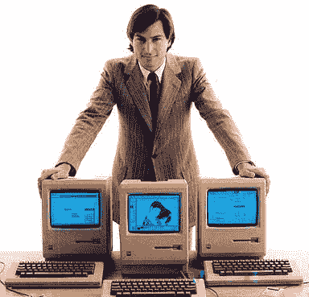

# iPhone 杀手的问题是...TechCrunch

> 原文：<https://web.archive.org/web/https://techcrunch.com/2009/10/26/the-problem-with-iphone-killers/>

我们又来了。将引向新移动设备的宣传达到了白热化。摩托罗拉的机器人[听起来](https://web.archive.org/web/20221209222756/http://www.mobilecrunch.com/2009/10/01/verizon-to-announce-moto-tao-next-week-phone-to-drop-dec-1/)，看起来[让人印象深刻](https://web.archive.org/web/20221209222756/http://www.beta.techcrunch.com/2009/10/18/verizon-droid-is-the-real-deal/)。因此，每个人最喜欢的形容词又一次被抛出:“iPhone 杀手。”当然，我们以前听过这句话——可能有十几次了。黑莓风暴是 iPhone 杀手，Palm Pre 是 iPhone 杀手，G2 等等。iPhone 不仅存活了下来，而且还蓬勃发展。为什么？

答案很简单，但需要一些解释。从根本上说，大多数 iPhone 杀手的问题是，他们实际上并没有试图杀死 iPhone。作为设备，它们可能认为自己是，但由于它们运行的操作系统及其背后的公司，它们中的大多数都在玩一场不同的游戏。一种思考方式是将智能手机，更准确地说是它们的操作系统，与宗教进行比较([，我们之前已经做过](https://web.archive.org/web/20221209222756/http://www.beta.techcrunch.com/2009/08/18/android-v-iphone-religious-battle-rages-within-techcrunch/))。这是非常恰当的，因为 iPhone 的昵称是“耶稣手机”。

从宗教意义上来说，iPhone 是一神教。基本上它的 OS 相信一个设备。是的，我知道有 iPod touch，以及 iPhone 的变体(原版、3G、3GS)，但这些本质上都是相同的设备，具有本质上相同的硬件，只是提高了规格。同时，Android、Windows Mobile、黑莓、Symbian 等。都是多神论者。但是“异教徒”，虽然可能不完全正确，是一个更酷的术语，所以让我们继续下去。所有这些移动操作系统都是异教徒。他们听从许多设备，他们的“神”

现在，我不是说异教的方法不好，我只是说试图用一个异教的操作系统杀死一个一神教的设备是非常困难的。问题是，这些异教组织都没有那种单一的设备，可以用来向大众传播他们的教义。他们可能在任何时候都更信任一款设备(Android 已经在用 droid 这么做了)，但最终，他们的忠诚还在于他们操作系统保护伞下的许多其他设备。异教徒教会(在 Android 的情况下，谷歌)，将是不明智的偏爱，因为它会破坏最终目标:尽可能多的设备上。

我认为谷歌意识到了这一点。虽然他们显然在 Droid 上帮了很大的忙，但是是摩托罗拉和威瑞森让 T2 大肆宣传。但我认为谷歌知道 Droid 不是 iPhone 杀手。相反，这可能是他们迄今为止击败真正竞争对手的最佳设备:Symbian，尤其是 Windows Mobile。跟我重复:Android 试图杀死 Windows Mobile，而不是 iPhone。

另一种流行的思考方式是 PC (Windows)与 Mac 的历史对比。从本质上讲，在个人电脑历史的早期，Mac 是王者。但是后来微软推出了可以在多家制造商的设备上运行的操作系统，数量占了上风，剩下的就是历史了。Android、Windows Mobile 等经常与在移动战场上采用这种方法联系在一起。

但是现在情况不同了。有人可能会说，20 世纪 80 年代苹果内部发生的许多其他事情导致了微软的崛起(当然，还有史蒂夫·乔布斯的下台)。从那时起，苹果公司，因为没有更好的说法，已经振作起来(并带回了乔布斯)。通过 iPhone——这意味着硬件、软件以及最重要的应用商店的结合——苹果创造了一个为自己加油的生态系统。

与此同时，微软多年来一直在 Windows Mobile 手机领域尝试同样的“数量”方法。有一段时间，它运行得相当好，但这主要是因为在这个仍然非常小的市场中缺乏竞争。现在，他们正在失去这个领域的市场份额，未来看起来很糟糕。再说一次，与其说是因为 iPhone(这在短期内对它造成了伤害)，不如说是因为 Windows Mobile 的真正竞争对手:Android。

Android 不仅是开源的，而且是免费的。另一方面，Windows Mobile 仍然荒谬地向制造商收取超过 25 美元的费用来使用他们的次等操作系统。在这一点上，他们的策略似乎是双管齐下的:1)试图尽可能地利用 Windows PC 品牌，并让用户相信 Windows Mobile [与 Windows](https://web.archive.org/web/20221209222756/http://www.beta.techcrunch.com/2009/10/09/video-windows-mobile-turns-twitter-into-party-boy/) 捆绑在一起，为移动设备创造了最好的环境。2)尽快退出全新的操作系统 Windows Mobile 7。

微软的问题(还是微软，而不是苹果)是，Android 现在对制造商有真正的吸引力，大量即将上市的设备(包括 droid)应该会在公众的心目中把 Windows Mobile 推到 Android 之后。虽然它的市场份额仍然较小，但这种情况也会比微软愿意承认的要快得多。

让我说清楚:我认为最终安卓很有可能会在全球范围内超过 iPhone。再说一遍，这是一个不同的游戏。这是一神论者对异教徒。这是 Mac 对 PC。即使苹果打破了美国电话电报公司在美国的独占地位，基本上仍然只有一种设备。Android 将有几十种设备。在世界其他地方甚至更多。但 iPhone 将继续生存，甚至茁壮成长，就像现在的 Mac 电脑一样。

通过提供一种设备，苹果接受了一种交换:他们为了质量牺牲了数量。苹果已经完全控制了它的设备(并且可能[在 App Store 方面有太多](https://web.archive.org/web/20221209222756/http://www.beta.techcrunch.com/2009/08/24/facebook-app-developer-to-apple-tear-down-this-app-store-wall/)的控制权)，正因为如此，它可以建立融合软件和硬件的东西，这是它的异教对手无法做到的。

事实上，最接近这样做的是手掌与预。但是 Pre 还不属于苹果手机的等级(太慢了)，Palm 已经准备好发布另一款设备。在那之后，他们在[谈论更多。这是一个更加封闭的异教，但它仍然是异教。开发人员不确定他们在为哪种设备开发，等等。](https://web.archive.org/web/20221209222756/http://www.beta.techcrunch.com/2009/10/05/palm-free-apps-for-the-web-free-development-for-open-source-and-free-pres/)

苹果也有朝一日会走这条路。自苹果发布以来，就有“苹果迷你”的传言，但这还没有发生。短期内更有可能的是，苹果的平板设备可能运行一些苹果操作系统的变体，这显然需要一些改变。但在智能手机领域，仍然会有一款设备。

虽然表面上看，可能不像，但对许多人来说，这是令人信服的。([)保持简单，愚蠢](https://web.archive.org/web/20221209222756/http://www.beta.techcrunch.com/2009/04/28/keep-it-simple-stupid/)等等。)当您被迫在数十种规格的设备中做出选择时，消费者会感到畏惧。有了苹果手机，他们知道自己会得到什么。开发者也知道他们得到了什么。他们知道他们的应用程序会在苹果手机上运行得很好，因为他们能够在设备上测试它，而不必购买并在几十台设备上测试它。

它是关于控制用户体验的。无论您同意还是不同意这种方法，您都必须承认苹果非常擅长这种方法。

说到开发者，除非你认为任何一个异教徒的智能手机制造商能够将 iPhone 用户全部转化，否则坚持使用 iPhone 是有巨大的信心的:近 10 万个应用程序和 20 亿次应用程序下载。虽然许多人说前者是吸引新用户的诱饵(很明显，绝对是这样)，但 20 亿这个数字是让用户留在 T2 的关键。很多人已经花了数百美元购买只能在 iPhone 上运行的应用程序。说服这些人改用 Droid 或黑莓手机将会很困难。相反，当他们升级时，他们可能会选择那些应用程序仍然适用的设备:一部新的 iPhone。

这就是为什么这不是要杀死 iPhone。关于“谷歌手机”的传言又开始了——也就是说，硬件由谷歌开发(或者至少完全由谷歌决定)。在 Web 2.0 峰会期间，谷歌联合创始人 Sergey Brin [承认](https://web.archive.org/web/20221209222756/http://www.beta.techcrunch.com/2009/10/24/sergey-brins-surprise-web-2-0-visit-the-video/)谷歌在 Android 的一些硬件上比其他硬件工作得更紧密，但这不足以成为 iPhone 杀手。如果谷歌(或微软，就此而言)决定将其所有支持(和营销支持)放在一款手机后面，让我知道，然后我们可以谈谈。

但据推测，即使是 Droid 也将是一系列手机。再说一遍，第一个看起来很棒。它可能是真正的杀手。但仅仅是因为它运行的是安卓系统，这可能是 Windows Mobile 的杀手。

*【照片:Miramax，flickr/ [flywood](https://web.archive.org/web/20221209222756/http://www.flickr.com/photos/flyworld/3126452629/) ，Apple】*