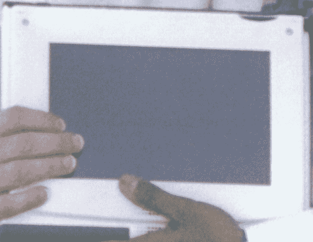

# 未上市的苹果平板电脑(大约 1990 年)的独家图片

> 原文：<https://web.archive.org/web/https://techcrunch.com/2009/10/27/exclusive-picture-of-unlaunched-apple-tablet-circa-1990/>

是的，好吧，这不是[那个](https://web.archive.org/web/20230219001729/https://techcrunch.com/2009/05/21/what-we-know-about-the-apple-tablet-so-far/)苹果平板电脑。但这是一张照片，拍摄于 1990 年左右，Apple Pen Mac，一个鲜为人知且从未推出的苹果平板电脑项目。据我们所知，互联网上没有这款设备的其他图片，也很少提到它。

Pen Mac 是一台功能齐全的 Mac 电脑(它甚至播放了 Mac 启动[的钟声](https://web.archive.org/web/20230219001729/http://www.whitwell.ndo.co.uk/musicthing/sounds/macstartup.mp3))，带有基于笔的触摸屏。屏幕本身与 [Mac 便携版](https://web.archive.org/web/20230219001729/http://en.wikipedia.org/wiki/Macintosh_Portable)相同，但增加了触控笔。当然，这个箱子比 Mac 便携版要小得多。Pen Mac 的厚度应该不超过一英寸。用户可以插入键盘和鼠标或更简单的输入。

照片中拿着苹果笔的是 Glam 首席执行官萨米尔·阿罗拉，他在几周前的晚餐上告诉了我这款设备。阿罗拉在苹果公司为这个项目工作，最终去了一家衍生公司 [Rae Technology](https://web.archive.org/web/20230219001729/http://en.wikipedia.org/wiki/Rae_Technology) ，该公司为 Pen Mac 设计应用程序。Rae 技术最终演变为 [NetObjects](https://web.archive.org/web/20230219001729/http://en.wikipedia.org/wiki/NetObjects,_Inc.) 。

Pen Mac 项目由 Paul Mercer 领导，但最终被 Newton 取代。当时苹果 CEO 约翰·斯卡利想要的是 PDA，而不是平板电脑。摘自 2006 年纽约时报的一篇文章:

> 然后在 1987 年和 1988 年，史蒂夫·乔布斯被当时的首席执行官约翰·斯卡利赶出公司后，像默瑟这样的工程师在公司被赋予了探索新想法的广泛自由。默塞尔独自进行了两个掌上电脑项目，代号为 Swatch 和 Pen Mac。
> 
> 20 世纪 90 年代初，在一次苹果公司高管会议之前，他展示了运行在手持电脑上的麦金塔软件，这远远早于 Newton、Palm Pilot 或 General Magic communicator 等产品的推出。
> 
> 技术演示令人印象深刻，但默瑟先生承认，他对自己的发明会得到什么样的反响有些天真。
> 
> 他没有受到热情的欢迎，而是接到了斯卡利的电话，说苹果刚刚与夏普电子公司(Sharp Electronics)签署了一份关于牛顿技术的合作协议，公司没有竞争手持计算项目的空间。

这就是笔式 Mac 的终结。

这里有一张图【Arora 告诉我们的第二代 Pen Mac 设备 PenLite 也被取消了。PenLite 的另一张图是[这里](https://web.archive.org/web/20230219001729/http://www.flickr.com/photos/sonnyhung/1319838563/)。一张[的最终图片](https://web.archive.org/web/20230219001729/http://www.flickr.com/photos/sonnyhung/1319838683/in/photostream/)，也被标为 PenLite，看起来确实与阿罗拉拿着的平板电脑相似。

