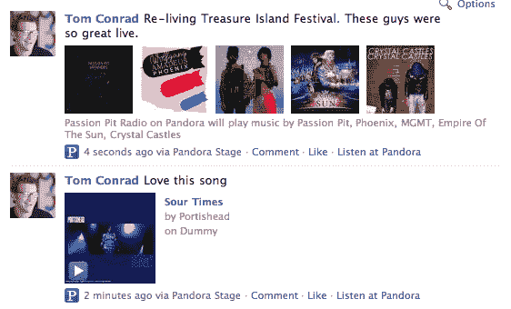

# Pandora 通过 Twitter、脸书和 Gifting Integration 进一步打开了它的盒子 TechCrunch

> 原文：<https://web.archive.org/web/https://techcrunch.com/2009/10/28/pandora-opens-its-box-a-bit-more-with-twitter-facebook-and-gifting-integration/>

# 潘多拉通过推特、脸书和礼物集成打开了它的盒子

目前，如果你想和朋友分享 T2 的电台或歌曲，你必须通过电子邮件发送给他们。据我所知，这不是 1994 年。今晚，潘多拉加入了 21 世纪，增加了在推特和脸书上分享电台和歌曲的简单方法。它进一步强调了一个似乎没有人意识到的特点:赠送潘多拉电台。

在 Pandora 的主播放页面上，你会在传统的播放按钮旁边看到一组新的按钮。这些按钮包括 Twitter 按钮、脸书按钮、邮件按钮和礼物按钮。点击其中任何一项，你就可以通过相应的服务发送你正在收听的当前电台或歌曲。

对于 Twitter，Pandora 正在使用 API 推出自己的 tweet box，允许您选择是发布歌曲还是电台，以及编辑正在发送的 140 个字符的消息。如果你要经常发微博，又不想一遍又一遍地发，你可以选择“总是使用这个选项和信息”，Pandora 会记住它，让你跳过这一步。

对于脸书，Pandora 使用 Connect 允许你将歌曲和电台发布到你的脸书个人资料和新闻订阅上。你还可以在脸书在线播放歌曲预览(30 秒)。

对于赠送功能，Pandora 会带您进入一个页面，允许您根据艺术家或歌曲创建一个定制电台。您可以为一个电台选择最多 5 位艺术家或歌曲。然后你给电台命名，为信息选择一个皮肤，输入你想发送给的人的电子邮件地址，以及个人信息。

这个过去就有，但以前很难找到的赠送功能是完全免费的。我们被告知，当每年的这个时候到来时，它将会有一个新的度假选择。“*这有点像我们为某人制作混音带的版本*，”Pandora CTO [Tom Conrad](https://web.archive.org/web/20221207200417/http://www.crunchbase.com/person/tom-conrad) 告诉我们。

这是另一种更好的赚钱方式。当用户收到礼品电子邮件并点击链接时，他们会被带到一个由赞助商赞助的礼品组合定制页面。从那里，用户必须再点击一次来启动他们的工作站。

当脸书和 Twitter 上的用户点击发出的潘多拉链接时，他们将被重定向到一个重新设计的登录页面，允许他们播放一首歌曲的 30 秒预览(如果是发出的歌曲)或一个启动潘多拉电台的链接(如果是发出的电台)。如果是前者，还有一个大按钮是根据那首歌创建新站。

那么潘多拉为什么要这么做呢？很明显，进入 21 世纪，人们通过推特和脸书分享，而不是电子邮件，这应该有助于提高使用率。但康拉德很快指出，分享是关键，而不是大规模的病毒式推特。我们被告知，不会有自动向 Twitter 发帖的废话。

