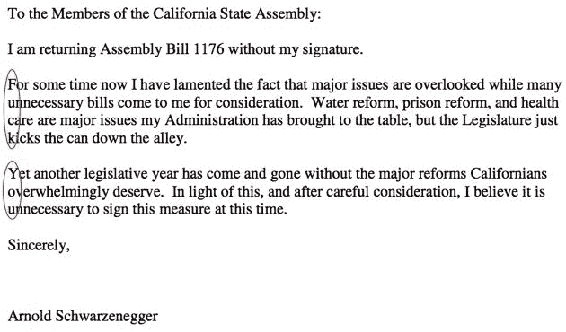

# 施瓦辛格给加州立法机构一个隐藏的手指技术危机

> 原文：<https://web.archive.org/web/https://techcrunch.com/2009/10/28/schwarzenegger-gives-california-legislature-a-hidden-finger/>

# 施瓦辛格给加州立法机构一个隐藏的手指

我绝对不可能把它和科技联系起来。但无论如何，我还是要把它发布出去。我们的州长，阿诺德·施瓦辛格，否决了加利福尼亚州的一项立法性财政法案-[AB 1176](https://web.archive.org/web/20230124183603/http://www.totalcapitol.com/?bill_id=9670)。[字母](https://web.archive.org/web/20230124183603/http://www.totalcapitol.com/?bill_id=9670)简洁明了。第 2-3 段中每一行的第一个字母更加简洁明了。

施瓦辛格与州议会的斗争是史诗般的。但这远远超出了史诗。这是历史书上的东西。

我希望我在 TechCrunch 的帖子里有时间做这种事情。

所有的引述和否认参见 [SF 纪事](https://web.archive.org/web/20230124183603/http://www.sfgate.com/cgi-bin/article.cgi?f=/c/a/2009/10/28/MNBN1ABKB8.DTL)。

现在，回到我们的常规节目。