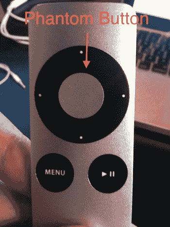

# 苹果的新遥控器是一个谜，被包裹在一个谜中

> 原文：<https://web.archive.org/web/https://techcrunch.com/2009/11/04/apples-new-remote-is-a-riddle-wrapped-in-a-mystery-inside-an-enigma/>

我手里拿着新的苹果遥控器。如果你错过了它，苹果[悄悄地](https://web.archive.org/web/20230118175109/http://www.crunchgear.com/2009/10/20/oh-yeah-theres-a-new-apple-remote/)在几周前与新的 iMacs、Mac minis、Magic Mice 和 MacBooks 一起发布了它。简单来说:我不明白。

这并不是说它不是一款好看的产品——的确是，但是有一些变化让我困惑，苹果到底想用这个东西做什么。从设计的角度来看，这是有意义的。新的遥控器现在有拉丝铝和黑色按钮外壳，这些天来为苹果的 MacBook Pro 系列和 iMac 系列增色不少。最初的苹果遥控器是全白色塑料的(除了顶部的传感器)，这与它最初推出的旧款 iMacs 相匹配。

那时候，遥控器更有意义。首先，它是大多数新 MAC 电脑自带的。这一点，再加上苹果的 Front Row 软件，使得苹果开始非常认真地对待 Mac 产品线中的媒体(不仅仅是音乐)(有一段时间，它甚至与 Mac 笔记本电脑一起出现)。但是今天，除了苹果电视(原因显而易见)，遥控器没有成为任何苹果产品的标准配置。相反，这是一个 19.00 美元的附加产品，即使是新的 27 英寸大屏幕顶级 iMacs(这似乎是观看媒体的天然选择)。

同样奇怪的是:虽然原来的白色遥控器有磁性背面，可以很容易地粘在 iMac 的侧面，但新遥控器没有。这意味着，如果你选择购买，这个遥控器又是你桌子上的一堆杂物。看起来苹果并不在乎你使用这个遥控器，即使没有它，Front Row 基本上是无用的。如果你不得不坐在电脑前使用它，那么简单地使用 iTunes 就没有什么意义了。

但新遥控器最奇怪的地方在于，苹果出于某种原因决定将播放/暂停按钮从导航圈的中心移到设备的右下方，将菜单按钮向左移动以腾出空间。这可能只是一个简单的人体工程学设计变化，但最奇怪的是，导航圈的中心仍然是一个按钮，与播放/暂停按钮做同样的事情。

 是的，苹果公司增加了一个新的无用按钮。还是苹果。讨厌纽扣的公司。

苹果新遥控器的文档没有提供什么见解，但他们确实将这个新的中央按钮标记为“选择”，而不是播放/暂停。但同样，它做完全相同的事情。未来会有一些新的前排功能来利用选择按钮吗？也许吧。但即使推出像现在与电影打包在一起的新 iTunes Extras 内容这样的东西，似乎也不需要自己的按钮。

还有一点:苹果甚至懒得在它的网站的主[遥控器页面上提及它，但这款新遥控器确实能与苹果电视兼容。同样，从设计的角度来看，这是有意义的，因为新的遥控器看起来更像苹果电视，而不是目前与之配套的白色遥控器。但同样，遥控器的幻影按钮与播放/暂停按钮没有什么不同，除了按住播放/暂停按钮会调出电影章节，而按住幻影按钮似乎不会。奇怪。](https://web.archive.org/web/20230118175109/http://store.apple.com/us/product/MC377LL/A)

这种新遥控器有一个明显的优点:换电池容易多了。我有朋友有一大堆旧的白色遥控器，只是因为他们甚至不知道你可以事先更换电池。这很好，但它真的值得为一个更大、更重、不再粘在 iMac 上的遥控器支付 19 美元吗？大概不会。

如果你想要一个适用于 iTunes 和 Apple TV 的遥控器，只需使用你的 iPhone 或 iPod touch。苹果自己的远程应用程序使它比任何一个物理遥控器都有用得多。例如，你可以通过在设备的键盘上打字来进行搜索，而不是被迫进行大量的点击来手动在 Apple TV 的屏幕键盘上输入每个字母。对于滚动浏览一堆标题来说，它也要好得多。真的，在你能想到的各方面都更好。唯一的缺点是，你必须拥有一部 iPhone 或 iPod touch。但是如果你有一台苹果电视，你很可能也有一台。

真不明白苹果用这些遥控器是什么思路。看起来，他们显然正在向按钮更少、触摸元件更多的产品迈进，但这款新遥控器恰恰相反。有传言说[有触摸屏遥控器](https://web.archive.org/web/20230118175109/http://www.boygeniusreport.com/2009/09/29/apple-working-on-a-touchscreen-remote-for-upcoming-apple-tv/)已经有一段时间了，但这是我们现在得到的？怎么了，苹果？

**更新**:来自一些有见地的评论者的几件事:

1)同样有点奇怪的是，新遥控器上没有任何苹果标志。旧的在后面做了。

2)铝确实不是磁性金属，但塑料也不是，而旧遥控器是。

3)我已经忘记了这一点，但旧的苹果遥控器非常类似于最初的 iPod Shuffle。很有可能苹果对这两种遥控器使用了相同的制造工艺，而且这种 Shuffle 早就退役了，很容易就能转移到一种新型的遥控器上。

4)显然，播放/暂停单独按钮也允许您在不在该部分时停止/开始播放内容。这很可能是苹果这样做的原因，但这也不是很直观，因为按钮在其他时间做同样的事情。

